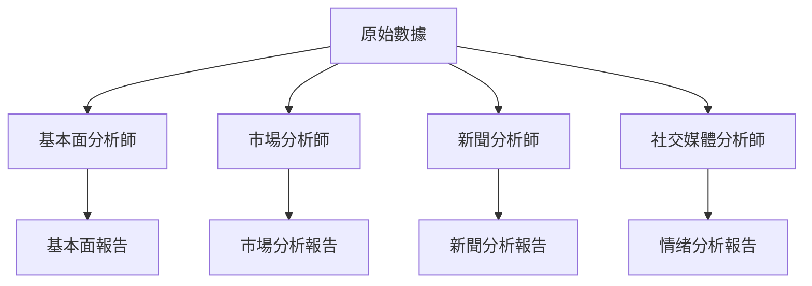

# 分析師团隊

## 概述

分析師团隊是 TradingAgents 框架的核心分析組件，负责從不同維度對股票進行專業分析。团隊由四類專業分析師組成，每個分析師都專註於特定的分析領域，通過協作為投資決策提供全面的數據支持。

## 分析師架構

### 基础分析師設計

所有分析師都基於統一的架構設計，使用相同的工具接口和日誌系統：

```python
# 統一的分析師模塊日誌裝饰器
from tradingagents.utils.tool_logging import log_analyst_module

# 統一日誌系統
from tradingagents.utils.logging_init import get_logger
logger = get_logger("default")

@log_analyst_module("analyst_type")
def analyst_node(state):
    # 分析師逻辑實現
    pass
```

### 智能體狀態管理

分析師通過 `AgentState` 進行狀態管理：

```python
class AgentState:
    company_of_interest: str      # 股票代碼
    trade_date: str              # 交易日期
    fundamentals_report: str     # 基本面報告
    market_report: str           # 市場分析報告
    news_report: str             # 新聞分析報告
    sentiment_report: str        # 情绪分析報告
    messages: List              # 消息歷史
```

## 分析師团隊成員

### 1. 基本面分析師 (Fundamentals Analyst)

**文件位置**: `tradingagents/agents/analysts/fundamentals_analyst.py`

**核心職责**:
- 分析公司財務數據和基本面指標
- 評估公司估值和財務健康度
- 提供基於財務數據的投資建议

**技術特性**:
- 使用統一工具架構自動识別股票類型
- 支持A股、港股、美股的基本面分析
- 智能選擇合適的數據源（在線/離線模式）

**核心實現**:
```python
def create_fundamentals_analyst(llm, toolkit):
    @log_analyst_module("fundamentals")
    def fundamentals_analyst_node(state):
        ticker = state["company_of_interest"]
        
        # 獲取股票市場信息
        from tradingagents.utils.stock_utils import StockUtils
        market_info = StockUtils.get_market_info(ticker)
        
        # 獲取公司名稱
        company_name = _get_company_name_for_fundamentals(ticker, market_info)
        
        # 選擇合適的工具
        if toolkit.config["online_tools"]:
            tools = [toolkit.get_stock_fundamentals_unified]
        else:
            # 離線模式工具選擇
            tools = [...]
```

**支持的數據源**:
- **A股**: 統一接口獲取中國股票信息
- **港股**: 改進的港股工具
- **美股**: FinnHub、SimFin等數據源

### 2. 市場分析師 (Market Analyst)

**文件位置**: `tradingagents/agents/analysts/market_analyst.py`

**核心職责**:
- 技術指標分析（RSI、MACD、布林帶等）
- 價格趋势和圖表模式识別
- 支撑阻力位分析
- 交易信號生成

**分析維度**:
- 短期技術指標
- 中長期趋势分析
- 成交量分析
- 價格動量評估

### 3. 新聞分析師 (News Analyst)

**文件位置**: `tradingagents/agents/analysts/news_analyst.py`

**核心職责**:
- 新聞事件影響分析
- 宏觀經濟數據解讀
- 政策影響評估
- 行業動態分析

**數據來源**:
- Google News API
- FinnHub新聞數據
- 實時新聞流
- 經濟數據發布

**特殊功能**:
- 新聞過濾和质量評估
- 情感分析和影響評級
- 時效性評估

### 4. 社交媒體分析師 (Social Media Analyst)

**文件位置**: `tradingagents/agents/analysts/social_media_analyst.py`

**核心職责**:
- 社交媒體情绪分析
- 投資者情绪監測
- 舆論趋势识別
- 熱點話題追蹤

**數據來源**:
- Reddit討論數據
- Twitter情感數據
- 金融論坛討論
- 社交媒體熱度指標

### 5. 中國市場分析師 (China Market Analyst)

**文件位置**: `tradingagents/agents/analysts/china_market_analyst.py`

**核心職责**:
- 專門针對中國A股市場的分析
- 中國特色的市場因素分析
- 政策環境影響評估
- 本土化的投資逻辑

## 工具集成

### 統一工具架構

分析師使用統一的工具接口，支持自動股票類型识別：

```python
# 統一基本面分析工具
tools = [toolkit.get_stock_fundamentals_unified]

# 工具內部自動识別股票類型並調用相應數據源
# - A股: 使用中國股票數據接口
# - 港股: 使用港股專用接口
# - 美股: 使用FinnHub等國际數據源
```

### 在線/離線模式

**在線模式** (`online_tools=True`):
- 使用實時API數據
- 數據最新但成本較高
- 適合生產環境

**離線模式** (`online_tools=False`):
- 使用緩存數據
- 成本低但數據可能滞後
- 適合開發和測試

## 股票類型支持

### 市場识別機制

```python
from tradingagents.utils.stock_utils import StockUtils
market_info = StockUtils.get_market_info(ticker)

# 返回信息包括：
# - is_china: 是否為A股
# - is_hk: 是否為港股
# - is_us: 是否為美股
# - market_name: 市場名稱
# - currency_name: 貨币名稱
# - currency_symbol: 貨币符號
```

### 支持的市場

1. **中國A股**
   - 股票代碼格式：000001, 600000等
   - 貨币單位：人民币(CNY)
   - 數據源：統一中國股票接口

2. **香港股市**
   - 股票代碼格式：0700.HK, 00700等
   - 貨币單位：港币(HKD)
   - 數據源：改進的港股工具

3. **美國股市**
   - 股票代碼格式：AAPL, TSLA等
   - 貨币單位：美元(USD)
   - 數據源：FinnHub, Yahoo Finance等

## 分析流程

### 1. 數據獲取階段


### 2. 分析執行階段


### 3. 報告生成階段


## 配置選項

### 分析師選擇
```python
# 可選擇的分析師類型
selected_analysts = [
    "market",        # 市場分析師
    "social",        # 社交媒體分析師
    "news",          # 新聞分析師
    "fundamentals"   # 基本面分析師
]
```

### 工具配置
```python
toolkit_config = {
    "online_tools": True,     # 是否使用在線工具
    "cache_enabled": True,    # 是否啟用緩存
    "timeout": 30,           # API超時時間
    "retry_count": 3         # 重試次數
}
```

## 日誌和監控

### 統一日誌系統
```python
# 每個分析師都使用統一的日誌系統
logger = get_logger("default")

# 詳細的調試日誌
logger.debug(f"📊 [DEBUG] 基本面分析師節點開始")
logger.info(f"📊 [基本面分析師] 正在分析股票: {ticker}")
logger.warning(f"⚠️ [DEBUG] memory為None，跳過歷史記忆檢索")
```

### 性能監控
- 分析耗時統計
- API調用次數追蹤
- 錯誤率監控
- 緩存命中率統計

## 擴展指南

### 添加新的分析師

1. **創建分析師文件**
```python
# tradingagents/agents/analysts/custom_analyst.py
from tradingagents.utils.tool_logging import log_analyst_module
from tradingagents.utils.logging_init import get_logger

def create_custom_analyst(llm, toolkit):
    @log_analyst_module("custom")
    def custom_analyst_node(state):
        # 自定義分析逻辑
        pass
    return custom_analyst_node
```

2. **註冊到系統**
```python
# 在trading_graph.py中添加
selected_analysts.append("custom")
```

### 添加新的數據源

1. **實現數據接口**
2. **添加到工具集**
3. **更新配置選項**

## 最佳實踐

### 1. 錯誤處理
- 使用try-catch包裝API調用
- 提供降級方案
- 記錄詳細錯誤信息

### 2. 性能優化
- 啟用數據緩存
- 合理設置超時時間
- 避免重複API調用

### 3. 數據质量
- 驗證數據完整性
- 處理異常值
- 提供數據质量評分

### 4. 可維護性
- 使用統一的代碼結構
- 添加詳細的註釋
- 遵循命名規範

## 故障排除

### 常见問題

1. **API調用失败**
   - 檢查網絡連接
   - 驗證API密鑰
   - 查看速率限制

2. **數據格式錯誤**
   - 檢查股票代碼格式
   - 驗證市場類型识別
   - 查看數據源兼容性

3. **性能問題**
   - 啟用緩存機制
   - 優化並發設置
   - 减少不必要的API調用

### 調試技巧

1. **啟用詳細日誌**
```python
logger.setLevel(logging.DEBUG)
```

2. **檢查狀態傳遞**
```python
logger.debug(f"當前狀態: {state}")
```

3. **驗證工具配置**
```python
logger.debug(f"工具配置: {toolkit.config}")
```

分析師团隊是整個TradingAgents框架的基础，通過專業化分工和協作，為後续的研究辩論和交易決策提供高质量的數據支持。