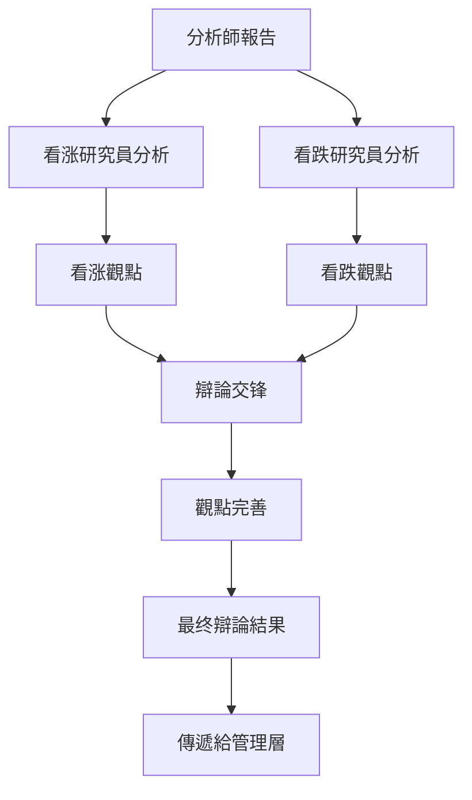

# 研究員團隊

## 概述

研究員團隊是 TradingAgents 框架的核心決策組件，負責基於分析師提供的數據進行深度研究和投資辯論。團隊由看涨研究員和看跌研究員組成，通過對立觀點的辯論來全面評估投資機會和風險，為最终的投資決策提供平衡的視角。

## 研究員架構

### 基礎研究員設計

所有研究員都基於統一的架構設計，使用相同的狀態管理和日誌系統：

```python
# 統一的研究員模組日誌裝飾器
from tradingagents.utils.tool_logging import log_researcher_module

# 統一日誌系統
from tradingagents.utils.logging_init import get_logger
logger = get_logger("default")

@log_researcher_module("researcher_type")
def researcher_node(state):
    # 研究員邏輯實現
    pass
```

### 智能體狀態管理

研究員通過 `AgentState` 進行狀態管理，包含辯論歷史和分析報告：

```python
class AgentState:
    company_of_interest: str      # 股票代碼
    trade_date: str              # 交易日期
    fundamentals_report: str     # 基本面報告
    market_report: str           # 市場分析報告
    news_report: str             # 新聞分析報告
    sentiment_report: str        # 情緒分析報告
    debate_state: str            # 辯論狀態
    messages: List              # 消息歷史
    memory: Any                 # 歷史記忆
```

## 研究員團隊成員

### 1. 看涨研究員 (Bull Researcher)

**檔案位置**: `tradingagents/agents/researchers/bull_researcher.py`

**核心職責**:
- 寻找和強調投資機會的積極因素
- 提出看涨觀點和支持論據
- 反駁看跌觀點中的薄弱環節
- 推動積極的投資決策

**核心實現**:
```python
def create_bull_researcher(llm, memory=None):
    @log_researcher_module("bull")
    def bull_node(state):
        # 獲取基礎資訊
        company_name = state["company_of_interest"]
        debate_state = state.get("debate_state", "")
        
        # 獲取股票市場資訊
        from tradingagents.utils.stock_utils import StockUtils
        market_info = StockUtils.get_market_info(company_name)
        
        # 安全檢查
        if memory is None:
            logger.warning(f"⚠️ [DEBUG] memory為None，跳過歷史記忆檢索")
        
        # 構建看涨論證
        messages = state.get("messages", [])
        
        # 分析各類報告並提出看涨觀點
        market_report = state.get("market_report", "")
        sentiment_report = state.get("sentiment_report", "")
        news_report = state.get("news_report", "")
        fundamentals_report = state.get("fundamentals_report", "")
```

**分析策略**:
- **積極解讀數據**: 從樂觀角度解釋市場數據和財務指標
- **機會識別**: 發現被市場低估的價值和增長潛力
- **風險最小化**: 論證風險的可控性和臨時性
- **催化劑分析**: 識別可能推動股價上涨的因素

### 2. 看跌研究員 (Bear Researcher)

**檔案位置**: `tradingagents/agents/researchers/bear_researcher.py`

**核心職責**:
- 識別和強調投資風險和負面因素
- 提出看跌觀點和警示論據
- 質疑看涨觀點中的樂觀假設
- 推動謹慎的投資決策

**核心實現**:
```python
def create_bear_researcher(llm, memory=None):
    @log_researcher_module("bear")
    def bear_node(state):
        # 獲取基礎資訊
        company_name = state["company_of_interest"]
        debate_state = state.get("debate_state", "")
        
        # 獲取股票市場資訊
        from tradingagents.utils.stock_utils import StockUtils
        market_info = StockUtils.get_market_info(company_name)
        
        # 安全檢查
        if memory is None:
            logger.warning(f"⚠️ [DEBUG] memory為None，跳過歷史記忆檢索")
        
        # 構建看跌論證
        messages = state.get("messages", [])
        
        # 分析各類報告並提出看跌觀點
        market_report = state.get("market_report", "")
        sentiment_report = state.get("sentiment_report", "")
        news_report = state.get("news_report", "")
        fundamentals_report = state.get("fundamentals_report", "")
```

**分析策略**:
- **風險放大**: 深入分析潛在風險和負面因素
- **估值質疑**: 質疑當前估值的合理性
- **趨勢反轉**: 識別可能的負面趨勢轉折點
- **競爭威胁**: 分析行業競爭和市場變化風險

## 辯論機制

### 辯論流程



### 辯論狀態管理

```python
# 辯論狀態類型
DEBATE_STATES = {
    "initial": "初始狀態",
    "bull_turn": "看涨方發言",
    "bear_turn": "看跌方發言",
    "rebuttal": "反駁階段",
    "conclusion": "總結階段"
}

# 狀態轉換邏輯
def update_debate_state(current_state, participant):
    if current_state == "initial":
        return "bull_turn" if participant == "bull" else "bear_turn"
    elif current_state in ["bull_turn", "bear_turn"]:
        return "rebuttal"
    elif current_state == "rebuttal":
        return "conclusion"
    return current_state
```

### 記忆系統集成

研究員支持歷史記忆功能，能夠：

1. **歷史辯論回顧**: 參考之前的辯論結果和觀點
2. **學习改進**: 從歷史決策的成败中學习
3. **一致性維護**: 保持觀點的邏輯一致性
4. **經驗積累**: 積累特定股票或行業的分析經驗

```python
# 記忆檢索示例
if memory is not None:
    historical_debates = memory.get_relevant_debates(company_name)
    previous_analysis = memory.get_analysis_history(company_name)
else:
    logger.warning(f"⚠️ [DEBUG] memory為None，跳過歷史記忆檢索")
```

## 股票類型支持

### 多市場分析能力

研究員團隊支持全球主要股票市場的分析：

```python
# 市場資訊獲取
from tradingagents.utils.stock_utils import StockUtils
market_info = StockUtils.get_market_info(ticker)

# 根據市場類型調整分析策略
if market_info.get("is_china"):
    # 美股市場特有的分析邏輯
    analysis_context = "中國美股市場"
    currency = "美元"
elif market_info.get("is_hk"):
    # 美股市場特有的分析邏輯
    analysis_context = "香美股市場"
    currency = "美元"
elif market_info.get("is_us"):
    # 美股特有的分析邏輯
    analysis_context = "美國股市"
    currency = "美元"
```

### 本土化分析

1. **美股市場**:
   - 政策影響分析
   - 監管環境評估
   - 國內經濟周期考量
   - 投資者結構特點

2. **美股市場**:
   - 中港两地聯動
   - 汇率風險評估
   - 國際資本流動
   - 估值差異分析

3. **美股市場**:
   - 美聯储政策影響
   - 全球經濟環境
   - 行業競爭格局
   - 技術創新趨勢

## 分析維度

### 看涨研究員關註點

1. **增長潛力**:
   - 收入增長趨勢
   - 市場份額擴張
   - 新產品/服務機會
   - 國際化進展

2. **估值優勢**:
   - 相對估值吸引力
   - 歷史估值比較
   - 同行業估值對比
   - 資產價值重估

3. **催化因素**:
   - 政策利好
   - 行業景气度提升
   - 技術突破
   - 管理層變化

4. **財務健康**:
   - 現金流改善
   - 盈利能力提升
   - 债務結構優化
   - 分红政策

### 看跌研究員關註點

1. **風險因素**:
   - 行業衰退風險
   - 競爭加剧威胁
   - 監管政策風險
   - 技術替代風險

2. **估值風險**:
   - 估值過高警示
   - 泡沫風險評估
   - 盈利預期過於樂觀
   - 市場情緒過熱

3. **財務問題**:
   - 現金流恶化
   - 债務负擔過重
   - 盈利品質下降
   - 會計問題質疑

4. **宏觀環境**:
   - 經濟周期下行
   - 利率上升影響
   - 汇率波動風險
   - 地缘政治風險

## 辯論品質評估

### 論證強度指標

1. **數據支撑度**:
   - 引用數據的準確性
   - 數據來源的可靠性
   - 數據分析的深度
   - 數據解讀的合理性

2. **邏輯一致性**:
   - 論證鏈條的完整性
   - 推理過程的嚴密性
   - 結論與前提的一致性
   - 反駁的有效性

3. **風險識別**:
   - 風險因素的全面性
   - 風險評估的準確性
   - 風險應對的可行性
   - 風險權衡的合理性

### 辯論輸出品質

```python
# 辯論結果結構
class DebateResult:
    bull_arguments: List[str]     # 看涨論點
    bear_arguments: List[str]     # 看跌論點
    key_disagreements: List[str]  # 主要分歧
    consensus_points: List[str]   # 共識觀點
    confidence_level: float       # 置信度
    recommendation_strength: str  # 建議強度
```

## 配置選項

### 研究員配置

```python
researcher_config = {
    "enable_memory": True,        # 是否啟用記忆功能
    "debate_rounds": 3,           # 辯論輪數
    "argument_depth": "deep",     # 論證深度
    "risk_tolerance": "moderate", # 風險容忍度
    "analysis_style": "balanced" # 分析風格
}
```

### 辯論參數

```python
debate_params = {
    "max_rounds": 5,              # 最大辯論輪數
    "time_limit": 300,            # 單轮時間限制(秒)
    "evidence_weight": 0.7,       # 證據權重
    "logic_weight": 0.3,          # 邏輯權重
    "consensus_threshold": 0.8    # 共識閾值
}
```

## 性能優化

### 並行處理

```python
# 並行執行看涨和看跌分析
import asyncio

async def parallel_research(state):
    bull_task = asyncio.create_task(bull_researcher(state))
    bear_task = asyncio.create_task(bear_researcher(state))
    
    bull_result, bear_result = await asyncio.gather(bull_task, bear_task)
    return bull_result, bear_result
```

### 快取機制

```python
# 分析結果快取
from functools import lru_cache

@lru_cache(maxsize=100)
def cached_analysis(ticker, date, report_hash):
    # 快取分析結果
    pass
```

## 日誌和監控

### 詳細日誌記錄

```python
# 研究員活動日誌
logger.info(f"🐂 [看涨研究員] 開始分析股票: {company_name}")
logger.info(f"🐻 [看跌研究員] 開始分析股票: {company_name}")
logger.debug(f"📊 [辯論狀態] 當前狀態: {debate_state}")
logger.warning(f"⚠️ [記忆系統] memory為None，跳過歷史記忆檢索")
```

### 性能指標

- 辯論完成時間
- 論證品質評分
- 預測準確率
- 風險識別率
- 共識達成率

## 擴展指南

### 添加新的研究員類型

1. **創建研究員文件**
```python
# tradingagents/agents/researchers/neutral_researcher.py
from tradingagents.utils.tool_logging import log_researcher_module

def create_neutral_researcher(llm, memory=None):
    @log_researcher_module("neutral")
    def neutral_node(state):
        # 中性研究員邏輯
        pass
    return neutral_node
```

2. **集成到辯論流程**
```python
# 在trading_graph.py中添加
researchers = {
    "bull": create_bull_researcher(llm, memory),
    "bear": create_bear_researcher(llm, memory),
    "neutral": create_neutral_researcher(llm, memory)
}
```

### 自定義辯論策略

1. **實現策略接口**
```python
class DebateStrategy:
    def generate_arguments(self, reports, market_info):
        pass
    
    def evaluate_counterarguments(self, opponent_args):
        pass
    
    def synthesize_conclusion(self, all_arguments):
        pass
```

2. **註冊策略**
```python
strategy_registry = {
    "aggressive_bull": AggressiveBullStrategy(),
    "conservative_bear": ConservativeBearStrategy(),
    "data_driven": DataDrivenStrategy()
}
```

## 最佳實踐

### 1. 平衡性維護
- 確保看涨和看跌觀點的平衡
- 避免極端偏见
- 基於數據而非情緒
- 保持客觀分析態度

### 2. 品質控制
- 驗證數據來源
- 檢查邏輯一致性
- 評估論證強度
- 識別認知偏差

### 3. 效率優化
- 並行執行分析
- 快取重複計算
- 優化內存使用
- 減少冗余操作

### 4. 可解釋性
- 提供清晰的推理路徑
- 標註關鍵假設
- 量化不確定性
- 記錄決策依據

## 故障排除

### 常見問題

1. **辯論陷入僵局**
   - 引入新的分析維度
   - 調整權重參數
   - 增加外部資訊
   - 設置超時機制

2. **觀點過於極端**
   - 調整風險容忍度
   - 增加平衡機制
   - 引入中性觀點
   - 强化數據驗證

3. **性能問題**
   - 啟用並行處理
   - 優化快取策略
   - 減少分析深度
   - 限制辯論輪數

### 調試技巧

1. **辯論過程追蹤**
```python
logger.debug(f"辯論輪次: {round_number}")
logger.debug(f"當前發言方: {current_speaker}")
logger.debug(f"論點數量: {len(arguments)}")
```

2. **狀態檢查**
```python
logger.debug(f"狀態完整性: {validate_state(state)}")
logger.debug(f"報告可用性: {check_reports_availability(state)}")
```

3. **性能監控**
```python
import time
start_time = time.time()
# 執行分析
end_time = time.time()
logger.debug(f"分析耗時: {end_time - start_time:.2f}秒")
```

研究員團隊通過結構化的辯論機制，確保投資決策的全面性和客觀性，是TradingAgents框架中連接數據分析和最终決策的關鍵環節。