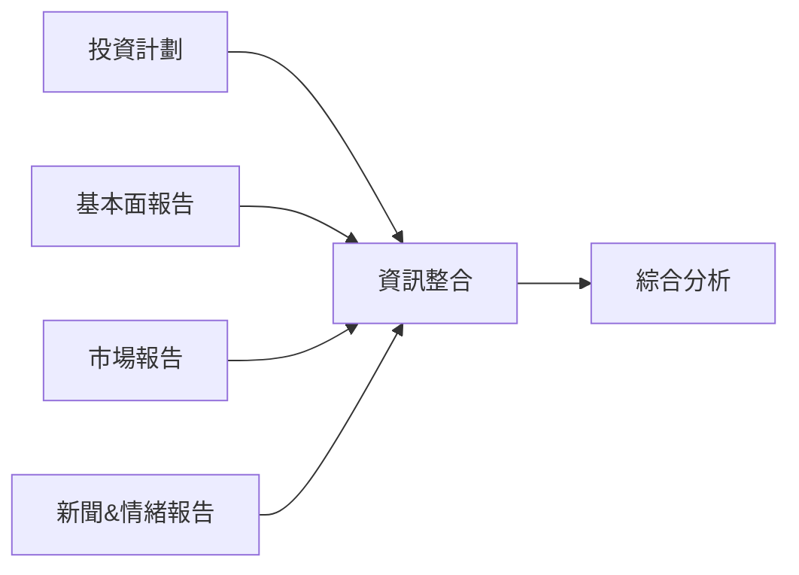
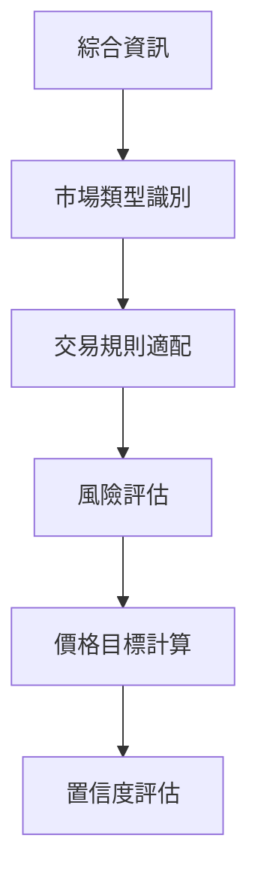
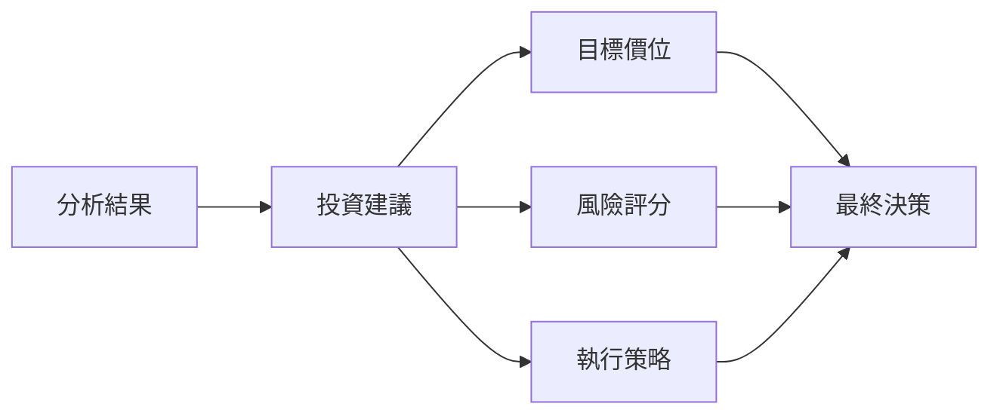

# 交易員

## 概述

交易員是 TradingAgents 框架的執行層核心，負責基於研究員團隊的辯論結果和管理層的投資計劃，生成具體的投資建議和交易決策。交易員將所有前期分析和決策轉化為可執行的投資行動，包括具體的目標價位、置信度評估和風險評分。

## 交易員架構

### 基礎設計

交易員基於統一的架構設計，集成了多維度分析能力和決策執行功能：

```python
# 統一的交易員模組日誌裝飾器
from tradingagents.utils.tool_logging import log_trader_module

# 統一日誌系統
from tradingagents.utils.logging_init import get_logger
logger = get_logger("default")

@log_trader_module("trader")
def trader_node(state):
    # 交易員邏輯實現
    pass
```

### 智能體狀態管理

交易員通過 `AgentState` 獲取完整的分析鏈條資訊：

```python
class AgentState:
    company_of_interest: str      # 股票代碼
    trade_date: str              # 交易日期
    fundamentals_report: str     # 基本面報告
    market_report: str           # 市場分析報告
    news_report: str             # 新聞分析報告
    sentiment_report: str        # 情緒分析報告
    investment_plan: str         # 投資計劃
    messages: List              # 消息歷史
```

## 交易員實現

### 核心功能

**檔案位置**: `tradingagents/agents/trader/trader.py`

**核心職責**:
- 綜合分析所有輸入資訊
- 生成具體的投資建議
- 提供目標價位和置信度
- 評估投資風險等級
- 制定執行策略

### 核心實現邏輯

```python
def create_trader(llm):
    @log_trader_module("trader")
    def trader_node(state):
        # 獲取基礎資訊
        company_name = state["company_of_interest"]
        investment_plan = state.get("investment_plan", "")
        
        # 獲取股票市場資訊
        from tradingagents.utils.stock_utils import get_stock_market_info
        market_info = get_stock_market_info(company_name)
        
        # 確定股票類型和貨幣資訊
        if market_info.get("is_us"):
            stock_type = "美股"
            currency_unit = "美元"
        else:
            stock_type = "未知市場"
            currency_unit = "未知貨幣"
        
        # 獲取各類分析報告
        market_report = state.get("market_report", "")
        sentiment_report = state.get("sentiment_report", "")
        news_report = state.get("news_report", "")
        fundamentals_report = state.get("fundamentals_report", "")
        
        # 構建交易決策提示
        trader_prompt = f"""
        作為專業交易員，請基於以下資訊生成投資建議：
        
        公司名稱: {company_name}
        股票類型: {stock_type}
        貨幣單位: {currency_unit}
        
        投資計劃: {investment_plan}
        
        市場研究報告: {market_report}
        情緒報告: {sentiment_report}
        新聞報告: {news_report}
        基本面報告: {fundamentals_report}
        
        請提供：
        1. 明確的投資建議（買入/賣出/持有）
        2. 具體目標價位（以{currency_unit}計價）
        3. 置信度評估（0-100%）
        4. 風險評分（1-10分）
        5. 詳細推理過程
        """
        
        # 調用LLM生成交易決策
        response = llm.invoke(trader_prompt)
        
        return {"trader_recommendation": response.content}
```

## 決策輸入分析

### 多維度資訊整合

交易員需要綜合處理來自多個源頭的資訊：

1. **投資計劃** (`investment_plan`)
   - 來源：研究管理員的綜合決策
   - 內容：基於辯論結果的投資建議
   - 作用：提供決策框架和方向指導

2. **市場研究報告** (`market_report`)
   - 來源：市場分析師
   - 內容：技術指標、價格趨勢、交易信號
   - 作用：提供技術面分析支持

3. **情緒報告** (`sentiment_report`)
   - 來源：社交媒體分析師
   - 內容：投資者情緒、輿論趨勢
   - 作用：評估市場情緒影響

4. **新聞報告** (`news_report`)
   - 來源：新聞分析師
   - 內容：重要新聞事件、政策影響
   - 作用：識別催化因素和風險事件

5. **基本面報告** (`fundamentals_report`)
   - 來源：基本面分析師
   - 內容：財務數據、估值分析
   - 作用：提供價值投資依據

### 資訊權重分配

```python
# 資訊權重配置示例
info_weights = {
    "investment_plan": 0.35,      # 投資計劃權重最高
    "fundamentals_report": 0.25,  # 基本面分析
    "market_report": 0.20,        # 技術分析
    "news_report": 0.15,          # 新聞影響
    "sentiment_report": 0.05       # 情緒分析
}
```

## 股票類型支持

### 美股交易能力

交易員專注於美國股票市場的交易決策：

```python
# 市場資訊獲取和處理
from tradingagents.utils.stock_utils import get_stock_market_info
market_info = get_stock_market_info(company_name)

# 美股交易策略
if market_info.get("is_us"):
    trading_hours = "09:30-16:00 (EST)"
    price_limit = "無漲跌停限制"
    settlement = "T+2"
    currency = "美元(USD)"
```

### 美股交易策略特色

**美股市場特色**:
- 盤前盤後交易
- 期權策略考慮
- 機構投資者主導
- 全球經濟影響
- 美聯儲政策敏感性
- 行業輪動分析

## 決策輸出規範

### 標準輸出格式

交易員必須提供結構化的投資建議：

```python
class TradingRecommendation:
    action: str              # 投資行動 (買入/賣出/持有)
    target_price: float      # 目標價位
    confidence: float        # 置信度 (0-100%)
    risk_score: int          # 風險評分 (1-10)
    reasoning: str           # 詳細推理
    time_horizon: str        # 投資時間框架
    stop_loss: float         # 止損價位
    take_profit: float       # 止盈價位
```

### 強制要求

根據代碼實現，交易員必須提供：

1. **具體目標價位**
   - 必須以相應貨幣單位計價
   - 基於綜合分析的合理估值
   - 考慮市場流動性和交易成本

2. **置信度評估**
   - 0-100%的數值範圍
   - 反映決策的確定性程度
   - 基於資訊品質和分析深度

3. **風險評分**
   - 1-10分的評分體系
   - 1分為最低風險，10分為最高風險
   - 綜合考慮各類風險因素

4. **詳細推理**
   - 完整的決策邏輯鏈條
   - 關鍵假設和依據說明
   - 風險因素識別和應對

## 決策流程

### 1. 資訊收集階段



### 2. 分析處理階段



### 3. 決策生成階段



## 風險管理

### 風險評估維度

1. **市場風險**:
   - 系統性風險評估
   - 行業周期風險
   - 流動性風險
   - 波動率風險

2. **信用風險**:
   - 公司財務風險
   - 債務違約風險
   - 管理層風險
   - 治理結構風險

3. **操作風險**:
   - 交易執行風險
   - 技術系統風險
   - 人為操作風險
   - 合規風險

4. **特殊風險**:
   - 政策監管風險
   - 匯率風險
   - 地緣政治風險
   - 黑天鵝事件

### 風險控制措施

```python
# 風險控制參數
risk_controls = {
    "max_position_size": 0.05,    # 最大倉位比例
    "stop_loss_ratio": 0.08,      # 止損比例
    "take_profit_ratio": 0.15,    # 止盈比例
    "max_drawdown": 0.10,         # 最大回撤
    "correlation_limit": 0.70     # 相關性限制
}
```

## 性能評估

### 關鍵指標

1. **準確性指標**:
   - 預測準確率
   - 目標價位達成率
   - 方向判斷正確率
   - 時間框架準確性

2. **收益指標**:
   - 絕對收益率
   - 相對基準收益
   - 風險調整收益
   - 夏普比率

3. **風險指標**:
   - 最大回撤
   - 波動率
   - VaR值
   - 風險評分準確性

### 性能監控

```python
# 交易性能追蹤
class TradingPerformance:
    def __init__(self):
        self.trades = []
        self.accuracy_rate = 0.0
        self.total_return = 0.0
        self.max_drawdown = 0.0
        self.sharpe_ratio = 0.0
    
    def update_performance(self, trade_result):
        # 更新性能指標
        pass
    
    def generate_report(self):
        # 生成性能報告
        pass
```

## 配置選項

### 交易員配置

```python
trader_config = {
    "risk_tolerance": "moderate",     # 風險容忍度
    "investment_style": "balanced",   # 投資風格
    "time_horizon": "medium",         # 投資時間框架
    "position_sizing": "kelly",       # 倉位管理方法
    "rebalance_frequency": "weekly"   # 再平衡頻率
}
```

### 市場配置

```python
market_config = {
    "trading_hours": {
        "us": "09:30-16:00"
    },
    "settlement_days": {
        "us": 2
    },
    "commission_rates": {
        "us": 0.0005
    }
}
```

## 日誌和監控

### 詳細日誌記錄

```python
# 交易員活動日誌
logger.info(f"💼 [交易員] 開始分析股票: {company_name}")
logger.info(f"📈 [交易員] 股票類型: {stock_type}, 貨幣: {currency_unit}")
logger.debug(f"📊 [交易員] 投資計劃: {investment_plan[:100]}...")
logger.info(f"🎯 [交易員] 生成投資建議完成")
```

### 決策追蹤

```python
# 決策過程記錄
decision_log = {
    "timestamp": datetime.now(),
    "ticker": company_name,
    "market_type": stock_type,
    "input_reports": {
        "fundamentals": len(fundamentals_report),
        "market": len(market_report),
        "news": len(news_report),
        "sentiment": len(sentiment_report)
    },
    "decision": {
        "action": action,
        "target_price": target_price,
        "confidence": confidence,
        "risk_score": risk_score
    }
}
```

## 擴展指南

### 添加新的交易策略

1. **創建策略類**
```python
class CustomTradingStrategy:
    def __init__(self, config):
        self.config = config
    
    def generate_recommendation(self, state):
        # 自定義交易邏輯
        pass
    
    def calculate_position_size(self, confidence, risk_score):
        # 倉位計算邏輯
        pass
```

2. **集成到交易員**
```python
# 在trader.py中添加策略選擇
strategy_map = {
    "conservative": ConservativeStrategy(),
    "aggressive": AggressiveStrategy(),
    "custom": CustomTradingStrategy()
}

strategy = strategy_map.get(config.get("strategy", "balanced"))
```

### 添加新的風險模型

1. **實現風險模型接口**
```python
class RiskModel:
    def calculate_risk_score(self, market_data, fundamentals):
        pass
    
    def estimate_var(self, position, confidence_level):
        pass
    
    def suggest_position_size(self, risk_budget, expected_return):
        pass
```

2. **註冊風險模型**
```python
risk_models = {
    "var": VaRRiskModel(),
    "monte_carlo": MonteCarloRiskModel(),
    "factor": FactorRiskModel()
}
```

## 最佳實踐

### 1. 決策一致性
- 保持決策邏輯的一致性
- 避免情緒化決策
- 基於數據和分析
- 記錄決策依據

### 2. 風險控制
- 嚴格執行止損策略
- 分散投資風險
- 定期評估風險敞口
- 及時調整倉位

### 3. 性能優化
- 持續監控交易表現
- 定期回測策略效果
- 優化決策模型
- 學習市場變化

### 4. 合規管理
- 遵守交易規則
- 滿足監管要求
- 保持透明度
- 記錄完整審計軌跡

## 故障排除

### 常見問題

1. **決策品質問題**
   - 檢查輸入數據品質
   - 驗證分析邏輯
   - 調整權重配置
   - 增加驗證步驟

2. **風險控制失效**
   - 檢查風險參數設置
   - 驗證止損機制
   - 評估相關性計算
   - 更新風險模型

3. **性能問題**
   - 優化決策算法
   - 減少計算複雜度
   - 啟用結果快取
   - 並行處理分析

### 調試技巧

1. **決策過程追蹤**
```python
logger.debug(f"輸入資訊完整性: {check_input_completeness(state)}")
logger.debug(f"市場資訊: {market_info}")
logger.debug(f"決策權重: {info_weights}")
```

2. **結果驗證**
```python
logger.debug(f"目標價位合理性: {validate_target_price(target_price)}")
logger.debug(f"風險評分一致性: {validate_risk_score(risk_score)}")
```

3. **性能監控**
```python
import time
start_time = time.time()
# 執行交易決策
end_time = time.time()
logger.debug(f"決策耗時: {end_time - start_time:.2f}秒")
```

交易員作為TradingAgents框架的最終執行層，承擔着將所有分析和研究轉化為具體投資行動的重要職責，其決策品質直接影響整個系統的投資表現。