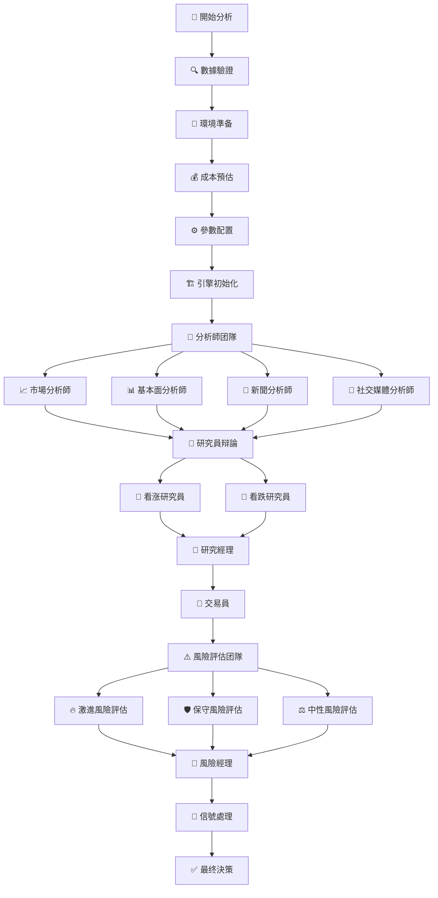

# 📊 TradingAgents 分析節點和工具完整指南

## 📋 概述

TradingAgents 採用多智能體協作架構，通過專業分工和結構化流程實現全面的股票分析。本文档詳細介紹了系統中的所有分析節點、工具配置以及數據流轉過程。

## 🔄 完整分析流程

### 流程圖


### 執行顺序
1. **初始化階段** (步骤1-5): 系統準备和配置
2. **分析師階段** (步骤6): 並行數據分析
3. **研究階段** (步骤7-8): 觀點辩論和共识形成
4. **決策階段** (步骤9-11): 交易決策和風險評估
5. **輸出階段** (步骤12-13): 信號處理和最终決策

## 👥 分析節點詳細說明

### 🔍 1. 分析師团隊 (Analysts)

#### 📈 市場分析師 (Market Analyst)
**職责**: 技術分析、價格趋势、市場情绪

**核心功能**:
- 技術指標計算 (MA, RSI, MACD, 布林帶)
- 價格趋势识別
- 支撑阻力位分析
- 成交量分析
- 交易信號生成

**使用工具**:
```python
# 主要工具
- get_stock_market_data_unified    # 統一市場數據 (推薦)
- get_YFin_data_online            # Yahoo Finance 在線數據
- get_stockstats_indicators_report_online  # 在線技術指標

# 备用工具
- get_YFin_data                   # Yahoo Finance 離線數據
- get_stockstats_indicators_report # 離線技術指標
```

**數據源映射**:
- **A股**: Tushare + AKShare 技術指標
- **港股**: AKShare + Yahoo Finance
- **美股**: Yahoo Finance + FinnHub

#### 📊 基本面分析師 (Fundamentals Analyst)
**職责**: 財務分析、估值模型、基本面指標

**核心功能**:
- 財務報表分析
- DCF估值模型
- 比較估值法 (P/E, P/B, EV/EBITDA)
- 行業基準對比
- 盈利质量評估

**使用工具**:
```python
# 主要工具
- get_stock_fundamentals_unified   # 統一基本面分析 (推薦)

# 補充工具
- get_finnhub_company_insider_sentiment      # 內部人士情绪
- get_finnhub_company_insider_transactions   # 內部人士交易
- get_simfin_balance_sheet        # 資產负债表
- get_simfin_cashflow            # 現金流量表
- get_simfin_income_stmt         # 利润表
```

**數據源映射**:
- **A股**: Tushare 財務數據 + AKShare 基本面
- **港股**: AKShare 基本面數據
- **美股**: FinnHub + SimFin 財務數據

#### 📰 新聞分析師 (News Analyst)
**職责**: 新聞事件分析、宏觀經濟影響評估

**核心功能**:
- 實時新聞監控
- 事件影響評估
- 宏觀經濟分析
- 政策影響分析
- 行業動態跟蹤

**使用工具**:
```python
# 在線工具
- get_realtime_stock_news         # 實時股票新聞
- get_global_news_openai         # 全球新聞 (OpenAI)
- get_google_news               # Google 新聞

# 離線工具
- get_finnhub_news              # FinnHub 新聞
- get_reddit_news               # Reddit 新聞
```

#### 💬 社交媒體分析師 (Social Media Analyst)
**職责**: 社交媒體情绪、投資者情绪分析

**核心功能**:
- 投資者情绪監控
- 社交媒體熱度分析
- 意见領袖觀點跟蹤
- 散戶情绪評估
- 情绪價格影響分析

**使用工具**:
```python
# 在線工具
- get_stock_news_openai          # 股票新聞情绪 (OpenAI)

# 離線工具
- get_reddit_stock_info          # Reddit 股票討論
- get_chinese_social_sentiment   # 中國社交媒體情绪
```

### 🎯 2. 研究員团隊 (Researchers)

#### 🐂 看涨研究員 (Bull Researcher)
**職责**: 從乐觀角度評估投資機會

**分析重點**:
- 增長潜力和市場機會
- 競爭優势和護城河
- 積極催化剂识別
- 估值吸引力評估
- 反驳看跌觀點

**工作方式**: 基於LLM推理，結合歷史記忆和經驗

#### 🐻 看跌研究員 (Bear Researcher)
**職责**: 從悲觀角度評估投資風險

**分析重點**:
- 潜在風險因素识別
- 市場威胁和挑战
- 负面催化剂評估
- 估值過高風險
- 反驳看涨觀點

**工作方式**: 基於LLM推理，結合歷史記忆和經驗

### 👔 3. 管理層 (Managers)

#### 🎯 研究經理 (Research Manager)
**職责**: 協調研究員辩論，形成研究共识

**核心功能**:
- 主持看涨/看跌研究員辩論
- 評估雙方論點质量和說服力
- 平衡不同觀點
- 形成综合投資建议
- 质量控制和標準制定

**決策逻辑**:
```python
# 評估標準
- 論點逻辑性和證據支持
- 數據质量和可靠性
- 風險收益平衡
- 市場時機判斷
- 歷史經驗參考
```

#### ⚖️ 風險經理 (Risk Manager)
**職责**: 管理整體風險控制流程

**核心功能**:
- 協調風險評估团隊工作
- 制定風險管理政策
- 監控關键風險指標
- 做出最终風險決策
- 風險限額管理

### 💰 4. 交易執行 (Trading)

#### 💼 交易員 (Trader)
**職责**: 制定最终交易決策

**決策輸入**:
- 所有分析師報告
- 研究員辩論結果
- 風險評估結論
- 市場條件評估
- 歷史交易經驗

**輸出內容**:
```python
# 交易建议格式
{
    "action": "买入/持有/卖出",
    "confidence": "置信度 (1-10)",
    "target_price": "目標價格",
    "stop_loss": "止損價格",
    "position_size": "建议仓位",
    "time_horizon": "投資期限",
    "reasoning": "決策理由"
}
```

### ⚠️ 5. 風險管理团隊 (Risk Management)

#### 🔥 激進風險評估 (Risky Analyst)
**風險偏好**: 高風險高收益
**關註點**: 最大化收益潜力，接受較高波動

#### 🛡️ 保守風險評估 (Safe Analyst)
**風險偏好**: 低風險穩健
**關註點**: 資本保護，風險最小化

#### ⚖️ 中性風險評估 (Neutral Analyst)
**風險偏好**: 平衡風險收益
**關註點**: 理性評估，適中風險

### 🔧 6. 信號處理 (Signal Processing)

#### 📡 信號處理器 (Signal Processor)
**職责**: 整合所有智能體輸出，生成最终決策

**處理流程**:
1. 收集所有智能體輸出
2. 權重分配和重要性評估
3. 冲突解決和一致性檢查
4. 生成結構化投資信號
5. 輸出最终決策建议

## 🔧 統一工具架構

### 🎯 核心優势

#### 智能路由
```python
# 自動识別股票類型並路由到最佳數據源
get_stock_market_data_unified(ticker, start_date, end_date)
get_stock_fundamentals_unified(ticker, start_date, end_date)
```

#### 數據源映射
| 股票類型 | 市場數據 | 基本面數據 | 新聞數據 |
|---------|---------|-----------|---------|
| **A股** | Tushare + AKShare | Tushare + AKShare | 財聯社 + 新浪財經 |
| **港股** | AKShare + Yahoo | AKShare | Google News |
| **美股** | Yahoo + FinnHub | FinnHub + SimFin | FinnHub + Google |

### 🔄 工具調用機制

每個分析師都遵循LangGraph的工具調用循環：

```python
# 工具調用循環
分析師節點 → 條件判斷 → 工具節點 → 回到分析師節點
    ↓           ↓           ↓           ↓
  決定調用工具  → 檢查工具調用 → 執行數據獲取 → 處理數據生成報告
```

**循環說明**:
1. **第一轮**: 分析師決定需要什么數據 → 調用相應工具
2. **第二轮**: 分析師處理獲取的數據 → 生成分析報告
3. **完成**: 没有更多工具調用需求 → 進入下一個分析師

## 🧠 LLM工具選擇逻辑

### 🎯 核心選擇機制

LLM並不會調用ToolNode中的所有工具，而是基於以下逻辑智能選擇：

#### 1️⃣ 系統提示詞的明確指導
```python
# 市場分析師的系統提示詞
**工具調用指令：**
你有一個工具叫做get_stock_market_data_unified，你必须立即調用這個工具來獲取{company_name}（{ticker}）的市場數據。
不要說你将要調用工具，直接調用工具。
```

#### 2️⃣ 工具描述的匹配度
| 工具名稱 | 描述 | 參數複雜度 | 匹配度 |
|---------|------|-----------|--------|
| `get_stock_market_data_unified` | **統一的股票市場數據工具，自動识別股票類型** | 簡單(3個參數) | ⭐⭐⭐⭐⭐ |
| `get_YFin_data_online` | Retrieve stock price data from Yahoo Finance | 簡單(3個參數) | ⭐⭐⭐ |
| `get_stockstats_indicators_report_online` | Retrieve stock stats indicators | 複雜(4個參數) | ⭐⭐ |

#### 3️⃣ 工具名稱的語義理解
- `unified` = 統一的，全面的
- `online` = 在線的，實時的
- `indicators` = 指標，更專業

#### 4️⃣ 參數簡潔性偏好
```python
# 統一工具 - 3個參數，簡單明了
get_stock_market_data_unified(ticker, start_date, end_date)

# 技術指標工具 - 4個參數，需要額外指定indicator
get_stockstats_indicators_report_online(symbol, indicator, curr_date, look_back_days)
```

### 🔍 LLM的決策過程

```
1. 任務理解: "需要對股票進行技術分析"
2. 工具扫描: 查看可用的5個工具
3. 描述匹配: "統一工具"最符合"全面分析"需求
4. 指令遵循: 系統提示明確要求調用unified工具
5. 參數簡單: unified工具參數最簡潔
6. 決策結果: 選擇get_stock_market_data_unified
```

### 🎯 工具池的分層設計

ToolNode中的多個工具形成**分層备用體系**：

```
第1層: get_stock_market_data_unified (首選)
第2層: get_YFin_data_online (在線备用)
第3層: get_stockstats_indicators_report_online (專業备用)
第4層: get_YFin_data (離線备用)
第5層: get_stockstats_indicators_report (最後备用)
```

### 📊 實际調用驗證

**A股分析日誌示例**:
```
📊 [DEBUG] 選擇的工具: ['get_stock_market_data_unified']
📊 [市場分析師] 工具調用: ['get_stock_market_data_unified']
📈 [統一市場工具] 分析股票: 000858
📈 [統一市場工具] 股票類型: 中國A股
🇨🇳 [統一市場工具] 處理A股市場數據...
```

**結論**: LLM實际只調用1個工具，而非所有5個工具！

## 🔄 基本面分析師的多轮調用機制

### ❓ 為什么基本面分析師會多轮調用？

与市場分析師不同，基本面分析師有一個特殊的**强制工具調用機制**，這是為了解決某些LLM（特別是阿里百炼）不調用工具的問題。

### 🔧 多轮調用的具體流程

#### 第1轮：正常工具調用嘗試
```python
# 基本面分析師首先嘗試让LLM自主調用工具
result = chain.invoke(state["messages"])

if hasattr(result, 'tool_calls') and len(result.tool_calls) > 0:
    # ✅ LLM成功調用了工具
    logger.info(f"📊 [基本面分析師] 工具調用: {tool_calls_info}")
    return {"messages": [result]}  # 進入工具執行階段
```

#### 第2轮：工具執行
```python
# LangGraph執行工具調用，獲取數據
tool_result = get_stock_fundamentals_unified.invoke(args)
# 返回到分析師節點處理數據
```

#### 第3轮：數據處理和報告生成
```python
# 分析師處理工具返回的數據，生成最终報告
final_result = llm.invoke(messages_with_tool_data)
return {"fundamentals_report": final_result.content}
```

#### 🚨 强制工具調用機制（备用方案）
```python
else:
    # ❌ LLM没有調用工具，啟動强制機制
    logger.debug(f"📊 [DEBUG] 檢測到模型未調用工具，啟用强制工具調用模式")

    # 直接調用工具獲取數據
    unified_tool = find_tool('get_stock_fundamentals_unified')
    combined_data = unified_tool.invoke({
        'ticker': ticker,
        'start_date': start_date,
        'end_date': current_date,
        'curr_date': current_date
    })

    # 使用獲取的數據重新生成分析報告
    analysis_prompt = f"基於以下真實數據，對{company_name}進行詳細的基本面分析：\n{combined_data}"
    final_result = llm.invoke(analysis_prompt)

    return {"fundamentals_report": final_result.content}
```

### 📊 多轮調用的日誌示例

**正常情况（3轮）**:
```
📊 [模塊開始] fundamentals_analyst - 股票: 000858
📊 [基本面分析師] 工具調用: ['get_stock_fundamentals_unified']  # 第1轮：決定調用工具
📊 [統一基本面工具] 分析股票: 000858                           # 第2轮：執行工具
📊 [模塊完成] fundamentals_analyst - ✅ 成功 - 耗時: 45.32s    # 第3轮：生成報告
```

**强制調用情况（可能更多轮）**:
```
📊 [模塊開始] fundamentals_analyst - 股票: 000858
📊 [DEBUG] 檢測到模型未調用工具，啟用强制工具調用模式          # 第1轮：LLM未調用工具
📊 [DEBUG] 强制調用 get_stock_fundamentals_unified...        # 第2轮：强制調用工具
📊 [統一基本面工具] 分析股票: 000858                         # 第3轮：執行工具
📊 [基本面分析師] 强制工具調用完成，報告長度: 1847            # 第4轮：重新生成報告
📊 [模塊完成] fundamentals_analyst - ✅ 成功 - 耗時: 52.18s  # 完成
```

### 🎯 為什么需要强制工具調用？

#### 1️⃣ LLM模型差異
不同LLM對工具調用的理解和執行能力不同：
- **GPT系列**: 工具調用能力强，很少需要强制調用
- **Claude系列**: 工具調用穩定，偶爾需要强制調用
- **阿里百炼**: 早期版本工具調用不穩定，經常需要强制調用
- **DeepSeek**: 工具調用能力中等，偶爾需要强制調用

#### 2️⃣ 提示詞複雜度
基本面分析的提示詞比市場分析更複雜，包含更多約束條件，可能導致LLM"忘記"調用工具。

#### 3️⃣ 數據质量保證
强制工具調用確保即使LLM不主動調用工具，也能獲取真實數據進行分析，避免"編造"數據。

### 🔧 優化建议

#### 1️⃣ 提示詞優化
```python
# 更明確的工具調用指令
"🔴 立即調用 get_stock_fundamentals_unified 工具"
"📊 分析要求：基於真實數據進行深度基本面分析"
"🚫 嚴格禁止：不允許假設任何數據"
```

#### 2️⃣ 模型選擇
- 優先使用工具調用能力强的模型
- 為不同模型配置不同的提示詞策略

#### 3️⃣ 監控和日誌
- 記錄强制工具調用的頻率
- 分析哪些模型需要更多强制調用
- 優化提示詞减少强制調用需求

## 📊 配置和自定義

### 分析師選擇
```python
# 可選的分析師類型
selected_analysts = [
    "market",        # 市場分析師
    "fundamentals",  # 基本面分析師  
    "news",         # 新聞分析師
    "social"        # 社交媒體分析師
]
```

### 研究深度配置
```python
# 研究深度級別
research_depth = {
    1: "快速分析",    # 减少工具調用，使用快速模型
    2: "基础分析",    # 標準配置
    3: "深度分析"     # 增加辩論轮次，使用深度思考模型
}
```

### 風險管理配置
```python
# 風險管理參數
risk_config = {
    "max_debate_rounds": 2,           # 最大辩論轮次
    "max_risk_discuss_rounds": 1,     # 最大風險討論轮次
    "memory_enabled": True,           # 啟用歷史記忆
    "online_tools": True              # 使用在線工具
}
```

## 🎯 流程合理性評估

### ✅ 優點
1. **專業分工明確**: 每個智能體職责清晰，避免重複工作
2. **多角度全覆蓋**: 技術面、基本面、情绪面、新聞面全方位分析
3. **辩論機制平衡**: 看涨/看跌研究員提供對立觀點，避免偏见
4. **分層風險控制**: 多層次風險評估，確保決策穩健性
5. **統一工具架構**: 自動適配不同市場，簡化維護
6. **記忆學习機制**: 從歷史決策中學习，持续改進

### ⚠️ 改進建议
1. **並行化優化**: 某些分析師可以並行執行，提高效率
2. **緩存機制**: 避免重複API調用，降低成本
3. **時間控制**: 為每個節點設置超時機制
4. **動態權重**: 根據市場條件動態調整各分析師權重
5. **實時監控**: 增加分析過程的實時監控和干預機制

## 🛠️ 實际使用示例

### 基本使用
```python
from tradingagents.graph.trading_graph import TradingAgentsGraph

# 創建分析圖
graph = TradingAgentsGraph(
    selected_analysts=["market", "fundamentals"],
    config={
        "llm_provider": "dashscope",
        "research_depth": 2,
        "online_tools": True
    }
)

# 執行分析
state, decision = graph.propagate("000858", "2025-01-17")
print(f"投資建议: {decision['action']}")
```

### 自定義分析師組合
```python
# 快速技術分析
quick_analysis = ["market"]

# 全面基本面分析
fundamental_analysis = ["fundamentals", "news"]

# 完整分析 (推薦)
complete_analysis = ["market", "fundamentals", "news", "social"]
```

## 🔍 工具調用示例

### 統一工具調用
```python
# 市場數據獲取
market_data = toolkit.get_stock_market_data_unified.invoke({
    'ticker': '000858',
    'start_date': '2025-01-01',
    'end_date': '2025-01-17'
})

# 基本面數據獲取
fundamentals = toolkit.get_stock_fundamentals_unified.invoke({
    'ticker': '000858',
    'start_date': '2025-01-01',
    'end_date': '2025-01-17',
    'curr_date': '2025-01-17'
})
```

### 工具調用日誌示例
```
📊 [模塊開始] market_analyst - 股票: 000858
📊 [市場分析師] 工具調用: ['get_stock_market_data_unified']
📊 [統一市場工具] 檢測到A股代碼: 000858
📊 [統一市場工具] 使用Tushare數據源
📊 [模塊完成] market_analyst - ✅ 成功 - 耗時: 41.73s
```

## ❓ 常见問題

### Q: 為什么會看到重複的分析師調用？
A: 這是LangGraph的正常工作機制。每個分析師遵循"分析師→工具→分析師"的循環，直到完成所有必要的數據獲取和分析。

### Q: 如何選擇合適的分析師組合？
A:
- **快速分析**: 只選擇market分析師
- **基本面重點**: fundamentals + news
- **全面分析**: market + fundamentals + news + social

### Q: 統一工具如何選擇數據源？
A: 系統自動识別股票代碼格式：
- 6位數字 → A股 → Tushare/AKShare
- .HK後缀 → 港股 → AKShare/Yahoo
- 字母代碼 → 美股 → FinnHub/Yahoo

### Q: 分析時間過長怎么办？
A:
1. 降低research_depth (1=快速, 2=標準, 3=深度)
2. 减少分析師數量
3. 檢查網絡連接和API限額

### Q: 如何理解最终決策輸出？
A: 最终決策包含：
- **action**: 买入/持有/卖出
- **confidence**: 置信度(1-10分)
- **target_price**: 目標價格
- **reasoning**: 詳細分析理由

### Q: DashScope API密鑰未配置會有什么影響？
A:
- **記忆功能被禁用**: 看涨/看跌研究員無法使用歷史經驗
- **系統仍可正常運行**: 所有分析功能正常，只是没有歷史記忆
- **自動降級**: 系統會自動檢測並優雅降級，不會崩潰
- **建议**: 配置DASHSCOPE_API_KEY以獲得完整功能

### Q: DashScope API調用異常時如何處理？
A: 系統具有完善的異常處理機制：
- **網絡錯誤**: 自動降級，返回空向量
- **API限額超出**: 優雅降級，記忆功能禁用
- **密鑰無效**: 自動檢測，切換到降級模式
- **服務不可用**: 系統繼续運行，不影響分析功能
- **包未安裝**: 自動檢測dashscope包，缺失時禁用記忆功能

### Q: 如何測試記忆系統的降級機制？
A: 運行降級測試工具：
```bash
python test_memory_fallback.py
```
该工具會測試各種異常情况下的系統行為。

### Q: 如何檢查API配置狀態？
A: 運行配置檢查工具：
```bash
python scripts/check_api_config.py
```
该工具會檢查所有API密鑰配置狀態並提供建议。

## 📈 性能優化建议

### 1. 緩存策略
```python
# 啟用數據緩存
config = {
    "cache_enabled": True,
    "cache_duration": 3600,  # 1小時
    "force_refresh": False
}
```

### 2. 並行執行
```python
# 某些分析師可以並行執行
parallel_analysts = ["news", "social"]  # 可並行
sequential_analysts = ["market", "fundamentals"]  # 需顺序
```

### 3. 超時控制
```python
# 設置超時時間
config = {
    "max_execution_time": 300,  # 5分鐘
    "tool_timeout": 30,         # 工具調用30秒超時
    "llm_timeout": 60          # LLM調用60秒超時
}
```

## 📊 監控和調試

### 日誌級別配置
```python
import logging

# 設置詳細日誌
logging.getLogger('agents').setLevel(logging.DEBUG)
logging.getLogger('tools').setLevel(logging.INFO)
```

### 進度監控
```python
# 使用異步進度跟蹤
from web.utils.async_progress_tracker import AsyncProgressTracker

tracker = AsyncProgressTracker(
    analysis_id="analysis_123",
    analysts=["market", "fundamentals"],
    research_depth=2,
    llm_provider="dashscope"
)
```

## 🔮 未來發展方向

### 1. 智能體擴展
- **量化分析師**: 基於數學模型的量化分析
- **宏觀分析師**: 宏觀經濟和政策分析
- **行業分析師**: 特定行業深度分析

### 2. 工具增强
- **實時數據流**: WebSocket實時數據推送
- **多語言支持**: 支持更多國际市場
- **AI增强**: 集成更先進的AI模型

### 3. 性能優化
- **分布式執行**: 支持多機器並行分析
- **智能緩存**: 基於AI的智能緩存策略
- **自適應配置**: 根據市場條件自動調整參數

## 📚 相關文档

- [系統架構文档](./architecture/system-architecture.md)
- [智能體架構文档](./architecture/agent-architecture.md)
- [進度跟蹤說明](./progress-tracking-explanation.md)
- [API參考文档](./api/api-reference.md)
- [部署指南](./deployment/deployment-guide.md)
- [故障排除](./troubleshooting/common-issues.md)

---

*本文档描述了TradingAgents v0.1.7的分析節點和工具配置。系統持续更新中，最新信息請參考GitHub仓庫。*
