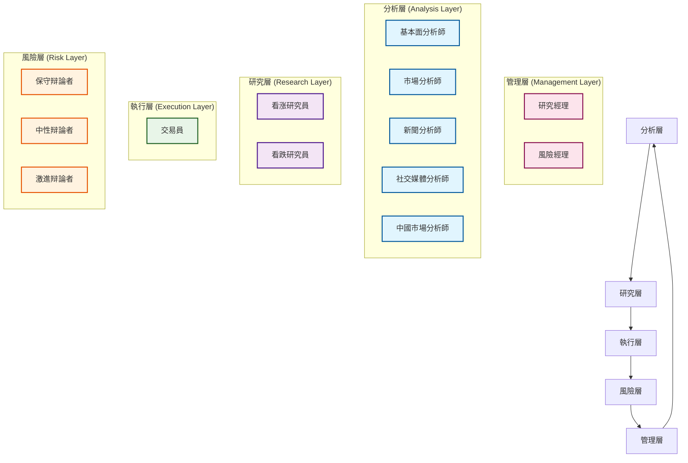

# TradingAgents 智能體架構

## 概述

TradingAgents 採用多智能體協作架構，模擬真實金融機構的团隊協作模式。每個智能體都有明確的職责分工，通過狀態共享和消息傳遞實現協作決策。本文档基於實际代碼結構，詳細描述了智能體的架構設計和實現細節。

## 🏗️ 智能體層次結構

### 架構層次

TradingAgents 採用5層智能體架構，每層專註於特定的功能領域：



### 層次職责

- **分析層**: 负责數據收集和初步分析
- **研究層**: 進行深度研究和觀點辩論
- **執行層**: 制定具體的交易決策
- **風險層**: 評估和管理投資風險
- **管理層**: 協調決策和最终審批

## 🔧 智能體狀態管理

### AgentState 核心狀態類

基於實际代碼 `tradingagents/agents/utils/agent_states.py`，系統使用 `AgentState` 類管理所有智能體的共享狀態：

```python
from typing import Annotated
from langgraph.graph import MessagesState

class AgentState(MessagesState):
    """智能體狀態管理類 - 繼承自 LangGraph MessagesState"""
    
    # 基础信息
    company_of_interest: Annotated[str, "目標分析公司股票代碼"]
    trade_date: Annotated[str, "交易日期"]
    sender: Annotated[str, "發送消息的智能體"]
    
    # 分析師報告
    market_report: Annotated[str, "市場分析師報告"]
    sentiment_report: Annotated[str, "社交媒體分析師報告"]
    news_report: Annotated[str, "新聞分析師報告"]
    fundamentals_report: Annotated[str, "基本面分析師報告"]
    
    # 研究和決策
    investment_debate_state: Annotated[InvestDebateState, "投資辩論狀態"]
    investment_plan: Annotated[str, "投資計劃"]
    trader_investment_plan: Annotated[str, "交易員投資計劃"]
    
    # 風險管理
    risk_debate_state: Annotated[RiskDebateState, "風險辩論狀態"]
    final_trade_decision: Annotated[str, "最终交易決策"]
```

### 辩論狀態管理

#### 投資辩論狀態

```python
class InvestDebateState(TypedDict):
    """研究員团隊辩論狀態"""
    bull_history: Annotated[str, "看涨方對話歷史"]
    bear_history: Annotated[str, "看跌方對話歷史"]
    history: Annotated[str, "完整對話歷史"]
    current_response: Annotated[str, "最新回應"]
    judge_decision: Annotated[str, "最终判決"]
    count: Annotated[int, "對話轮次計數"]
```

#### 風險辩論狀態

```python
class RiskDebateState(TypedDict):
    """風險管理团隊辩論狀態"""
    risky_history: Annotated[str, "激進分析師對話歷史"]
    safe_history: Annotated[str, "保守分析師對話歷史"]
    neutral_history: Annotated[str, "中性分析師對話歷史"]
    history: Annotated[str, "完整對話歷史"]
    latest_speaker: Annotated[str, "最後發言的分析師"]
    current_risky_response: Annotated[str, "激進分析師最新回應"]
    current_safe_response: Annotated[str, "保守分析師最新回應"]
    current_neutral_response: Annotated[str, "中性分析師最新回應"]
    judge_decision: Annotated[str, "判決結果"]
    count: Annotated[int, "對話轮次計數"]
```

## 🤖 智能體實現架構

### 分析師团隊 (Analysis Layer)

#### 1. 基本面分析師

**文件位置**: `tradingagents/agents/analysts/fundamentals_analyst.py`

```python
from tradingagents.utils.tool_logging import log_analyst_module
from tradingagents.utils.logging_init import get_logger

def create_fundamentals_analyst(llm, toolkit):
    @log_analyst_module("fundamentals")
    def fundamentals_analyst_node(state):
        """基本面分析師節點實現"""
        logger = get_logger("default")
        
        # 獲取輸入參數
        current_date = state["trade_date"]
        ticker = state["company_of_interest"]
        
        # 股票類型檢測
        from tradingagents.utils.stock_utils import StockUtils
        market_info = StockUtils.get_market_info(ticker)
        
        # 選擇合適的分析工具
        if toolkit.config["online_tools"]:
            tools = [toolkit.get_stock_fundamentals_unified]
        else:
            # 離線模式工具選擇
            tools = [toolkit.get_fundamentals_openai]
        
        # 執行分析逻辑
        # ...
        
        return state
    
    return fundamentals_analyst_node
```

#### 2. 市場分析師

**文件位置**: `tradingagents/agents/analysts/market_analyst.py`

```python
def create_market_analyst(llm, toolkit):
    @log_analyst_module("market")
    def market_analyst_node(state):
        """市場分析師節點實現"""
        # 技術分析和市場趋势分析
        # ...
        return state
    
    return market_analyst_node
```

#### 3. 新聞分析師

**文件位置**: `tradingagents/agents/analysts/news_analyst.py`

```python
def create_news_analyst(llm, toolkit):
    @log_analyst_module("news")
    def news_analyst_node(state):
        """新聞分析師節點實現"""
        # 新聞情绪分析和事件影響評估
        # ...
        return state
    
    return news_analyst_node
```

#### 4. 社交媒體分析師

**文件位置**: `tradingagents/agents/analysts/social_media_analyst.py`

```python
def create_social_media_analyst(llm, toolkit):
    @log_analyst_module("social_media")
    def social_media_analyst_node(state):
        """社交媒體分析師節點實現"""
        # 社交媒體情绪分析
        # ...
        return state
    
    return social_media_analyst_node
```

#### 5. 中國市場分析師

**文件位置**: `tradingagents/agents/analysts/china_market_analyst.py`

```python
def create_china_market_analyst(llm, toolkit):
    @log_analyst_module("china_market")
    def china_market_analyst_node(state):
        """中國市場分析師節點實現"""
        # 專門针對中國A股市場的分析
        # ...
        return state
    
    return china_market_analyst_node
```

### 研究員团隊 (Research Layer)

#### 1. 看涨研究員

**文件位置**: `tradingagents/agents/researchers/bull_researcher.py`

```python
def create_bull_researcher(llm):
    def bull_researcher_node(state):
        """看涨研究員節點實現"""
        # 基於分析師報告生成看涨觀點
        # ...
        return state
    
    return bull_researcher_node
```

#### 2. 看跌研究員

**文件位置**: `tradingagents/agents/researchers/bear_researcher.py`

```python
def create_bear_researcher(llm):
    def bear_researcher_node(state):
        """看跌研究員節點實現"""
        # 基於分析師報告生成看跌觀點
        # ...
        return state
    
    return bear_researcher_node
```

### 交易員 (Execution Layer)

**文件位置**: `tradingagents/agents/trader/trader.py`

```python
def create_trader(llm, memory):
    def trader_node(state, name):
        """交易員節點實現"""
        # 獲取所有分析報告
        company_name = state["company_of_interest"]
        investment_plan = state["investment_plan"]
        market_research_report = state["market_report"]
        sentiment_report = state["sentiment_report"]
        news_report = state["news_report"]
        fundamentals_report = state["fundamentals_report"]
        
        # 股票類型檢測
        from tradingagents.utils.stock_utils import StockUtils
        market_info = StockUtils.get_market_info(company_name)
        
        # 貨币單位確定
        currency = market_info['currency_name']
        currency_symbol = market_info['currency_symbol']
        
        # 歷史記忆檢索
        if memory is not None:
            past_memories = memory.get_memories(curr_situation, n_matches=2)
        
        # 生成交易決策
        # ...
        
        return state
    
    return trader_node
```

### 風險管理团隊 (Risk Layer)

#### 1. 保守辩論者

**文件位置**: `tradingagents/agents/risk_mgmt/conservative_debator.py`

```python
def create_conservative_debator(llm):
    def conservative_debator_node(state):
        """保守風險辩論者節點實現"""
        # 保守的風險評估觀點
        # ...
        return state
    
    return conservative_debator_node
```

#### 2. 中性辩論者

**文件位置**: `tradingagents/agents/risk_mgmt/neutral_debator.py`

```python
def create_neutral_debator(llm):
    def neutral_debator_node(state):
        """中性風險辩論者節點實現"""
        # 中性的風險評估觀點
        # ...
        return state
    
    return neutral_debator_node
```

#### 3. 激進辩論者

**文件位置**: `tradingagents/agents/risk_mgmt/aggresive_debator.py`

```python
def create_aggressive_debator(llm):
    def aggressive_debator_node(state):
        """激進風險辩論者節點實現"""
        # 激進的風險評估觀點
        # ...
        return state
    
    return aggressive_debator_node
```

### 管理層团隊 (Management Layer)

#### 1. 研究經理

**文件位置**: `tradingagents/agents/managers/research_manager.py`

```python
def create_research_manager(llm):
    def research_manager_node(state):
        """研究經理節點實現"""
        # 協調研究員辩論，形成投資計劃
        # ...
        return state
    
    return research_manager_node
```

#### 2. 風險經理

**文件位置**: `tradingagents/agents/managers/risk_manager.py`

```python
def create_risk_manager(llm):
    def risk_manager_node(state):
        """風險經理節點實現"""
        # 協調風險辩論，做出最终決策
        # ...
        return state
    
    return risk_manager_node
```

## 🔧 智能體工具集成

### 統一工具架構

所有智能體都通過統一的工具接口訪問數據和功能：

```python
class ToolKit:
    """統一工具包"""
    
    def __init__(self, config):
        self.config = config
    
    # 基本面分析工具
    def get_stock_fundamentals_unified(self, ticker: str):
        """統一基本面分析工具，自動识別股票類型"""
        pass
    
    # 市場數據工具
    def get_market_data(self, ticker: str):
        """獲取市場數據"""
        pass
    
    # 新聞數據工具
    def get_news_data(self, ticker: str):
        """獲取新聞數據"""
        pass
```

### 日誌裝饰器系統

系統使用統一的日誌裝饰器來跟蹤智能體執行：

```python
from tradingagents.utils.tool_logging import log_analyst_module

@log_analyst_module("analyst_type")
def analyst_node(state):
    """分析師節點，自動記錄執行日誌"""
    # 智能體逻辑
    pass
```

## 🔄 智能體協作機制

### 狀態傳遞流程

1. **初始化**: 創建 `AgentState` 實例
2. **分析階段**: 各分析師並行執行，更新對應報告字段
3. **研究階段**: 研究員基於分析報告進行辩論
4. **交易階段**: 交易員综合所有信息制定交易計劃
5. **風險階段**: 風險团隊評估交易風險
6. **管理階段**: 管理層做出最终決策

### 消息傳遞機制

智能體通過 `MessagesState` 繼承的消息系統進行通信：

```python
# 添加消息
state["messages"].append({
    "role": "assistant",
    "content": "分析結果",
    "sender": "fundamentals_analyst"
})

# 獲取歷史消息
history = state["messages"]
```

## 🛠️ 工具和實用程序

### 股票工具

**文件位置**: `tradingagents/agents/utils/agent_utils.py`

```python
from tradingagents.utils.stock_utils import StockUtils

# 股票類型檢測
market_info = StockUtils.get_market_info(ticker)
print(f"市場類型: {market_info['market_name']}")
print(f"貨币: {market_info['currency_name']}")
```

### 內存管理

**文件位置**: `tradingagents/agents/utils/memory.py`

```python
class Memory:
    """智能體記忆管理"""
    
    def get_memories(self, query: str, n_matches: int = 2):
        """檢索相關歷史記忆"""
        pass
    
    def add_memory(self, content: str, metadata: dict):
        """添加新記忆"""
        pass
```

### Google工具處理器

**文件位置**: `tradingagents/agents/utils/google_tool_handler.py`

```python
class GoogleToolCallHandler:
    """Google AI 工具調用處理器"""
    
    def handle_tool_calls(self, response, tools, state):
        """處理Google AI的工具調用"""
        pass
```

## 📊 性能監控

### 日誌系統

系統使用統一的日誌系統跟蹤智能體執行：

```python
from tradingagents.utils.logging_init import get_logger

logger = get_logger("default")
logger.info(f"📊 [基本面分析師] 正在分析股票: {ticker}")
logger.debug(f"📊 [DEBUG] 股票類型: {market_info}")
```

### 執行追蹤

每個智能體的執行都會被詳細記錄：

- 輸入參數
- 執行時間
- 輸出結果
- 錯誤信息

## 🚀 擴展指南

### 添加新智能體

1. **創建智能體文件**
```python
# tradingagents/agents/analysts/custom_analyst.py
def create_custom_analyst(llm, toolkit):
    @log_analyst_module("custom")
    def custom_analyst_node(state):
        # 自定義分析逻辑
        return state
    
    return custom_analyst_node
```

2. **更新狀態類**
```python
# 在 AgentState 中添加新字段
custom_report: Annotated[str, "自定義分析師報告"]
```

3. **集成到工作流**
```python
# 在圖構建器中添加節點
workflow.add_node("custom_analyst", create_custom_analyst(llm, toolkit))
```

### 擴展工具集

```python
class ExtendedToolKit(ToolKit):
    def get_custom_data(self, ticker: str):
        """自定義數據獲取工具"""
        pass
```

## 🔧 配置選項

### 智能體配置

```python
agent_config = {
    "online_tools": True,  # 是否使用在線工具
    "memory_enabled": True,  # 是否啟用記忆功能
    "debug_mode": False,  # 調試模式
    "max_iterations": 10,  # 最大迭代次數
}
```

### 日誌配置

```python
logging_config = {
    "level": "INFO",
    "format": "%(asctime)s - %(name)s - %(levelname)s - %(message)s",
    "handlers": ["console", "file"]
}
```

## 🛡️ 最佳實踐

### 1. 狀態管理
- 始终通過 `AgentState` 傳遞數據
- 避免在智能體間直接共享變量
- 使用類型註解確保數據一致性

### 2. 錯誤處理
- 在每個智能體中添加異常處理
- 使用日誌記錄錯誤信息
- 提供降級策略

### 3. 性能優化
- 使用緩存减少重複計算
- 並行執行獨立的智能體
- 監控內存使用情况

### 4. 代碼組織
- 每個智能體獨立文件
- 統一的命名規範
- 清晰的文档註釋

TradingAgents 智能體架構通過清晰的分層設計、統一的狀態管理和灵活的擴展機制，為複雜的金融決策流程提供了强大而可靠的技術基础。