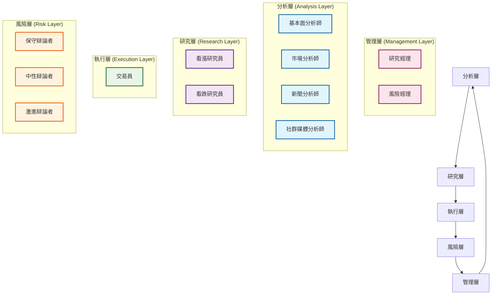

# TradingAgents 智慧體架構

## 概述

TradingAgents 採用多智慧體協作架構，模擬真實金融機構的團隊協作模式。每個智慧體都有明確的職責分工，透過狀態共享和訊息傳遞實現協作決策。

## 🏗️ 智慧體層次結構

### 架構層次

TradingAgents 採用5層智慧體架構，每層專注於特定的功能領域：



### 層次職責

- **分析層**: 負責資料收集和初步分析
- **研究層**: 進行深度研究和觀點辯論
- **執行層**: 制定具體的交易決策
- **風險層**: 評估和管理投資風險
- **管理層**: 協調決策和最終審批

## 🔧 智慧體狀態管理

### AgentState 核心狀態類

基於實際程式碼 `tradingagents/agents/utils/agent_states.py`，系統使用 `AgentState` 類別管理所有智慧體的共享狀態：

```python
from typing import Annotated
from langgraph.graph import MessagesState

class AgentState(MessagesState):
    """智慧體狀態管理類 - 繼承自 LangGraph MessagesState"""

    # 基礎資訊
    company_of_interest: Annotated[str, "目標分析公司股票代號"]
    trade_date: Annotated[str, "交易日期"]
    sender: Annotated[str, "傳送訊息的智慧體"]

    # 分析師報告
    market_report: Annotated[str, "市場分析師報告"]
    sentiment_report: Annotated[str, "社群媒體分析師報告"]
    news_report: Annotated[str, "新聞分析師報告"]
    fundamentals_report: Annotated[str, "基本面分析師報告"]

    # 研究和決策
    investment_debate_state: Annotated[InvestDebateState, "投資辯論狀態"]
    investment_plan: Annotated[str, "投資計劃"]
    trader_investment_plan: Annotated[str, "交易員投資計劃"]

    # 風險管理
    risk_debate_state: Annotated[RiskDebateState, "風險辯論狀態"]
    final_trade_decision: Annotated[str, "最終交易決策"]
```

## 🤖 智慧體實現架構

### 分析師團隊 (Analysis Layer)

#### 1. 基本面分析師

**檔案位置**: `tradingagents/agents/analysts/fundamentals_analyst.py`

```python
from tradingagents.utils.tool_logging import log_analyst_module
from tradingagents.utils.logging_init import get_logger

def create_fundamentals_analyst(llm, toolkit):
    @log_analyst_module("fundamentals")
    def fundamentals_analyst_node(state):
        """基本面分析師節點實作"""
        logger = get_logger("default")

        # 取得輸入參數
        current_date = state["trade_date"]
        ticker = state["company_of_interest"]

        # 選擇合適的分析工具
        if toolkit.config["online_tools"]:
            tools = [toolkit.get_stock_fundamentals_unified]
        else:
            tools = [toolkit.get_fundamentals_openai]

        # 執行分析邏輯
        # ...

        return state

    return fundamentals_analyst_node
```

### 研究員團隊 (Research Layer)

#### 1. 看漲研究員

**檔案位置**: `tradingagents/agents/researchers/bull_researcher.py`

```python
def create_bull_researcher(llm):
    def bull_researcher_node(state):
        """看漲研究員節點實作"""
        # 基於分析師報告產生看漲觀點
        # ...
        return state

    return bull_researcher_node
```

### 交易員 (Execution Layer)

**檔案位置**: `tradingagents/agents/trader/trader.py`

```python
def create_trader(llm, memory):
    def trader_node(state, name):
        """交易員節點實作"""
        # 取得所有分析報告
        company_name = state["company_of_interest"]
        investment_plan = state["investment_plan"]
        market_research_report = state["market_report"]
        sentiment_report = state["sentiment_report"]
        news_report = state["news_report"]
        fundamentals_report = state["fundamentals_report"]

        # 歷史記憶檢索
        if memory is not None:
            past_memories = memory.get_memories(curr_situation, n_matches=2)

        # 產生交易決策
        # ...

        return state

    return trader_node
```

## 🔄 智慧體協作機制

### 狀態傳遞流程

1. **初始化**: 建立 `AgentState` 實例
2. **分析階段**: 各分析師平行執行，更新對應報告欄位
3. **研究階段**: 研究員基於分析報告進行辯論
4. **交易階段**: 交易員綜合所有資訊制定交易計劃
5. **風險階段**: 風險團隊評估交易風險
6. **管理階段**: 管理層做出最終決策

### 訊息傳遞機制

智慧體透過 `MessagesState` 繼承的訊息系統進行通訊：

```python
# 新增訊息
state["messages"].append({
    "role": "assistant",
    "content": "分析結果",
    "sender": "fundamentals_analyst"
})

# 取得歷史訊息
history = state["messages"]
```

## 📊 效能監控

### 日誌系統

系統使用統一的日誌系統追蹤智慧體執行：

```python
from tradingagents.utils.logging_init import get_logger

logger = get_logger("default")
logger.info(f"📊 [基本面分析師] 正在分析股票: {ticker}")
logger.debug(f"📊 [DEBUG] 股票類型: {market_info}")
```

## 🚀 擴展指南

### 新增新智慧體

```python
# 1. 建立智慧體檔案
# tradingagents/agents/analysts/custom_analyst.py
def create_custom_analyst(llm, toolkit):
    @log_analyst_module("custom")
    def custom_analyst_node(state):
        # 自訂分析邏輯
        return state

    return custom_analyst_node

# 2. 更新狀態類
# 在 AgentState 中新增新欄位
custom_report: Annotated[str, "自訂分析師報告"]

# 3. 整合到工作流
# 在圖建構器中新增節點
workflow.add_node("custom_analyst", create_custom_analyst(llm, toolkit))
```

TradingAgents 智慧體架構透過清晰的分層設計、統一的狀態管理和彈性的擴展機制，為複雜的金融決策流程提供強大而可靠的技術基礎。
