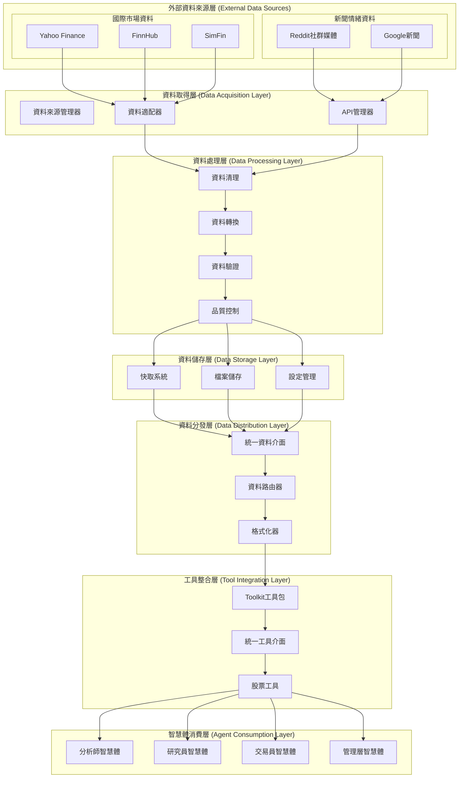
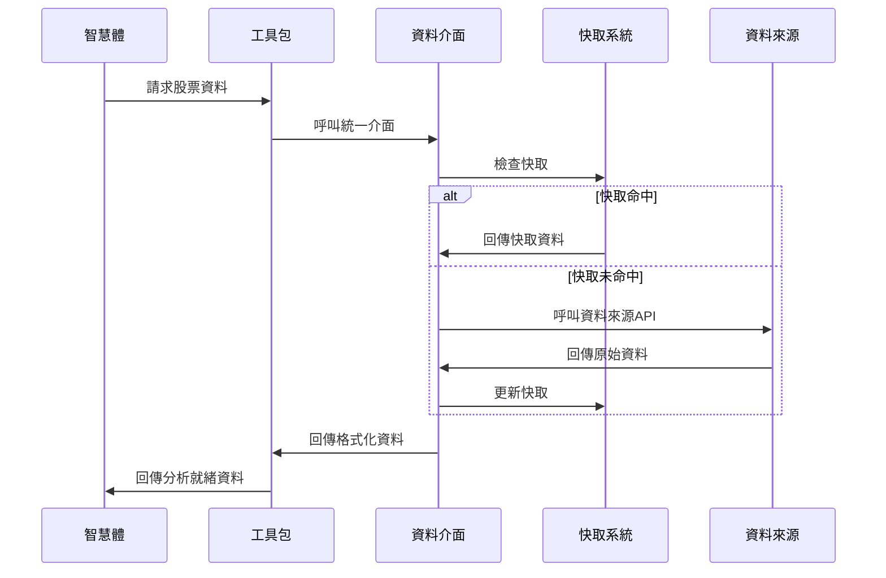

# TradingAgents 資料流架構

## 概述

TradingAgents 採用多層次資料流架構，支援全球股票市場的全面資料取得和處理。系統透過統一的資料介面、智慧的資料來源管理和高效的快取機制，為智慧體提供高品質的金融資料服務。

## 🏗️ 資料流架構設計

### 架構層次圖



## 📊 各層次詳細說明

### 1. 外部資料來源層 (External Data Sources)

#### Yahoo Finance
**檔案位置**: `tradingagents/dataflows/yfin_utils.py`

```python
import yfinance as yf
import pandas as pd
from typing import Optional

def get_yahoo_finance_data(ticker: str, period: str = "1y",
                          start_date: str = None, end_date: str = None):
    """取得Yahoo Finance資料

    Args:
        ticker: 股票代號
        period: 時間週期 (1d, 5d, 1mo, 3mo, 6mo, 1y, 2y, 5y, 10y, ytd, max)
        start_date: 開始日期 (YYYY-MM-DD)
        end_date: 結束日期 (YYYY-MM-DD)

    Returns:
        DataFrame: 股票資料
    """
    try:
        stock = yf.Ticker(ticker)

        if start_date and end_date:
            data = stock.history(start=start_date, end=end_date)
        else:
            data = stock.history(period=period)

        if data.empty:
            logger.warning(f"Yahoo Finance未找到{ticker}的資料")
            return None

        return data
    except Exception as e:
        logger.error(f"Yahoo Finance資料取得失敗: {e}")
        return None
```

#### FinnHub 新聞和基本面資料
**檔案位置**: `tradingagents/dataflows/finnhub_utils.py`

```python
from datetime import datetime, relativedelta
import json
import os

def get_data_in_range(ticker: str, start_date: str, end_date: str,
                     data_type: str, data_dir: str):
    """從快取中取得指定時間範圍的資料

    Args:
        ticker: 股票代號
        start_date: 開始日期
        end_date: 結束日期
        data_type: 資料類型 (news_data, insider_senti, insider_trans)
        data_dir: 資料目錄

    Returns:
        dict: 資料字典
    """
    try:
        file_path = os.path.join(data_dir, f"{ticker}_{data_type}.json")

        if not os.path.exists(file_path):
            logger.warning(f"資料檔案不存在: {file_path}")
            return {}

        with open(file_path, 'r', encoding='utf-8') as f:
            all_data = json.load(f)

        # 過濾時間範圍內的資料
        filtered_data = {}
        start_dt = datetime.strptime(start_date, "%Y-%m-%d")
        end_dt = datetime.strptime(end_date, "%Y-%m-%d")

        for date_str, data in all_data.items():
            try:
                data_dt = datetime.strptime(date_str, "%Y-%m-%d")
                if start_dt <= data_dt <= end_dt:
                    filtered_data[date_str] = data
            except ValueError:
                continue

        return filtered_data
    except Exception as e:
        logger.error(f"資料取得失敗: {e}")
        return {}
```

### 2. 資料處理層 (Data Processing Layer)

#### 資料驗證和清理

```python
def validate_and_clean_data(data, data_type: str):
    """資料驗證和清理

    Args:
        data: 原始資料
        data_type: 資料類型

    Returns:
        處理後的資料
    """
    if data is None or (hasattr(data, 'empty') and data.empty):
        return None

    try:
        if data_type == "stock_data":
            required_columns = ['open', 'high', 'low', 'close', 'volume']
            if hasattr(data, 'columns'):
                missing_cols = [col for col in required_columns if col not in data.columns]
                if missing_cols:
                    logger.warning(f"⚠️ 缺少必要欄位: {missing_cols}")

                # 資料清理
                data = data.dropna()
                data = data[data['volume'] > 0]

        elif data_type == "news_data":
            if isinstance(data, str) and len(data.strip()) == 0:
                return None

        return data
    except Exception as e:
        logger.error(f"資料驗證失敗: {e}")
        return None
```

### 3. 工具整合層 (Tool Integration Layer)

#### Toolkit 統一工具包

```python
class Toolkit:
    """統一工具包，為所有智慧體提供資料存取介面"""

    def __init__(self, config):
        self.config = config
        self.logger = get_logger('agents')

    def get_stock_fundamentals_unified(self, ticker: str):
        """統一基本面分析工具"""
        try:
            return self._get_us_stock_fundamentals(ticker)
        except Exception as e:
            self.logger.error(f"基本面資料取得失敗: {e}")
            return f"❌ 基本面資料取得失敗: {str(e)}"

    def get_market_data(self, ticker: str, period: str = "1y"):
        """取得市場資料"""
        return get_yahoo_finance_data(ticker, period)

    def get_news_data(self, ticker: str, days: int = 7):
        """取得新聞資料"""
        return get_finnhub_news(ticker, datetime.now().strftime("%Y-%m-%d"), days)
```

## 🔄 資料流轉過程

### 完整資料流程圖



## 📊 效能優化

### 快取策略

```python
class CacheManager:
    """快取管理器"""

    def __init__(self, config):
        self.config = config
        self.cache_dir = config.get('cache_dir', './cache')
        self.cache_expiry = config.get('cache_expiry', {})
        self.max_cache_size = config.get('max_cache_size', 1000)

    def get_cache_key(self, ticker: str, data_type: str, params: dict = None) -> str:
        """產生快取鍵"""
        import hashlib

        key_parts = [ticker, data_type]
        if params:
            key_parts.append(str(sorted(params.items())))

        key_string = '|'.join(key_parts)
        return hashlib.md5(key_string.encode()).hexdigest()
```

## 🔧 設定管理

### 環境變數設定

```bash
# .env 檔案範例

# 資料來源設定
FINNHUB_API_KEY=your_finnhub_api_key
REDDIT_CLIENT_ID=your_reddit_client_id
REDDIT_CLIENT_SECRET=your_reddit_client_secret

# 資料目錄設定
DATA_DIR=./data
CACHE_DIR=./cache
RESULTS_DIR=./results

# 快取設定
ENABLE_CACHE=true
CACHE_EXPIRY_MARKET_DATA=300
CACHE_EXPIRY_NEWS_DATA=3600
CACHE_EXPIRY_FUNDAMENTALS=86400
MAX_CACHE_SIZE=1000

# 效能設定
MAX_PARALLEL_WORKERS=5
REQUEST_TIMEOUT=30
RETRY_ATTEMPTS=3
RETRY_DELAY=1

# 監控設定
ENABLE_MONITORING=true
LOG_LEVEL=INFO
```

## 📋 總結

TradingAgents 的資料流架構具有以下特點：

### ✅ 優勢

1. **統一介面**: 透過統一的資料介面遮蔽底層資料來源差異
2. **智慧降級**: 自動資料來源切換，確保資料取得的可靠性
3. **高效快取**: 多層快取策略，顯著提升回應速度
4. **品質監控**: 即時資料品質檢查和效能監控
5. **彈性擴展**: 模組化設計，易於新增新的資料來源
6. **錯誤恢復**: 完善的錯誤處理和重試機制

### 🎯 適用場景

- **多市場交易**: 支援全球股票市場的統一資料存取
- **即時分析**: 低延遲的資料取得和處理
- **大規模部署**: 支援高並行和大資料量處理
- **研究開發**: 彈性的資料來源設定和擴展能力

透過這個資料流架構，TradingAgents 能夠為智慧體提供高品質、高可用的金融資料服務，支撐複雜的投資決策分析。
