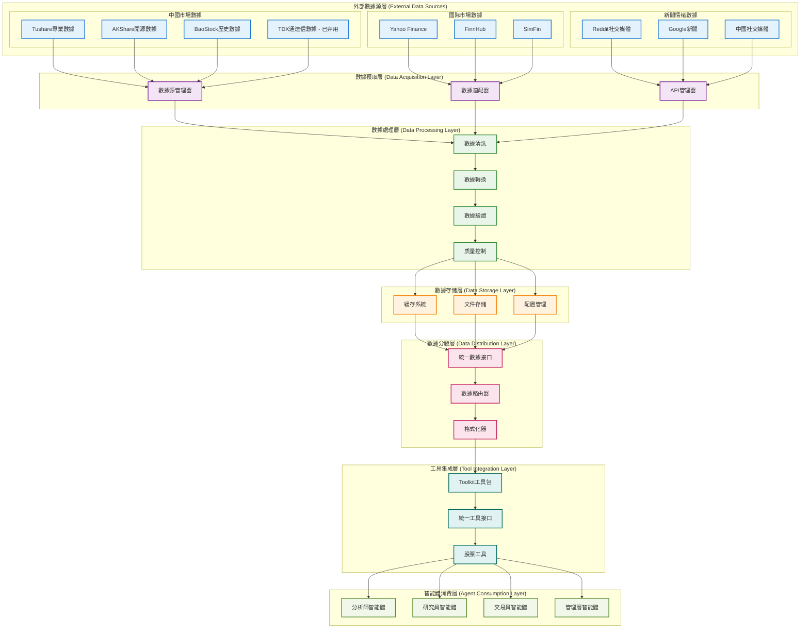
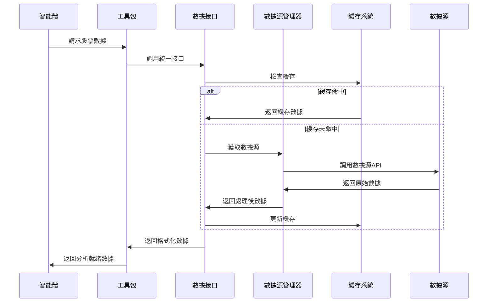

# TradingAgents 數據流架構

## 概述

TradingAgents 採用多層次數據流架構，支持中國A股、港股和美股的全面數據獲取和處理。系統通過統一的數據接口、智能的數據源管理和高效的緩存機制，為智能體提供高质量的金融數據服務。

## 🏗️ 數據流架構設計

### 架構層次圖



## 📊 各層次詳細說明

### 1. 外部數據源層 (External Data Sources)

#### 中國市場數據源

##### Tushare 專業數據源 (推薦)
**文件位置**: `tradingagents/dataflows/tushare_utils.py`

```python
import tushare as ts
from tradingagents.utils.logging_manager import get_logger

class TushareProvider:
    """Tushare數據提供商"""
    
    def __init__(self):
        self.token = os.getenv('TUSHARE_TOKEN')
        if self.token:
            ts.set_token(self.token)
            self.pro = ts.pro_api()
        else:
            raise ValueError("TUSHARE_TOKEN環境變量未設置")
    
    def get_stock_data(self, ts_code: str, start_date: str, end_date: str):
        """獲取股票歷史數據"""
        try:
            df = self.pro.daily(
                ts_code=ts_code,
                start_date=start_date.replace('-', ''),
                end_date=end_date.replace('-', '')
            )
            return df
        except Exception as e:
            logger.error(f"Tushare數據獲取失败: {e}")
            return None
    
    def get_stock_basic(self, ts_code: str):
        """獲取股票基本信息"""
        try:
            df = self.pro.stock_basic(
                ts_code=ts_code,
                fields='ts_code,symbol,name,area,industry,market,list_date'
            )
            return df
        except Exception as e:
            logger.error(f"Tushare基本信息獲取失败: {e}")
            return None
```

##### AKShare 開源數據源 (备用)
**文件位置**: `tradingagents/dataflows/akshare_utils.py`

```python
import akshare as ak
import pandas as pd
from typing import Optional, Dict, Any

def get_akshare_provider():
    """獲取AKShare數據提供商實例"""
    return AKShareProvider()

class AKShareProvider:
    """AKShare數據提供商"""
    
    def __init__(self):
        self.logger = get_logger('agents')
    
    def get_stock_zh_a_hist(self, symbol: str, period: str = "daily", 
                           start_date: str = None, end_date: str = None):
        """獲取A股歷史數據"""
        try:
            df = ak.stock_zh_a_hist(
                symbol=symbol,
                period=period,
                start_date=start_date,
                end_date=end_date,
                adjust="qfq"  # 前複權
            )
            return df
        except Exception as e:
            self.logger.error(f"AKShare A股數據獲取失败: {e}")
            return None
    
    def get_hk_stock_data_akshare(self, symbol: str, period: str = "daily"):
        """獲取港股數據"""
        try:
            # 港股代碼格式轉換
            if not symbol.startswith('0') and len(symbol) <= 5:
                symbol = symbol.zfill(5)
            
            df = ak.stock_hk_hist(
                symbol=symbol,
                period=period,
                adjust="qfq"
            )
            return df
        except Exception as e:
            self.logger.error(f"AKShare港股數據獲取失败: {e}")
            return None
    
    def get_hk_stock_info_akshare(self, symbol: str):
        """獲取港股基本信息"""
        try:
            df = ak.stock_hk_spot_em()
            if not df.empty:
                # 查找匹配的股票
                matched = df[df['代碼'].str.contains(symbol, na=False)]
                return matched
            return None
        except Exception as e:
            self.logger.error(f"AKShare港股信息獲取失败: {e}")
            return None
```

##### BaoStock 歷史數據源 (备用)
**文件位置**: `tradingagents/dataflows/baostock_utils.py`

```python
import baostock as bs
import pandas as pd

class BaoStockProvider:
    """BaoStock數據提供商"""
    
    def __init__(self):
        self.logger = get_logger('agents')
        self.login_result = bs.login()
        if self.login_result.error_code != '0':
            self.logger.error(f"BaoStock登錄失败: {self.login_result.error_msg}")
    
    def get_stock_data(self, code: str, start_date: str, end_date: str):
        """獲取股票歷史數據"""
        try:
            rs = bs.query_history_k_data_plus(
                code,
                "date,code,open,high,low,close,preclose,volume,amount,adjustflag,turn,tradestatus,pctChg,isST",
                start_date=start_date,
                end_date=end_date,
                frequency="d",
                adjustflag="3"  # 前複權
            )
            
            data_list = []
            while (rs.error_code == '0') & rs.next():
                data_list.append(rs.get_row_data())
            
            df = pd.DataFrame(data_list, columns=rs.fields)
            return df
        except Exception as e:
            self.logger.error(f"BaoStock數據獲取失败: {e}")
            return None
    
    def __del__(self):
        """析構函數，登出BaoStock"""
        bs.logout()
```

#### 國际市場數據源

##### Yahoo Finance
**文件位置**: `tradingagents/dataflows/yfin_utils.py`

```python
import yfinance as yf
import pandas as pd
from typing import Optional

def get_yahoo_finance_data(ticker: str, period: str = "1y", 
                          start_date: str = None, end_date: str = None):
    """獲取Yahoo Finance數據
    
    Args:
        ticker: 股票代碼
        period: 時間周期 (1d, 5d, 1mo, 3mo, 6mo, 1y, 2y, 5y, 10y, ytd, max)
        start_date: 開始日期 (YYYY-MM-DD)
        end_date: 結束日期 (YYYY-MM-DD)
    
    Returns:
        DataFrame: 股票數據
    """
    try:
        stock = yf.Ticker(ticker)
        
        if start_date and end_date:
            data = stock.history(start=start_date, end=end_date)
        else:
            data = stock.history(period=period)
        
        if data.empty:
            logger.warning(f"Yahoo Finance未找到{ticker}的數據")
            return None
        
        return data
    except Exception as e:
        logger.error(f"Yahoo Finance數據獲取失败: {e}")
        return None

def get_stock_info_yahoo(ticker: str):
    """獲取股票基本信息"""
    try:
        stock = yf.Ticker(ticker)
        info = stock.info
        return info
    except Exception as e:
        logger.error(f"Yahoo Finance信息獲取失败: {e}")
        return None
```

##### FinnHub 新聞和基本面數據
**文件位置**: `tradingagents/dataflows/finnhub_utils.py`

```python
from datetime import datetime, relativedelta
import json
import os

def get_data_in_range(ticker: str, start_date: str, end_date: str, 
                     data_type: str, data_dir: str):
    """從緩存中獲取指定時間範围的數據
    
    Args:
        ticker: 股票代碼
        start_date: 開始日期
        end_date: 結束日期
        data_type: 數據類型 (news_data, insider_senti, insider_trans)
        data_dir: 數據目錄
    
    Returns:
        dict: 數據字典
    """
    try:
        file_path = os.path.join(data_dir, f"{ticker}_{data_type}.json")
        
        if not os.path.exists(file_path):
            logger.warning(f"數據文件不存在: {file_path}")
            return {}
        
        with open(file_path, 'r', encoding='utf-8') as f:
            all_data = json.load(f)
        
        # 過濾時間範围內的數據
        filtered_data = {}
        start_dt = datetime.strptime(start_date, "%Y-%m-%d")
        end_dt = datetime.strptime(end_date, "%Y-%m-%d")
        
        for date_str, data in all_data.items():
            try:
                data_dt = datetime.strptime(date_str, "%Y-%m-%d")
                if start_dt <= data_dt <= end_dt:
                    filtered_data[date_str] = data
            except ValueError:
                continue
        
        return filtered_data
    except Exception as e:
        logger.error(f"數據獲取失败: {e}")
        return {}
```

#### 新聞情绪數據源

##### Reddit 社交媒體
**文件位置**: `tradingagents/dataflows/reddit_utils.py`

```python
import praw
import os
from typing import List, Dict

def fetch_top_from_category(subreddit: str, category: str = "hot", 
                           limit: int = 10) -> List[Dict]:
    """從Reddit獲取熱門帖子
    
    Args:
        subreddit: 子版塊名稱
        category: 分類 (hot, new, top)
        limit: 獲取數量限制
    
    Returns:
        List[Dict]: 帖子列表
    """
    try:
        reddit = praw.Reddit(
            client_id=os.getenv('REDDIT_CLIENT_ID'),
            client_secret=os.getenv('REDDIT_CLIENT_SECRET'),
            user_agent='TradingAgents/1.0'
        )
        
        subreddit_obj = reddit.subreddit(subreddit)
        
        if category == "hot":
            posts = subreddit_obj.hot(limit=limit)
        elif category == "new":
            posts = subreddit_obj.new(limit=limit)
        elif category == "top":
            posts = subreddit_obj.top(limit=limit)
        else:
            posts = subreddit_obj.hot(limit=limit)
        
        results = []
        for post in posts:
            results.append({
                'title': post.title,
                'score': post.score,
                'url': post.url,
                'created_utc': post.created_utc,
                'num_comments': post.num_comments,
                'selftext': post.selftext[:500] if post.selftext else ''
            })
        
        return results
    except Exception as e:
        logger.error(f"Reddit數據獲取失败: {e}")
        return []
```

##### 中國社交媒體情绪
**文件位置**: `tradingagents/dataflows/chinese_finance_utils.py`

```python
def get_chinese_social_sentiment(ticker: str, platform: str = "weibo"):
    """獲取中國社交媒體情绪數據
    
    Args:
        ticker: 股票代碼
        platform: 平台名稱 (weibo, xueqiu, eastmoney)
    
    Returns:
        str: 情绪分析報告
    """
    try:
        # 這里可以集成微博、雪球、东方財富等平台的API
        # 目前返回模擬數據
        sentiment_data = {
            'positive_ratio': 0.65,
            'negative_ratio': 0.25,
            'neutral_ratio': 0.10,
            'total_mentions': 1250,
            'trending_keywords': ['上涨', '利好', '業绩', '增長']
        }
        
        report = f"""## {ticker} 中國社交媒體情绪分析
        
**平台**: {platform}
**总提及數**: {sentiment_data['total_mentions']}
**情绪分布**:
- 積極: {sentiment_data['positive_ratio']:.1%}
- 消極: {sentiment_data['negative_ratio']:.1%}
- 中性: {sentiment_data['neutral_ratio']:.1%}

**熱門關键詞**: {', '.join(sentiment_data['trending_keywords'])}
        """
        
        return report
    except Exception as e:
        logger.error(f"中國社交媒體情绪獲取失败: {e}")
        return f"中國社交媒體情绪數據獲取失败: {str(e)}"
```

### 2. 數據獲取層 (Data Acquisition Layer)

#### 數據源管理器
**文件位置**: `tradingagents/dataflows/data_source_manager.py`

```python
from enum import Enum
from typing import List, Optional

class ChinaDataSource(Enum):
    """中國股票數據源枚举"""
    TUSHARE = "tushare"
    AKSHARE = "akshare"
    BAOSTOCK = "baostock"
    TDX = "tdx"  # 已弃用

class DataSourceManager:
    """數據源管理器"""
    
    def __init__(self):
        """初始化數據源管理器"""
        self.default_source = self._get_default_source()
        self.available_sources = self._check_available_sources()
        self.current_source = self.default_source
        
        logger.info(f"📊 數據源管理器初始化完成")
        logger.info(f"   默認數據源: {self.default_source.value}")
        logger.info(f"   可用數據源: {[s.value for s in self.available_sources]}")
    
    def _get_default_source(self) -> ChinaDataSource:
        """獲取默認數據源"""
        default = os.getenv('DEFAULT_CHINA_DATA_SOURCE', 'tushare').lower()
        
        try:
            return ChinaDataSource(default)
        except ValueError:
            logger.warning(f"⚠️ 無效的默認數據源: {default}，使用Tushare")
            return ChinaDataSource.TUSHARE
    
    def _check_available_sources(self) -> List[ChinaDataSource]:
        """檢查可用的數據源"""
        available = []
        
        # 檢查Tushare
        try:
            import tushare as ts
            token = os.getenv('TUSHARE_TOKEN')
            if token:
                available.append(ChinaDataSource.TUSHARE)
                logger.info("✅ Tushare數據源可用")
            else:
                logger.warning("⚠️ Tushare數據源不可用: 未設置TUSHARE_TOKEN")
        except ImportError:
            logger.warning("⚠️ Tushare數據源不可用: 庫未安裝")
        
        # 檢查AKShare
        try:
            import akshare as ak
            available.append(ChinaDataSource.AKSHARE)
            logger.info("✅ AKShare數據源可用")
        except ImportError:
            logger.warning("⚠️ AKShare數據源不可用: 庫未安裝")
        
        # 檢查BaoStock
        try:
            import baostock as bs
            available.append(ChinaDataSource.BAOSTOCK)
            logger.info("✅ BaoStock數據源可用")
        except ImportError:
            logger.warning("⚠️ BaoStock數據源不可用: 庫未安裝")
        
        # 檢查TDX (已弃用)
        try:
            import pytdx
            available.append(ChinaDataSource.TDX)
            logger.warning("⚠️ TDX數據源可用但已弃用，建议迁移到Tushare")
        except ImportError:
            logger.info("ℹ️ TDX數據源不可用: 庫未安裝")
        
        return available
    
    def switch_source(self, source_name: str) -> str:
        """切換數據源
        
        Args:
            source_name: 數據源名稱
        
        Returns:
            str: 切換結果消息
        """
        try:
            new_source = ChinaDataSource(source_name.lower())
            
            if new_source in self.available_sources:
                self.current_source = new_source
                logger.info(f"✅ 數據源已切換到: {new_source.value}")
                return f"✅ 數據源已成功切換到: {new_source.value}"
            else:
                logger.warning(f"⚠️ 數據源{new_source.value}不可用")
                return f"⚠️ 數據源{new_source.value}不可用，請檢查安裝和配置"
        except ValueError:
            logger.error(f"❌ 無效的數據源名稱: {source_name}")
            return f"❌ 無效的數據源名稱: {source_name}"
    
    def get_current_source(self) -> str:
        """獲取當前數據源"""
        return self.current_source.value
    
    def get_available_sources(self) -> List[str]:
        """獲取可用數據源列表"""
        return [s.value for s in self.available_sources]
```

### 3. 數據處理層 (Data Processing Layer)

#### 數據驗證和清洗
**文件位置**: `tradingagents/dataflows/interface.py`

```python
def validate_and_clean_data(data, data_type: str):
    """數據驗證和清洗
    
    Args:
        data: 原始數據
        data_type: 數據類型
    
    Returns:
        處理後的數據
    """
    if data is None or (hasattr(data, 'empty') and data.empty):
        return None
    
    try:
        if data_type == "stock_data":
            # 股票數據驗證
            required_columns = ['open', 'high', 'low', 'close', 'volume']
            if hasattr(data, 'columns'):
                missing_cols = [col for col in required_columns if col not in data.columns]
                if missing_cols:
                    logger.warning(f"⚠️ 缺少必要列: {missing_cols}")
                
                # 數據清洗
                data = data.dropna()  # 刪除空值
                data = data[data['volume'] > 0]  # 刪除無交易量的數據
        
        elif data_type == "news_data":
            # 新聞數據驗證
            if isinstance(data, str) and len(data.strip()) == 0:
                return None
        
        return data
    except Exception as e:
        logger.error(f"數據驗證失败: {e}")
        return None
```

### 4. 數據存储層 (Data Storage Layer)

#### 緩存系統
**文件位置**: `tradingagents/dataflows/config.py`

```python
import os
from typing import Dict, Any

# 全局配置
_config = None

def get_config() -> Dict[str, Any]:
    """獲取數據流配置"""
    global _config
    if _config is None:
        _config = {
            "data_dir": os.path.join(os.path.expanduser("~"), "Documents", "TradingAgents", "data"),
            "cache_dir": os.path.join(os.path.expanduser("~"), "Documents", "TradingAgents", "cache"),
            "cache_expiry": {
                "market_data": 300,      # 5分鐘
                "news_data": 3600,       # 1小時
                "fundamentals": 86400,   # 24小時
                "social_sentiment": 1800, # 30分鐘
            },
            "max_cache_size": 1000,  # 最大緩存條目數
            "enable_cache": True,
        }
    return _config

def set_config(config: Dict[str, Any]):
    """設置數據流配置"""
    global _config
    _config = config

# 數據目錄
DATA_DIR = get_config()["data_dir"]
CACHE_DIR = get_config()["cache_dir"]

# 確保目錄存在
os.makedirs(DATA_DIR, exist_ok=True)
os.makedirs(CACHE_DIR, exist_ok=True)
```

### 5. 數據分發層 (Data Distribution Layer)

#### 統一數據接口
**文件位置**: `tradingagents/dataflows/interface.py`

```python
# 統一數據獲取接口
def get_finnhub_news(
    ticker: Annotated[str, "公司股票代碼，如 'AAPL', 'TSM' 等"],
    curr_date: Annotated[str, "當前日期，格式為 yyyy-mm-dd"],
    look_back_days: Annotated[int, "回看天數"],
):
    """獲取指定時間範围內的公司新聞
    
    Args:
        ticker (str): 目標公司的股票代碼
        curr_date (str): 當前日期，格式為 yyyy-mm-dd
        look_back_days (int): 回看天數
    
    Returns:
        str: 包含公司新聞的數據框
    """
    start_date = datetime.strptime(curr_date, "%Y-%m-%d")
    before = start_date - relativedelta(days=look_back_days)
    before = before.strftime("%Y-%m-%d")
    
    result = get_data_in_range(ticker, before, curr_date, "news_data", DATA_DIR)
    
    if len(result) == 0:
        error_msg = f"⚠️ 無法獲取{ticker}的新聞數據 ({before} 到 {curr_date})\n"
        error_msg += f"可能的原因：\n"
        error_msg += f"1. 數據文件不存在或路徑配置錯誤\n"
        error_msg += f"2. 指定日期範围內没有新聞數據\n"
        error_msg += f"3. 需要先下載或更新Finnhub新聞數據\n"
        error_msg += f"建议：檢查數據目錄配置或重新獲取新聞數據"
        logger.debug(f"📰 [DEBUG] {error_msg}")
        return error_msg
    
    combined_result = ""
    for day, data in result.items():
        if len(data) == 0:
            continue
        for entry in data:
            current_news = (
                "### " + entry["headline"] + f" ({day})" + "\n" + entry["summary"]
            )
            combined_result += current_news + "\n\n"
    
    return f"## {ticker} News, from {before} to {curr_date}:\n" + str(combined_result)

def get_finnhub_company_insider_sentiment(
    ticker: Annotated[str, "股票代碼"],
    curr_date: Annotated[str, "當前交易日期，yyyy-mm-dd格式"],
    look_back_days: Annotated[int, "回看天數"],
):
    """獲取公司內部人士情绪數據（來自公開SEC信息）
    
    Args:
        ticker (str): 公司股票代碼
        curr_date (str): 當前交易日期，yyyy-mm-dd格式
        look_back_days (int): 回看天數
    
    Returns:
        str: 過去指定天數的情绪報告
    """
    date_obj = datetime.strptime(curr_date, "%Y-%m-%d")
    before = date_obj - relativedelta(days=look_back_days)
    before = before.strftime("%Y-%m-%d")
    
    data = get_data_in_range(ticker, before, curr_date, "insider_senti", DATA_DIR)
    
    if len(data) == 0:
        return ""
    
    result_str = ""
    seen_dicts = []
    for date, senti_list in data.items():
        for entry in senti_list:
            if entry not in seen_dicts:
                result_str += f"### {entry['year']}-{entry['month']}:\nChange: {entry['change']}\nMonthly Share Purchase Ratio: {entry['mspr']}\n\n"
                seen_dicts.append(entry)
    
    return (
        f"## {ticker} Insider Sentiment Data for {before} to {curr_date}:\n"
        + result_str
        + "The change field refers to the net buying/selling from all insiders' transactions. The mspr field refers to monthly share purchase ratio."
    )
```

### 6. 工具集成層 (Tool Integration Layer)

#### Toolkit 統一工具包
**文件位置**: `tradingagents/agents/utils/agent_utils.py`

```python
class Toolkit:
    """統一工具包，為所有智能體提供數據訪問接口"""
    
    def __init__(self, config):
        self.config = config
        self.logger = get_logger('agents')
    
    def get_stock_fundamentals_unified(self, ticker: str):
        """統一基本面分析工具，自動识別股票類型"""
        from tradingagents.utils.stock_utils import StockUtils
        
        try:
            market_info = StockUtils.get_market_info(ticker)
            
            if market_info['market_type'] == 'A股':
                return self._get_china_stock_fundamentals(ticker)
            elif market_info['market_type'] == '港股':
                return self._get_hk_stock_fundamentals(ticker)
            else:
                return self._get_us_stock_fundamentals(ticker)
        except Exception as e:
            self.logger.error(f"基本面數據獲取失败: {e}")
            return f"❌ 基本面數據獲取失败: {str(e)}"
    
    def _get_china_stock_fundamentals(self, ticker: str):
        """獲取中國股票基本面數據"""
        try:
            from tradingagents.dataflows.data_source_manager import DataSourceManager
            
            manager = DataSourceManager()
            current_source = manager.get_current_source()
            
            if current_source == 'tushare':
                return self._get_tushare_fundamentals(ticker)
            elif current_source == 'akshare':
                return self._get_akshare_fundamentals(ticker)
            else:
                # 降級策略
                return self._get_akshare_fundamentals(ticker)
        except Exception as e:
            self.logger.error(f"中國股票基本面獲取失败: {e}")
            return f"❌ 中國股票基本面獲取失败: {str(e)}"
    
    def _get_tushare_fundamentals(self, ticker: str):
        """使用Tushare獲取基本面數據"""
        try:
            from tradingagents.dataflows.tushare_utils import TushareProvider
            
            provider = TushareProvider()
            
            # 獲取基本信息
            basic_info = provider.get_stock_basic(ticker)
            
            # 獲取財務數據
            financial_data = provider.get_financial_data(ticker)
            
            # 格式化輸出
            report = f"""## {ticker} 基本面分析報告 (Tushare數據源)
            
**基本信息**:
- 股票名稱: {basic_info.get('name', 'N/A')}
- 所屬行業: {basic_info.get('industry', 'N/A')}
- 上市日期: {basic_info.get('list_date', 'N/A')}

**財務指標**:
- 总市值: {financial_data.get('total_mv', 'N/A')}
- 市盈率: {financial_data.get('pe', 'N/A')}
- 市净率: {financial_data.get('pb', 'N/A')}
- 净資產收益率: {financial_data.get('roe', 'N/A')}
            """
            
            return report
        except Exception as e:
            self.logger.error(f"Tushare基本面獲取失败: {e}")
            return f"❌ Tushare基本面獲取失败: {str(e)}"
```

#### 股票工具
**文件位置**: `tradingagents/utils/stock_utils.py`

```python
from enum import Enum
from typing import Dict, Any

class StockMarket(Enum):
    """股票市場枚举"""
    CHINA_A = "china_a"      # 中國A股
    HONG_KONG = "hong_kong"  # 港股
    US = "us"                # 美股
    UNKNOWN = "unknown"      # 未知市場

class StockUtils:
    """股票工具類"""
    
    @staticmethod
    def identify_stock_market(ticker: str) -> StockMarket:
        """识別股票所屬市場
        
        Args:
            ticker: 股票代碼
            
        Returns:
            StockMarket: 股票市場類型
        """
        ticker = ticker.upper().strip()
        
        # 中國A股判斷
        if (ticker.isdigit() and len(ticker) == 6 and 
            (ticker.startswith('0') or ticker.startswith('3') or ticker.startswith('6'))):
            return StockMarket.CHINA_A
        
        # 港股判斷
        if (ticker.isdigit() and len(ticker) <= 5) or ticker.endswith('.HK'):
            return StockMarket.HONG_KONG
        
        # 美股判斷（字母開头或包含字母）
        if any(c.isalpha() for c in ticker) and not ticker.endswith('.HK'):
            return StockMarket.US
        
        return StockMarket.UNKNOWN
    
    @staticmethod
    def get_market_info(ticker: str) -> Dict[str, Any]:
        """獲取股票市場信息
        
        Args:
            ticker: 股票代碼
            
        Returns:
            Dict: 市場信息字典
        """
        market = StockUtils.identify_stock_market(ticker)
        
        market_info = {
            StockMarket.CHINA_A: {
                'market_type': 'A股',
                'market_name': '中國A股市場',
                'currency_name': '人民币',
                'currency_symbol': '¥',
                'timezone': 'Asia/Shanghai',
                'trading_hours': '09:30-15:00'
            },
            StockMarket.HONG_KONG: {
                'market_type': '港股',
                'market_name': '香港股票市場',
                'currency_name': '港币',
                'currency_symbol': 'HK$',
                'timezone': 'Asia/Hong_Kong',
                'trading_hours': '09:30-16:00'
            },
            StockMarket.US: {
                'market_type': '美股',
                'market_name': '美國股票市場',
                'currency_name': '美元',
                'currency_symbol': '$',
                'timezone': 'America/New_York',
                'trading_hours': '09:30-16:00'
            },
            StockMarket.UNKNOWN: {
                'market_type': '未知',
                'market_name': '未知市場',
                'currency_name': '未知',
                'currency_symbol': '?',
                'timezone': 'UTC',
                'trading_hours': 'Unknown'
            }
        }
        
        return market_info.get(market, market_info[StockMarket.UNKNOWN])
    
    @staticmethod
    def get_data_source(ticker: str) -> str:
        """根據股票代碼獲取推薦的數據源
        
        Args:
            ticker: 股票代碼
            
        Returns:
            str: 數據源名稱
        """
        market = StockUtils.identify_stock_market(ticker)
        
        if market == StockMarket.CHINA_A:
            return "china_unified"  # 使用統一的中國股票數據源
        elif market == StockMarket.HONG_KONG:
            return "yahoo_finance"  # 港股使用Yahoo Finance
        elif market == StockMarket.US:
            return "yahoo_finance"  # 美股使用Yahoo Finance
        else:
            return "unknown"
```

## 🔄 數據流轉過程

### 完整數據流程圖



### 數據處理流水線

1. **數據請求**: 智能體通過Toolkit請求數據
2. **緩存檢查**: 首先檢查本地緩存是否有效
3. **數據源選擇**: 根據股票類型選擇最佳數據源
4. **數據獲取**: 從外部API獲取原始數據
5. **數據驗證**: 驗證數據完整性和有效性
6. **數據清洗**: 清理異常值和缺失數據
7. **數據標準化**: 統一數據格式和字段名
8. **數據緩存**: 将處理後的數據存入緩存
9. **數據返回**: 返回格式化的分析就绪數據

## 📊 數據质量監控

### 數據质量指標

```python
class DataQualityMonitor:
    """數據质量監控器"""
    
    def __init__(self):
        self.quality_metrics = {
            'completeness': 0.0,    # 完整性
            'accuracy': 0.0,        # 準確性
            'timeliness': 0.0,      # 及時性
            'consistency': 0.0,     # 一致性
        }
    
    def check_data_quality(self, data, data_type: str):
        """檢查數據质量
        
        Args:
            data: 待檢查的數據
            data_type: 數據類型
        
        Returns:
            Dict: 质量評分
        """
        if data is None:
            return {'overall_score': 0.0, 'issues': ['數據為空']}
        
        issues = []
        scores = {}
        
        # 完整性檢查
        completeness = self._check_completeness(data, data_type)
        scores['completeness'] = completeness
        if completeness < 0.8:
            issues.append(f'數據完整性不足: {completeness:.1%}')
        
        # 準確性檢查
        accuracy = self._check_accuracy(data, data_type)
        scores['accuracy'] = accuracy
        if accuracy < 0.9:
            issues.append(f'數據準確性不足: {accuracy:.1%}')
        
        # 及時性檢查
        timeliness = self._check_timeliness(data, data_type)
        scores['timeliness'] = timeliness
        if timeliness < 0.7:
            issues.append(f'數據及時性不足: {timeliness:.1%}')
        
        # 計算总分
        overall_score = sum(scores.values()) / len(scores)
        
        return {
            'overall_score': overall_score,
            'detailed_scores': scores,
            'issues': issues
        }
    
    def _check_completeness(self, data, data_type: str) -> float:
        """檢查數據完整性"""
        if data_type == "stock_data":
            required_fields = ['open', 'high', 'low', 'close', 'volume']
            if hasattr(data, 'columns'):
                available_fields = len([f for f in required_fields if f in data.columns])
                return available_fields / len(required_fields)
        return 1.0
    
    def _check_accuracy(self, data, data_type: str) -> float:
        """檢查數據準確性"""
        if data_type == "stock_data" and hasattr(data, 'columns'):
            # 檢查價格逻辑性
            if all(col in data.columns for col in ['high', 'low', 'close']):
                valid_rows = (data['high'] >= data['low']).sum()
                total_rows = len(data)
                return valid_rows / total_rows if total_rows > 0 else 0.0
        return 1.0
    
    def _check_timeliness(self, data, data_type: str) -> float:
        """檢查數據及時性"""
        # 簡化實現，實际應檢查數據時間戳
        return 1.0
```

## 🚀 性能優化

### 緩存策略

```python
class CacheManager:
    """緩存管理器"""
    
    def __init__(self, config):
        self.config = config
        self.cache_dir = config.get('cache_dir', './cache')
        self.cache_expiry = config.get('cache_expiry', {})
        self.max_cache_size = config.get('max_cache_size', 1000)
    
    def get_cache_key(self, ticker: str, data_type: str, params: dict = None) -> str:
        """生成緩存键"""
        import hashlib
        
        key_parts = [ticker, data_type]
        if params:
            key_parts.append(str(sorted(params.items())))
        
        key_string = '|'.join(key_parts)
        return hashlib.md5(key_string.encode()).hexdigest()
    
    def is_cache_valid(self, cache_file: str, data_type: str) -> bool:
        """檢查緩存是否有效"""
        if not os.path.exists(cache_file):
            return False
        
        # 檢查緩存時間
        cache_time = os.path.getmtime(cache_file)
        current_time = time.time()
        expiry_seconds = self.cache_expiry.get(data_type, 3600)
        
        return (current_time - cache_time) < expiry_seconds
    
    def get_from_cache(self, cache_key: str, data_type: str):
        """從緩存獲取數據"""
        cache_file = os.path.join(self.cache_dir, f"{cache_key}.json")
        
        if self.is_cache_valid(cache_file, data_type):
            try:
                with open(cache_file, 'r', encoding='utf-8') as f:
                    return json.load(f)
            except Exception as e:
                logger.warning(f"緩存讀取失败: {e}")
        
        return None
    
    def save_to_cache(self, cache_key: str, data, data_type: str):
        """保存數據到緩存"""
        try:
            os.makedirs(self.cache_dir, exist_ok=True)
            cache_file = os.path.join(self.cache_dir, f"{cache_key}.json")
            
            # 序列化數據
            if hasattr(data, 'to_dict'):
                serializable_data = data.to_dict()
            elif hasattr(data, 'to_json'):
                serializable_data = json.loads(data.to_json())
            else:
                serializable_data = data
            
            with open(cache_file, 'w', encoding='utf-8') as f:
                json.dump(serializable_data, f, ensure_ascii=False, indent=2)
            
            logger.debug(f"數據已緩存: {cache_key}")
        except Exception as e:
            logger.warning(f"緩存保存失败: {e}")
```

### 並行數據獲取

```python
from concurrent.futures import ThreadPoolExecutor, as_completed
from typing import List, Callable

class ParallelDataFetcher:
    """並行數據獲取器"""
    
    def __init__(self, max_workers: int = 5):
        self.max_workers = max_workers
    
    def fetch_multiple_data(self, tasks: List[dict]) -> dict:
        """並行獲取多個數據源的數據
        
        Args:
            tasks: 任務列表，每個任務包含 {'name': str, 'func': callable, 'args': tuple, 'kwargs': dict}
        
        Returns:
            dict: 結果字典，键為任務名稱，值為結果
        """
        results = {}
        
        with ThreadPoolExecutor(max_workers=self.max_workers) as executor:
            # 提交所有任務
            future_to_name = {}
            for task in tasks:
                future = executor.submit(
                    task['func'], 
                    *task.get('args', ()), 
                    **task.get('kwargs', {})
                )
                future_to_name[future] = task['name']
            
            # 收集結果
            for future in as_completed(future_to_name):
                task_name = future_to_name[future]
                try:
                    result = future.result(timeout=30)  # 30秒超時
                    results[task_name] = result
                    logger.debug(f"✅ 任務完成: {task_name}")
                except Exception as e:
                    logger.error(f"❌ 任務失败: {task_name}, 錯誤: {e}")
                    results[task_name] = None
        
        return results
```

## 🛡️ 錯誤處理和降級策略

### 數據源降級

```python
class DataSourceFallback:
    """數據源降級處理器"""
    
    def __init__(self, manager: DataSourceManager):
        self.manager = manager
        self.fallback_order = {
            'china_stock': ['tushare', 'akshare', 'baostock'],
            'us_stock': ['yahoo_finance', 'finnhub'],
            'hk_stock': ['yahoo_finance', 'akshare']
        }
    
    def get_data_with_fallback(self, ticker: str, data_type: str, 
                              get_data_func: Callable, *args, **kwargs):
        """使用降級策略獲取數據
        
        Args:
            ticker: 股票代碼
            data_type: 數據類型
            get_data_func: 數據獲取函數
            *args, **kwargs: 函數參數
        
        Returns:
            數據或錯誤信息
        """
        from tradingagents.utils.stock_utils import StockUtils
        
        market_info = StockUtils.get_market_info(ticker)
        market_type = market_info['market_type']
        
        # 確定降級顺序
        if market_type == 'A股':
            sources = self.fallback_order['china_stock']
        elif market_type == '美股':
            sources = self.fallback_order['us_stock']
        elif market_type == '港股':
            sources = self.fallback_order['hk_stock']
        else:
            sources = ['yahoo_finance']  # 默認
        
        last_error = None
        
        for source in sources:
            try:
                # 切換數據源
                if source in self.manager.get_available_sources():
                    self.manager.switch_source(source)
                    
                    # 嘗試獲取數據
                    data = get_data_func(*args, **kwargs)
                    
                    if data is not None and not (hasattr(data, 'empty') and data.empty):
                        logger.info(f"✅ 使用{source}數據源成功獲取{ticker}的{data_type}數據")
                        return data
                    else:
                        logger.warning(f"⚠️ {source}數據源返回空數據")
                        
            except Exception as e:
                last_error = e
                logger.warning(f"⚠️ {source}數據源失败: {e}")
                continue
        
        # 所有數據源都失败
        error_msg = f"❌ 所有數據源都無法獲取{ticker}的{data_type}數據"
        if last_error:
            error_msg += f"，最後錯誤: {last_error}"
        
        logger.error(error_msg)
        return error_msg
```

## 📈 監控和觀測

### 數據流監控

```python
class DataFlowMonitor:
    """數據流監控器"""
    
    def __init__(self):
        self.metrics = {
            'total_requests': 0,
            'successful_requests': 0,
            'failed_requests': 0,
            'cache_hits': 0,
            'cache_misses': 0,
            'average_response_time': 0.0,
            'data_source_usage': {},
        }
    
    def record_request(self, ticker: str, data_type: str, 
                      success: bool, response_time: float, 
                      data_source: str, from_cache: bool):
        """記錄數據請求"""
        self.metrics['total_requests'] += 1
        
        if success:
            self.metrics['successful_requests'] += 1
        else:
            self.metrics['failed_requests'] += 1
        
        if from_cache:
            self.metrics['cache_hits'] += 1
        else:
            self.metrics['cache_misses'] += 1
        
        # 更新平均響應時間
        total_time = self.metrics['average_response_time'] * (self.metrics['total_requests'] - 1)
        self.metrics['average_response_time'] = (total_time + response_time) / self.metrics['total_requests']
        
        # 記錄數據源使用情况
        if data_source not in self.metrics['data_source_usage']:
            self.metrics['data_source_usage'][data_source] = 0
        self.metrics['data_source_usage'][data_source] += 1
        
        logger.info(f"📊 數據請求記錄: {ticker} {data_type} {'✅' if success else '❌'} {response_time:.2f}s {data_source} {'(緩存)' if from_cache else ''}")
    
    def get_metrics_report(self) -> str:
        """生成監控報告"""
        if self.metrics['total_requests'] == 0:
            return "📊 暂無數據請求記錄"
        
        success_rate = self.metrics['successful_requests'] / self.metrics['total_requests']
        cache_hit_rate = self.metrics['cache_hits'] / self.metrics['total_requests']
        
        report = f"""📊 數據流監控報告
        
**請求統計**:
- 总請求數: {self.metrics['total_requests']}
- 成功請求: {self.metrics['successful_requests']}
- 失败請求: {self.metrics['failed_requests']}
- 成功率: {success_rate:.1%}

**緩存統計**:
- 緩存命中: {self.metrics['cache_hits']}
- 緩存未命中: {self.metrics['cache_misses']}
- 緩存命中率: {cache_hit_rate:.1%}

**性能統計**:
- 平均響應時間: {self.metrics['average_response_time']:.2f}s

**數據源使用情况**:
"""
        
        for source, count in self.metrics['data_source_usage'].items():
            usage_rate = count / self.metrics['total_requests']
            report += f"- {source}: {count}次 ({usage_rate:.1%})\n"
        
        return report

# 全局監控實例
data_flow_monitor = DataFlowMonitor()
```

## 🔧 配置管理

### 環境變量配置

```bash
# .env 文件示例

# 數據源配置
DEFAULT_CHINA_DATA_SOURCE=tushare
TUSHARE_TOKEN=your_tushare_token_here
FINNHUB_API_KEY=your_finnhub_api_key
REDDIT_CLIENT_ID=your_reddit_client_id
REDDIT_CLIENT_SECRET=your_reddit_client_secret

# 數據目錄配置
DATA_DIR=./data
CACHE_DIR=./cache
RESULTS_DIR=./results

# 緩存配置
ENABLE_CACHE=true
CACHE_EXPIRY_MARKET_DATA=300
CACHE_EXPIRY_NEWS_DATA=3600
CACHE_EXPIRY_FUNDAMENTALS=86400
MAX_CACHE_SIZE=1000

# 性能配置
MAX_PARALLEL_WORKERS=5
REQUEST_TIMEOUT=30
RETRY_ATTEMPTS=3
RETRY_DELAY=1

# 監控配置
ENABLE_MONITORING=true
LOG_LEVEL=INFO
```

### 動態配置更新

```python
class ConfigManager:
    """配置管理器"""
    
    def __init__(self, config_file: str = None):
        self.config_file = config_file or '.env'
        self.config = self._load_config()
        self._setup_directories()
    
    def _load_config(self) -> dict:
        """加載配置"""
        from dotenv import load_dotenv
        
        load_dotenv(self.config_file)
        
        return {
            # 數據源配置
            'default_china_data_source': os.getenv('DEFAULT_CHINA_DATA_SOURCE', 'tushare'),
            'tushare_token': os.getenv('TUSHARE_TOKEN'),
            'finnhub_api_key': os.getenv('FINNHUB_API_KEY'),
            'reddit_client_id': os.getenv('REDDIT_CLIENT_ID'),
            'reddit_client_secret': os.getenv('REDDIT_CLIENT_SECRET'),
            
            # 目錄配置
            'data_dir': os.getenv('DATA_DIR', './data'),
            'cache_dir': os.getenv('CACHE_DIR', './cache'),
            'results_dir': os.getenv('RESULTS_DIR', './results'),
            
            # 緩存配置
            'enable_cache': os.getenv('ENABLE_CACHE', 'true').lower() == 'true',
            'cache_expiry': {
                'market_data': int(os.getenv('CACHE_EXPIRY_MARKET_DATA', '300')),
                'news_data': int(os.getenv('CACHE_EXPIRY_NEWS_DATA', '3600')),
                'fundamentals': int(os.getenv('CACHE_EXPIRY_FUNDAMENTALS', '86400')),
            },
            'max_cache_size': int(os.getenv('MAX_CACHE_SIZE', '1000')),
            
            # 性能配置
            'max_parallel_workers': int(os.getenv('MAX_PARALLEL_WORKERS', '5')),
            'request_timeout': int(os.getenv('REQUEST_TIMEOUT', '30')),
            'retry_attempts': int(os.getenv('RETRY_ATTEMPTS', '3')),
            'retry_delay': float(os.getenv('RETRY_DELAY', '1.0')),
            
            # 監控配置
            'enable_monitoring': os.getenv('ENABLE_MONITORING', 'true').lower() == 'true',
            'log_level': os.getenv('LOG_LEVEL', 'INFO'),
        }
    
    def _setup_directories(self):
        """設置目錄"""
        for dir_key in ['data_dir', 'cache_dir', 'results_dir']:
            dir_path = self.config[dir_key]
            os.makedirs(dir_path, exist_ok=True)
            logger.info(f"📁 目錄已準备: {dir_key} = {dir_path}")
    
    def get(self, key: str, default=None):
        """獲取配置值"""
        return self.config.get(key, default)
    
    def update(self, key: str, value):
        """更新配置值"""
        self.config[key] = value
        logger.info(f"🔧 配置已更新: {key} = {value}")
    
    def reload(self):
        """重新加載配置"""
        self.config = self._load_config()
        self._setup_directories()
        logger.info("🔄 配置已重新加載")

# 全局配置實例
config_manager = ConfigManager()
```

## 🚀 最佳實踐

### 1. 數據源選擇策略

```python
# 推薦的數據源配置
RECOMMENDED_DATA_SOURCES = {
    'A股': {
        'primary': 'tushare',      # 主要數據源：專業、穩定
        'fallback': ['akshare', 'baostock'],  # 备用數據源
        'use_case': '適用於專業投資分析，數據质量高'
    },
    '港股': {
        'primary': 'yahoo_finance',
        'fallback': ['akshare'],
        'use_case': '國际化數據源，覆蓋全面'
    },
    '美股': {
        'primary': 'yahoo_finance',
        'fallback': ['finnhub'],
        'use_case': '免費且穩定的美股數據'
    }
}
```

### 2. 緩存策略優化

```python
# 緩存過期時間建议
CACHE_EXPIRY_RECOMMENDATIONS = {
    'real_time_data': 60,        # 實時數據：1分鐘
    'intraday_data': 300,        # 日內數據：5分鐘
    'daily_data': 3600,          # 日線數據：1小時
    'fundamental_data': 86400,   # 基本面數據：24小時
    'news_data': 1800,           # 新聞數據：30分鐘
    'social_sentiment': 900,     # 社交情绪：15分鐘
}
```

### 3. 錯誤處理模式

```python
# 錯誤處理最佳實踐
def robust_data_fetch(func):
    """數據獲取裝饰器，提供統一的錯誤處理"""
    def wrapper(*args, **kwargs):
        max_retries = 3
        retry_delay = 1.0
        
        for attempt in range(max_retries):
            try:
                result = func(*args, **kwargs)
                if result is not None:
                    return result
                else:
                    logger.warning(f"第{attempt + 1}次嘗試返回空數據")
            except Exception as e:
                logger.warning(f"第{attempt + 1}次嘗試失败: {e}")
                if attempt < max_retries - 1:
                    time.sleep(retry_delay * (2 ** attempt))  # 指數退避
                else:
                    logger.error(f"所有重試都失败，最终錯誤: {e}")
                    return None
        
        return None
    return wrapper
```

### 4. 性能監控建议

```python
# 性能監控關键指標
PERFORMANCE_THRESHOLDS = {
    'response_time': {
        'excellent': 1.0,    # 1秒以內
        'good': 3.0,         # 3秒以內
        'acceptable': 10.0,  # 10秒以內
    },
    'success_rate': {
        'excellent': 0.99,   # 99%以上
        'good': 0.95,        # 95%以上
        'acceptable': 0.90,  # 90%以上
    },
    'cache_hit_rate': {
        'excellent': 0.80,   # 80%以上
        'good': 0.60,        # 60%以上
        'acceptable': 0.40,  # 40%以上
    }
}
```

## 📋 总結

TradingAgents 的數據流架構具有以下特點：

### ✅ 優势

1. **統一接口**: 通過統一的數據接口屏蔽底層數據源差異
2. **智能降級**: 自動數據源切換，確保數據獲取的可靠性
3. **高效緩存**: 多層緩存策略，顯著提升響應速度
4. **质量監控**: 實時數據质量檢查和性能監控
5. **灵活擴展**: 模塊化設計，易於添加新的數據源
6. **錯誤恢複**: 完善的錯誤處理和重試機制

### 🎯 適用場景

- **多市場交易**: 支持A股、港股、美股的統一數據訪問
- **實時分析**: 低延迟的數據獲取和處理
- **大規模部署**: 支持高並發和大數據量處理
- **研究開發**: 灵活的數據源配置和擴展能力

### 🔮 未來發展

1. **實時數據流**: 集成WebSocket實時數據推送
2. **機器學习**: 數據质量智能評估和預測
3. **云原生**: 支持云端數據源和分布式緩存
4. **國际化**: 擴展更多國际市場數據源

通過這個數據流架構，TradingAgents 能夠為智能體提供高质量、高可用的金融數據服務，支撑複雜的投資決策分析。