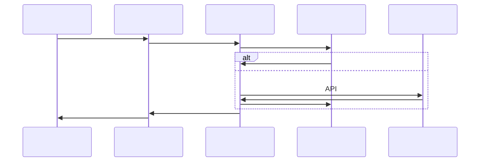

# TradingAgents 

## 

TradingAgents 

## 

### 

```mermaid
graph TB
 subgraph " (External Data Sources)"
 subgraph ""
 YFINANCE[Yahoo Finance]
 FINNHUB[FinnHub]
 SIMFIN[SimFin]
 end

 subgraph ""
 FINNHUB_SENT[FinnHub ]
 GOOGLENEWS[Google]
 end
 end

 subgraph " (Data Acquisition Layer)"
 DSM[]
 ADAPTERS[]
 API_MGR[API]
 end

 subgraph " (Data Processing Layer)"
 CLEANER[]
 TRANSFORMER[]
 VALIDATOR[]
 QUALITY[]
 end

 subgraph " (Data Storage Layer)"
 CACHE[]
 FILES[]
 CONFIG[]
 end

 subgraph " (Data Distribution Layer)"
 INTERFACE[]
 ROUTER[]
 FORMATTER[]
 end

 subgraph " (Tool Integration Layer)"
 TOOLKIT[Toolkit]
 UNIFIED_TOOLS[]
 STOCK_UTILS[]
 end

 subgraph " (Agent Consumption Layer)"
 ANALYSTS[]
 RESEARCHERS[]
 TRADER[]
 MANAGERS[]
 end

 %% 
 YFINANCE --> ADAPTERS
 FINNHUB --> ADAPTERS
 SIMFIN --> ADAPTERS
 FINNHUB_SENT --> API_MGR
 GOOGLENEWS --> API_MGR

 ADAPTERS --> CLEANER
 API_MGR --> CLEANER

 CLEANER --> TRANSFORMER
 TRANSFORMER --> VALIDATOR
 VALIDATOR --> QUALITY

 QUALITY --> CACHE
 QUALITY --> FILES
 QUALITY --> CONFIG

 CACHE --> INTERFACE
 FILES --> INTERFACE
 CONFIG --> INTERFACE

 INTERFACE --> ROUTER
 ROUTER --> FORMATTER

 FORMATTER --> TOOLKIT
 TOOLKIT --> UNIFIED_TOOLS
 UNIFIED_TOOLS --> STOCK_UTILS

 STOCK_UTILS --> ANALYSTS
 STOCK_UTILS --> RESEARCHERS
 STOCK_UTILS --> TRADER
 STOCK_UTILS --> MANAGERS
```

## 

### 1. (External Data Sources)

#### Yahoo Finance
****: `tradingagents/dataflows/yfin_utils.py`

```python
import yfinance as yf
import pandas as pd
from typing import Optional

def get_yahoo_finance_data(ticker: str, period: str = "1y",
 start_date: str = None, end_date: str = None):
 """Yahoo Finance

 Args:
 ticker: 
 period: (1d, 5d, 1mo, 3mo, 6mo, 1y, 2y, 5y, 10y, ytd, max)
 start_date: (YYYY-MM-DD)
 end_date: (YYYY-MM-DD)

 Returns:
 DataFrame: 
 """
 try:
 stock = yf.Ticker(ticker)

 if start_date and end_date:
 data = stock.history(start=start_date, end=end_date)
 else:
 data = stock.history(period=period)

 if data.empty:
 logger.warning(f"Yahoo Finance{ticker}")
 return None

 return data
 except Exception as e:
 logger.error(f"Yahoo Finance: {e}")
 return None
```

#### FinnHub 
****: `tradingagents/dataflows/finnhub_utils.py`

```python
from datetime import datetime, relativedelta
import json
import os

def get_data_in_range(ticker: str, start_date: str, end_date: str,
 data_type: str, data_dir: str):
 """

 Args:
 ticker: 
 start_date: 
 end_date: 
 data_type: (news_data, insider_senti, insider_trans)
 data_dir: 

 Returns:
 dict: 
 """
 try:
 file_path = os.path.join(data_dir, f"{ticker}_{data_type}.json")

 if not os.path.exists(file_path):
 logger.warning(f": {file_path}")
 return {}

 with open(file_path, 'r', encoding='utf-8') as f:
 all_data = json.load(f)

 # 
 filtered_data = {}
 start_dt = datetime.strptime(start_date, "%Y-%m-%d")
 end_dt = datetime.strptime(end_date, "%Y-%m-%d")

 for date_str, data in all_data.items():
 try:
 data_dt = datetime.strptime(date_str, "%Y-%m-%d")
 if start_dt <= data_dt <= end_dt:
 filtered_data[date_str] = data
 except ValueError:
 continue

 return filtered_data
 except Exception as e:
 logger.error(f": {e}")
 return {}
```

### 2. (Data Processing Layer)

#### 

```python
def validate_and_clean_data(data, data_type: str):
 """

 Args:
 data: 
 data_type: 

 Returns:
 
 """
 if data is None or (hasattr(data, 'empty') and data.empty):
 return None

 try:
 if data_type == "stock_data":
 required_columns = ['open', 'high', 'low', 'close', 'volume']
 if hasattr(data, 'columns'):
 missing_cols = [col for col in required_columns if col not in data.columns]
 if missing_cols:
 logger.warning(f" : {missing_cols}")

 # 
 data = data.dropna()
 data = data[data['volume'] > 0]

 elif data_type == "news_data":
 if isinstance(data, str) and len(data.strip()) == 0:
 return None

 return data
 except Exception as e:
 logger.error(f": {e}")
 return None
```

### 3. (Tool Integration Layer)

#### Toolkit 

```python
class Toolkit:
 """"""

 def __init__(self, config):
 self.config = config
 self.logger = get_logger('agents')

 def get_stock_fundamentals_unified(self, ticker: str):
 """"""
 try:
 return self._get_us_stock_fundamentals(ticker)
 except Exception as e:
 self.logger.error(f": {e}")
 return f" : {str(e)}"

 def get_market_data(self, ticker: str, period: str = "1y"):
 """"""
 return get_yahoo_finance_data(ticker, period)

 def get_news_data(self, ticker: str, days: int = 7):
 """"""
 return get_finnhub_news(ticker, datetime.now().strftime("%Y-%m-%d"), days)
```

## 

### 



## 

### 

```python
class CacheManager:
 """"""

 def __init__(self, config):
 self.config = config
 self.cache_dir = config.get('cache_dir', './cache')
 self.cache_expiry = config.get('cache_expiry', {})
 self.max_cache_size = config.get('max_cache_size', 1000)

 def get_cache_key(self, ticker: str, data_type: str, params: dict = None) -> str:
 """"""
 import hashlib

 key_parts = [ticker, data_type]
 if params:
 key_parts.append(str(sorted(params.items())))

 key_string = '|'.join(key_parts)
 return hashlib.md5(key_string.encode()).hexdigest()
```

## 

### 

```bash
# .env 

# 
FINNHUB_API_KEY=your_finnhub_api_key
# 
DATA_DIR=./data
CACHE_DIR=./cache
RESULTS_DIR=./results

# 
ENABLE_CACHE=true
CACHE_EXPIRY_MARKET_DATA=300
CACHE_EXPIRY_NEWS_DATA=3600
CACHE_EXPIRY_FUNDAMENTALS=86400
MAX_CACHE_SIZE=1000

# 
MAX_PARALLEL_WORKERS=5
REQUEST_TIMEOUT=30
RETRY_ATTEMPTS=3
RETRY_DELAY=1

# 
ENABLE_MONITORING=true
LOG_LEVEL=INFO
```

## 

TradingAgents 

### 

1. ****: 
2. ****: 
3. ****: 
4. ****: 
5. ****: 
6. ****: 

### 

- ****: 
- ****: 
- ****: 
- ****: 

TradingAgents 
