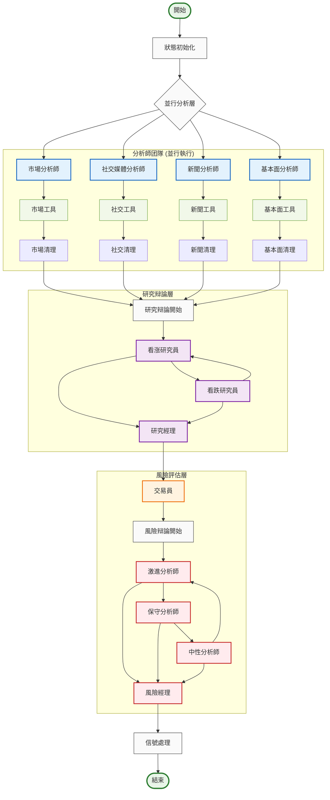
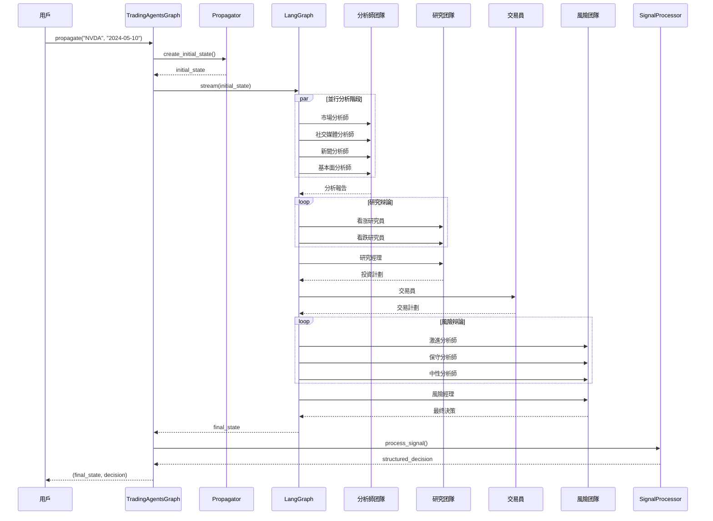

# TradingAgents 圖結構架構

## 概述

TradingAgents 基於 LangGraph 構建了一個複雜的多智能體協作圖結構，通過有向無環圖（DAG）的方式組織智能體工作流。系統採用狀態驱動的圖執行模式，支持條件路由、並行處理和動態決策。

## 🏗️ 圖結構設計原理

### 核心設計理念

- **狀態驱動**: 基於 `AgentState` 的統一狀態管理
- **條件路由**: 智能的工作流分支決策
- **並行處理**: 分析師团隊的並行執行
- **層次化協作**: 分析→研究→執行→風險→管理的層次結構
- **記忆機制**: 智能體間的經驗共享和學习

### 圖結構架構圖



## 📋 核心組件詳解

### 1. TradingAgentsGraph 主控制器

**文件位置**: `tradingagents/graph/trading_graph.py`

```python
class TradingAgentsGraph:
    """交易智能體圖的主要編排類"""
    
    def __init__(
        self,
        selected_analysts=["market", "social", "news", "fundamentals"],
        debug=False,
        config: Dict[str, Any] = None,
    ):
        """初始化交易智能體圖和組件"""
        self.debug = debug
        self.config = config or DEFAULT_CONFIG
        
        # 初始化LLM
        self._initialize_llms()
        
        # 初始化核心組件
        self.setup = GraphSetup(
            quick_thinking_llm=self.quick_thinking_llm,
            deep_thinking_llm=self.deep_thinking_llm,
            toolkit=self.toolkit,
            tool_nodes=self.tool_nodes,
            bull_memory=self.bull_memory,
            bear_memory=self.bear_memory,
            trader_memory=self.trader_memory,
            invest_judge_memory=self.invest_judge_memory,
            risk_manager_memory=self.risk_manager_memory,
            conditional_logic=self.conditional_logic,
            config=self.config
        )
        
        # 構建圖
        self.graph = self.setup.setup_graph(selected_analysts)
    
    def propagate(self, company_name: str, trade_date: str):
        """執行完整的交易分析流程"""
        # 創建初始狀態
        initial_state = self.propagator.create_initial_state(
            company_name, trade_date
        )
        
        # 執行圖
        graph_args = self.propagator.get_graph_args()
        
        for step in self.graph.stream(initial_state, **graph_args):
            if self.debug:
                print(step)
        
        # 處理最终信號
        final_signal = step.get("final_trade_decision", "")
        decision = self.signal_processor.process_signal(
            final_signal, company_name
        )
        
        return step, decision
```

### 2. GraphSetup 圖構建器

**文件位置**: `tradingagents/graph/setup.py`

```python
class GraphSetup:
    """负责構建和配置LangGraph工作流"""
    
    def setup_graph(self, selected_analysts=["market", "social", "news", "fundamentals"]):
        """設置和編譯智能體工作流圖"""
        workflow = StateGraph(AgentState)
        
        # 1. 添加分析師節點
        analyst_nodes = {}
        tool_nodes = {}
        delete_nodes = {}
        
        if "market" in selected_analysts:
            analyst_nodes["market"] = create_market_analyst(
                self.quick_thinking_llm, self.toolkit
            )
            tool_nodes["market"] = self.tool_nodes["market"]
            delete_nodes["market"] = create_msg_delete()
        
        # 類似地添加其他分析師...
        
        # 2. 添加研究員節點
        bull_researcher_node = create_bull_researcher(
            self.quick_thinking_llm, self.bull_memory
        )
        bear_researcher_node = create_bear_researcher(
            self.quick_thinking_llm, self.bear_memory
        )
        research_manager_node = create_research_manager(
            self.deep_thinking_llm, self.invest_judge_memory
        )
        
        # 3. 添加交易員和風險管理節點
        trader_node = create_trader(
            self.quick_thinking_llm, self.trader_memory
        )
        
        risky_analyst_node = create_risky_analyst(self.quick_thinking_llm)
        safe_analyst_node = create_safe_analyst(self.quick_thinking_llm)
        neutral_analyst_node = create_neutral_analyst(self.quick_thinking_llm)
        risk_judge_node = create_risk_judge(
            self.deep_thinking_llm, self.risk_manager_memory
        )
        
        # 4. 将節點添加到工作流
        for name, node in analyst_nodes.items():
            workflow.add_node(name, node)
            workflow.add_node(f"tools_{name}", tool_nodes[name])
            workflow.add_node(f"Msg Clear {name.title()}", delete_nodes[name])
        
        workflow.add_node("Bull Researcher", bull_researcher_node)
        workflow.add_node("Bear Researcher", bear_researcher_node)
        workflow.add_node("Research Manager", research_manager_node)
        workflow.add_node("Trader", trader_node)
        workflow.add_node("Risky Analyst", risky_analyst_node)
        workflow.add_node("Safe Analyst", safe_analyst_node)
        workflow.add_node("Neutral Analyst", neutral_analyst_node)
        workflow.add_node("Risk Judge", risk_judge_node)
        
        # 5. 定義邊和條件路由
        self._define_edges(workflow, selected_analysts)
        
        return workflow.compile()
```

### 3. ConditionalLogic 條件路由

**文件位置**: `tradingagents/graph/conditional_logic.py`

```python
class ConditionalLogic:
    """處理圖流程的條件逻辑"""
    
    def __init__(self, max_debate_rounds=1, max_risk_discuss_rounds=1):
        self.max_debate_rounds = max_debate_rounds
        self.max_risk_discuss_rounds = max_risk_discuss_rounds
    
    def should_continue_market(self, state: AgentState):
        """判斷市場分析是否應该繼续"""
        messages = state["messages"]
        last_message = messages[-1]
        
        if hasattr(last_message, 'tool_calls') and last_message.tool_calls:
            return "tools_market"
        return "Msg Clear Market"
    
    def should_continue_debate(self, state: AgentState) -> str:
        """判斷辩論是否應该繼续"""
        if state["investment_debate_state"]["count"] >= 2 * self.max_debate_rounds:
            return "Research Manager"
        if state["investment_debate_state"]["current_response"].startswith("Bull"):
            return "Bear Researcher"
        return "Bull Researcher"
    
    def should_continue_risk_analysis(self, state: AgentState) -> str:
        """判斷風險分析是否應该繼续"""
        if state["risk_debate_state"]["count"] >= 3 * self.max_risk_discuss_rounds:
            return "Risk Judge"
        
        latest_speaker = state["risk_debate_state"]["latest_speaker"]
        if latest_speaker.startswith("Risky"):
            return "Safe Analyst"
        elif latest_speaker.startswith("Safe"):
            return "Neutral Analyst"
        return "Risky Analyst"
```

### 4. AgentState 狀態管理

**文件位置**: `tradingagents/agents/utils/agent_states.py`

```python
class AgentState(MessagesState):
    """智能體狀態定義"""
    # 基本信息
    company_of_interest: Annotated[str, "我們感兴趣交易的公司"]
    trade_date: Annotated[str, "交易日期"]
    sender: Annotated[str, "發送此消息的智能體"]
    
    # 分析報告
    market_report: Annotated[str, "市場分析師的報告"]
    sentiment_report: Annotated[str, "社交媒體分析師的報告"]
    news_report: Annotated[str, "新聞研究員的報告"]
    fundamentals_report: Annotated[str, "基本面研究員的報告"]
    
    # 研究团隊討論狀態
    investment_debate_state: Annotated[InvestDebateState, "投資辩論的當前狀態"]
    investment_plan: Annotated[str, "分析師生成的計劃"]
    trader_investment_plan: Annotated[str, "交易員生成的計劃"]
    
    # 風險管理团隊討論狀態
    risk_debate_state: Annotated[RiskDebateState, "風險評估辩論的當前狀態"]
    final_trade_decision: Annotated[str, "風險分析師做出的最终決策"]

class InvestDebateState(TypedDict):
    """研究团隊狀態"""
    bull_history: Annotated[str, "看涨對話歷史"]
    bear_history: Annotated[str, "看跌對話歷史"]
    history: Annotated[str, "對話歷史"]
    current_response: Annotated[str, "最新回應"]
    judge_decision: Annotated[str, "最终判斷決策"]
    count: Annotated[int, "當前對話長度"]

class RiskDebateState(TypedDict):
    """風險管理团隊狀態"""
    risky_history: Annotated[str, "激進分析師的對話歷史"]
    safe_history: Annotated[str, "保守分析師的對話歷史"]
    neutral_history: Annotated[str, "中性分析師的對話歷史"]
    history: Annotated[str, "對話歷史"]
    latest_speaker: Annotated[str, "最後發言的分析師"]
    current_risky_response: Annotated[str, "激進分析師的最新回應"]
    current_safe_response: Annotated[str, "保守分析師的最新回應"]
    current_neutral_response: Annotated[str, "中性分析師的最新回應"]
    judge_decision: Annotated[str, "判斷決策"]
    count: Annotated[int, "當前對話長度"]
```

### 5. Propagator 狀態傳播器

**文件位置**: `tradingagents/graph/propagation.py`

```python
class Propagator:
    """處理狀態初始化和在圖中的傳播"""
    
    def __init__(self, max_recur_limit=100):
        self.max_recur_limit = max_recur_limit
    
    def create_initial_state(self, company_name: str, trade_date: str) -> Dict[str, Any]:
        """為智能體圖創建初始狀態"""
        return {
            "messages": [("human", company_name)],
            "company_of_interest": company_name,
            "trade_date": str(trade_date),
            "investment_debate_state": InvestDebateState({
                "history": "",
                "current_response": "",
                "count": 0
            }),
            "risk_debate_state": RiskDebateState({
                "history": "",
                "current_risky_response": "",
                "current_safe_response": "",
                "current_neutral_response": "",
                "count": 0,
            }),
            "market_report": "",
            "fundamentals_report": "",
            "sentiment_report": "",
            "news_report": "",
        }
    
    def get_graph_args(self) -> Dict[str, Any]:
        """獲取圖調用的參數"""
        return {
            "stream_mode": "values",
            "config": {"recursion_limit": self.max_recur_limit},
        }
```

### 6. SignalProcessor 信號處理器

**文件位置**: `tradingagents/graph/signal_processing.py`

```python
class SignalProcessor:
    """處理交易信號以提取可操作的決策"""
    
    def __init__(self, quick_thinking_llm: ChatOpenAI):
        self.quick_thinking_llm = quick_thinking_llm
    
    def process_signal(self, full_signal: str, stock_symbol: str = None) -> dict:
        """處理完整的交易信號以提取結構化決策信息"""
        
        # 檢測股票類型和貨币
        from tradingagents.utils.stock_utils import StockUtils
        market_info = StockUtils.get_market_info(stock_symbol)
        
        messages = [
            ("system", f"""您是一位專業的金融分析助手，负责從交易員的分析報告中提取結構化的投資決策信息。

請從提供的分析報告中提取以下信息，並以JSON格式返回：

{{
    "action": "买入/持有/卖出",
    "target_price": 數字({market_info['currency_name']}價格),
    "confidence": 數字(0-1之間),
    "risk_score": 數字(0-1之間),
    "reasoning": "決策的主要理由摘要"
}}
"""),
            ("human", full_signal),
        ]
        
        try:
            result = self.quick_thinking_llm.invoke(messages).content
            # 解析JSON並返回結構化決策
            return self._parse_decision(result)
        except Exception as e:
            logger.error(f"信號處理失败: {e}")
            return self._get_default_decision()
```

### 7. Reflector 反思器

**文件位置**: `tradingagents/graph/reflection.py`

```python
class Reflector:
    """處理決策反思和記忆更新"""
    
    def __init__(self, quick_thinking_llm: ChatOpenAI):
        self.quick_thinking_llm = quick_thinking_llm
        self.reflection_system_prompt = self._get_reflection_prompt()
    
    def reflect_bull_researcher(self, current_state, returns_losses, bull_memory):
        """反思看涨研究員的分析並更新記忆"""
        situation = self._extract_current_situation(current_state)
        bull_debate_history = current_state["investment_debate_state"]["bull_history"]
        
        result = self._reflect_on_component(
            "BULL", bull_debate_history, situation, returns_losses
        )
        bull_memory.add_situations([(situation, result)])
    
    def reflect_trader(self, current_state, returns_losses, trader_memory):
        """反思交易員的決策並更新記忆"""
        situation = self._extract_current_situation(current_state)
        trader_decision = current_state["trader_investment_plan"]
        
        result = self._reflect_on_component(
            "TRADER", trader_decision, situation, returns_losses
        )
        trader_memory.add_situations([(situation, result)])
```

## 🔄 圖執行流程

### 執行時序圖



### 狀態流轉過程

1. **初始化階段**
   ```python
   initial_state = {
       "messages": [("human", "NVDA")],
       "company_of_interest": "NVDA",
       "trade_date": "2024-05-10",
       "investment_debate_state": {...},
       "risk_debate_state": {...},
       # 各種報告字段初始化為空字符串
   }
   ```

2. **分析師並行執行**
   - 市場分析師 → `market_report`
   - 社交媒體分析師 → `sentiment_report`
   - 新聞分析師 → `news_report`
   - 基本面分析師 → `fundamentals_report`

3. **研究团隊辩論**
   ```python
   investment_debate_state = {
       "bull_history": "看涨觀點歷史",
       "bear_history": "看跌觀點歷史",
       "count": 辩論轮次,
       "judge_decision": "研究經理的最终決策"
   }
   ```

4. **交易員決策**
   - 基於研究团隊的投資計劃生成具體的交易策略
   - 更新 `trader_investment_plan`

5. **風險团隊評估**
   ```python
   risk_debate_state = {
       "risky_history": "激進觀點歷史",
       "safe_history": "保守觀點歷史",
       "neutral_history": "中性觀點歷史",
       "count": 風險討論轮次,
       "judge_decision": "風險經理的最终決策"
   }
   ```

6. **信號處理**
   - 提取結構化決策信息
   - 返回 `{action, target_price, confidence, risk_score, reasoning}`

## ⚙️ 邊和路由設計

### 邊類型分類

#### 1. 顺序邊 (Sequential Edges)
```python
# 分析師完成後進入研究階段
workflow.add_edge("Msg Clear Market", "Bull Researcher")
workflow.add_edge("Msg Clear Social", "Bull Researcher")
workflow.add_edge("Msg Clear News", "Bull Researcher")
workflow.add_edge("Msg Clear Fundamentals", "Bull Researcher")

# 研究經理 → 交易員
workflow.add_edge("Research Manager", "Trader")

# 交易員 → 風險分析
workflow.add_edge("Trader", "Risky Analyst")
```

#### 2. 條件邊 (Conditional Edges)
```python
# 分析師工具調用條件
workflow.add_conditional_edges(
    "market",
    self.conditional_logic.should_continue_market,
    {
        "tools_market": "tools_market",
        "Msg Clear Market": "Msg Clear Market",
    },
)

# 研究辩論條件
workflow.add_conditional_edges(
    "Bull Researcher",
    self.conditional_logic.should_continue_debate,
    {
        "Bear Researcher": "Bear Researcher",
        "Research Manager": "Research Manager",
    },
)

# 風險分析條件
workflow.add_conditional_edges(
    "Risky Analyst",
    self.conditional_logic.should_continue_risk_analysis,
    {
        "Safe Analyst": "Safe Analyst",
        "Neutral Analyst": "Neutral Analyst",
        "Risk Judge": "Risk Judge",
    },
)
```

#### 3. 並行邊 (Parallel Edges)
```python
# 從START同時啟動所有分析師
workflow.add_edge(START, "market")
workflow.add_edge(START, "social")
workflow.add_edge(START, "news")
workflow.add_edge(START, "fundamentals")
```

### 路由決策逻辑

#### 工具調用路由
```python
def should_continue_market(self, state: AgentState):
    """基於最後消息是否包含工具調用來決定路由"""
    messages = state["messages"]
    last_message = messages[-1]
    
    if hasattr(last_message, 'tool_calls') and last_message.tool_calls:
        return "tools_market"  # 執行工具
    return "Msg Clear Market"  # 清理消息並繼续
```

#### 辩論轮次路由
```python
def should_continue_debate(self, state: AgentState) -> str:
    """基於辩論轮次和當前發言者決定下一步"""
    # 檢查是否達到最大轮次
    if state["investment_debate_state"]["count"] >= 2 * self.max_debate_rounds:
        return "Research Manager"  # 結束辩論
    
    # 基於當前發言者決定下一個發言者
    if state["investment_debate_state"]["current_response"].startswith("Bull"):
        return "Bear Researcher"
    return "Bull Researcher"
```

## 🔧 錯誤處理和恢複

### 節點級錯誤處理

```python
# 在每個智能體節點中
try:
    # 執行智能體逻辑
    result = agent.invoke(state)
    return {"messages": [result]}
except Exception as e:
    logger.error(f"智能體執行失败: {e}")
    # 返回默認響應
    return {"messages": [("ai", "分析暂時不可用，請稍後重試")]}
```

### 圖級錯誤恢複

```python
# 在TradingAgentsGraph中
try:
    for step in self.graph.stream(initial_state, **graph_args):
        if self.debug:
            print(step)
except Exception as e:
    logger.error(f"圖執行失败: {e}")
    # 返回安全的默認決策
    return None, {
        'action': '持有',
        'target_price': None,
        'confidence': 0.5,
        'risk_score': 0.5,
        'reasoning': '系統錯誤，建议持有'
    }
```

### 超時和遞歸限制

```python
# 在Propagator中設置遞歸限制
def get_graph_args(self) -> Dict[str, Any]:
    return {
        "stream_mode": "values",
        "config": {
            "recursion_limit": self.max_recur_limit,  # 默認100
            "timeout": 300,  # 5分鐘超時
        },
    }
```

## 📊 性能監控和優化

### 執行時間監控

```python
import time
from tradingagents.utils.tool_logging import log_graph_module

@log_graph_module("graph_execution")
def propagate(self, company_name: str, trade_date: str):
    start_time = time.time()
    
    # 執行圖
    result = self.graph.stream(initial_state, **graph_args)
    
    execution_time = time.time() - start_time
    logger.info(f"圖執行完成，耗時: {execution_time:.2f}秒")
    
    return result
```

### 內存使用優化

```python
# 在狀態傳播過程中清理不必要的消息
class MessageCleaner:
    def clean_messages(self, state: AgentState):
        # 只保留最近的N條消息
        if len(state["messages"]) > 50:
            state["messages"] = state["messages"][-50:]
        return state
```

### 並行執行優化

```python
# 分析師团隊的並行執行通過LangGraph自動處理
# 無需額外配置，START節點的多個邊會自動並行執行
workflow.add_edge(START, "market")
workflow.add_edge(START, "social")
workflow.add_edge(START, "news")
workflow.add_edge(START, "fundamentals")
```

## 🚀 擴展和定制

### 添加新的分析師

```python
# 1. 創建新的分析師函數
def create_custom_analyst(llm, toolkit):
    # 實現自定義分析師逻辑
    pass

# 2. 在GraphSetup中添加
if "custom" in selected_analysts:
    analyst_nodes["custom"] = create_custom_analyst(
        self.quick_thinking_llm, self.toolkit
    )
    tool_nodes["custom"] = self.tool_nodes["custom"]
    delete_nodes["custom"] = create_msg_delete()

# 3. 添加條件逻辑
def should_continue_custom(self, state: AgentState):
    # 實現自定義條件逻辑
    pass
```

### 自定義辩論機制

```python
# 擴展辩論狀態
class CustomDebateState(TypedDict):
    participants: List[str]
    rounds: int
    max_rounds: int
    current_speaker: str
    history: Dict[str, str]

# 實現自定義辩論逻辑
def should_continue_custom_debate(self, state: AgentState) -> str:
    debate_state = state["custom_debate_state"]
    
    if debate_state["rounds"] >= debate_state["max_rounds"]:
        return "END_DEBATE"
    
    # 轮換發言者逻辑
    current_idx = debate_state["participants"].index(
        debate_state["current_speaker"]
    )
    next_idx = (current_idx + 1) % len(debate_state["participants"])
    
    return debate_state["participants"][next_idx]
```

### 動態圖構建

```python
class DynamicGraphSetup(GraphSetup):
    def build_dynamic_graph(self, config: Dict[str, Any]):
        """基於配置動態構建圖結構"""
        workflow = StateGraph(AgentState)
        
        # 基於配置添加節點
        for node_config in config["nodes"]:
            node_type = node_config["type"]
            node_name = node_config["name"]
            
            if node_type == "analyst":
                workflow.add_node(node_name, self._create_analyst(node_config))
            elif node_type == "researcher":
                workflow.add_node(node_name, self._create_researcher(node_config))
        
        # 基於配置添加邊
        for edge_config in config["edges"]:
            if edge_config["type"] == "conditional":
                workflow.add_conditional_edges(
                    edge_config["from"],
                    self._get_condition_func(edge_config["condition"]),
                    edge_config["mapping"]
                )
            else:
                workflow.add_edge(edge_config["from"], edge_config["to"])
        
        return workflow.compile()
```

## 📝 最佳實踐

### 1. 狀態設計原則
- **最小化狀態**: 只在狀態中保存必要的信息
- **類型安全**: 使用 TypedDict 和 Annotated 確保類型安全
- **狀態不變性**: 避免直接修改狀態，使用返回新狀態的方式

### 2. 節點設計原則
- **單一職责**: 每個節點只负责一個特定的任務
- **幂等性**: 節點應该是幂等的，多次執行產生相同結果
- **錯誤處理**: 每個節點都應该有適當的錯誤處理機制

### 3. 邊設計原則
- **明確條件**: 條件邊的逻辑應该清晰明確
- **避免死鎖**: 確保圖中不存在無法退出的循環
- **性能考慮**: 避免不必要的條件檢查

### 4. 調試和監控
- **日誌記錄**: 在關键節點添加詳細的日誌記錄
- **狀態跟蹤**: 跟蹤狀態在圖中的傳播過程
- **性能監控**: 監控每個節點的執行時間和資源使用

## 🔮 未來發展方向

### 1. 圖結構優化
- **動態圖構建**: 基於市場條件動態調整圖結構
- **自適應路由**: 基於歷史性能自動優化路由決策
- **圖壓縮**: 優化圖結構以减少執行時間

### 2. 智能體協作增强
- **協作學习**: 智能體間的知识共享和協同學习
- **角色專業化**: 更細粒度的智能體角色分工
- **動態团隊組建**: 基於任務需求動態組建智能體团隊

### 3. 性能和擴展性
- **分布式執行**: 支持跨多個節點的分布式圖執行
- **流式處理**: 支持實時數據流的處理
- **緩存優化**: 智能的中間結果緩存機制

### 4. 可觀測性增强
- **可視化調試**: 圖執行過程的可視化展示
- **性能分析**: 詳細的性能分析和瓶颈识別
- **A/B測試**: 支持不同圖結構的A/B測試

---

通過這種基於 LangGraph 的圖結構設計，TradingAgents 實現了高度灵活和可擴展的多智能體協作框架，為複雜的金融決策提供了强大的技術支撑。