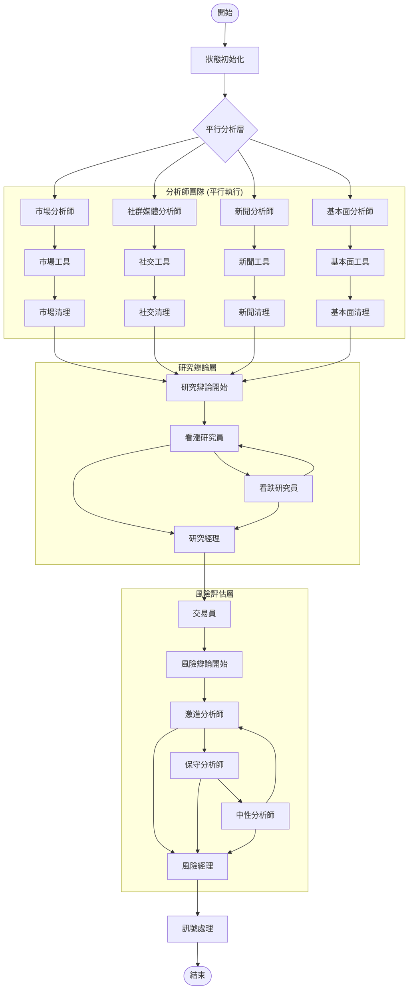
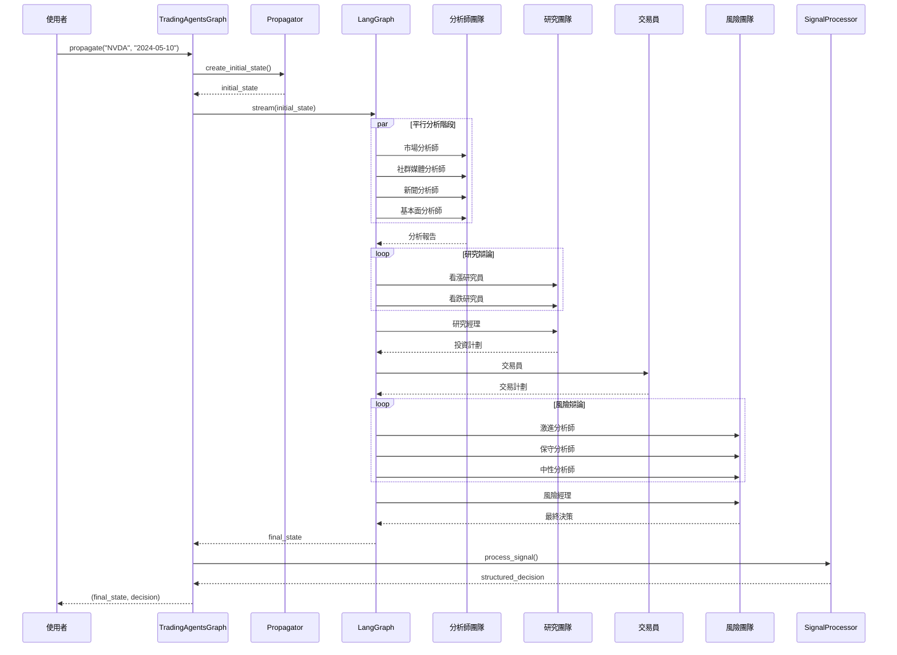

# TradingAgents 圖結構架構

## 概述

TradingAgents 基於 LangGraph 建構了一個複雜的多智慧體協作圖結構，透過有向無環圖（DAG）的方式組織智慧體工作流。系統採用狀態驅動的圖執行模式，支援條件路由、平行處理和動態決策。

## 🏗️ 圖結構設計原理

### 核心設計理念

- **狀態驅動**: 基於 `AgentState` 的統一狀態管理
- **條件路由**: 智慧的工作流分支決策
- **平行處理**: 分析師團隊的平行執行
- **層次化協作**: 分析→研究→執行→風險→管理的層次結構
- **記憶機制**: 智慧體間的經驗共享和學習

### 圖結構架構圖



## 📋 核心組件詳解

### 1. TradingAgentsGraph 主控制器

**檔案位置**: `tradingagents/graph/trading_graph.py`

```python
class TradingAgentsGraph:
    """交易智慧體圖的主要編排類別"""

    def __init__(
        self,
        selected_analysts=["market", "social", "news", "fundamentals"],
        debug=False,
        config: Dict[str, Any] = None,
    ):
        """初始化交易智慧體圖和組件"""
        self.debug = debug
        self.config = config or DEFAULT_CONFIG

        # 初始化LLM
        self._initialize_llms()

        # 初始化核心組件
        self.setup = GraphSetup()
        self.conditional_logic = ConditionalLogic()
        self.propagator = Propagator()
        self.reflector = Reflector()
        self.signal_processor = SignalProcessor()

    def propagate(self, company_name: str, trade_date: str):
        """執行完整的交易分析流程"""
        # 建立初始狀態
        initial_state = self.propagator.create_initial_state(
            company_name, trade_date
        )

        # 執行圖
        graph_args = self.propagator.get_graph_args()

        for step in self.graph.stream(initial_state, **graph_args):
            if self.debug:
                print(step)

        # 處理最終訊號
        final_signal = step.get("final_trade_decision", "")
        decision = self.signal_processor.process_signal(
            final_signal, company_name
        )

        return step, decision
```

### 2. ConditionalLogic 條件路由

**檔案位置**: `tradingagents/graph/conditional_logic.py`

```python
class ConditionalLogic:
    """處理圖流程的條件邏輯"""

    def __init__(self, max_debate_rounds=1, max_risk_discuss_rounds=1):
        self.max_debate_rounds = max_debate_rounds
        self.max_risk_discuss_rounds = max_risk_discuss_rounds

    def should_continue_market(self, state: AgentState):
        """判斷市場分析是否應該繼續"""
        messages = state["messages"]
        last_message = messages[-1]

        if hasattr(last_message, 'tool_calls') and last_message.tool_calls:
            return "tools_market"
        return "Msg Clear Market"

    def should_continue_debate(self, state: AgentState) -> str:
        """判斷辯論是否應該繼續"""
        if state["investment_debate_state"]["count"] >= 2 * self.max_debate_rounds:
            return "Research Manager"
        if state["investment_debate_state"]["current_response"].startswith("Bull"):
            return "Bear Researcher"
        return "Bull Researcher"
```

## 🔄 圖執行流程

### 執行時序圖



## ⚙️ 邊和路由設計

### 邊類型分類

#### 1. 順序邊 (Sequential Edges)
```python
# 分析師完成後進入研究階段
workflow.add_edge("Msg Clear Market", "Bull Researcher")
workflow.add_edge("Msg Clear Social", "Bull Researcher")
workflow.add_edge("Msg Clear News", "Bull Researcher")
workflow.add_edge("Msg Clear Fundamentals", "Bull Researcher")

# 研究經理 → 交易員
workflow.add_edge("Research Manager", "Trader")

# 交易員 → 風險分析
workflow.add_edge("Trader", "Risky Analyst")
```

#### 2. 條件邊 (Conditional Edges)
```python
# 分析師工具呼叫條件
workflow.add_conditional_edges(
    "market",
    self.conditional_logic.should_continue_market,
    {
        "tools_market": "tools_market",
        "Msg Clear Market": "Msg Clear Market",
    },
)

# 研究辯論條件
workflow.add_conditional_edges(
    "Bull Researcher",
    self.conditional_logic.should_continue_debate,
    {
        "Bear Researcher": "Bear Researcher",
        "Research Manager": "Research Manager",
    },
)
```

#### 3. 平行邊 (Parallel Edges)
```python
# 從START同時啟動所有分析師
workflow.add_edge(START, "market")
workflow.add_edge(START, "social")
workflow.add_edge(START, "news")
workflow.add_edge(START, "fundamentals")
```

## 🔧 錯誤處理和恢復

### 節點級錯誤處理

```python
# 在每個智慧體節點中
try:
    # 執行智慧體邏輯
    result = agent.invoke(state)
    return {"messages": [result]}
except Exception as e:
    logger.error(f"智慧體執行失敗: {e}")
    # 回傳預設回應
    return {"messages": [("ai", "分析暫時不可用，請稍後重試")]}
```

### 圖級錯誤恢復

```python
# 在TradingAgentsGraph中
try:
    for step in self.graph.stream(initial_state, **graph_args):
        if self.debug:
            print(step)
except Exception as e:
    logger.error(f"圖執行失敗: {e}")
    # 回傳安全的預設決策
    return None, {
        'action': '持有',
        'target_price': None,
        'confidence': 0.5,
        'risk_score': 0.5,
        'reasoning': '系統錯誤，建議持有'
    }
```

## 📊 效能監控和優化

### 執行時間監控

```python
import time
from tradingagents.utils.tool_logging import log_graph_module

@log_graph_module("graph_execution")
def propagate(self, company_name: str, trade_date: str):
    start_time = time.time()

    # 執行圖
    result = self.graph.stream(initial_state, **graph_args)

    execution_time = time.time() - start_time
    logger.info(f"圖執行完成，耗時: {execution_time:.2f}秒")

    return result
```

## 🚀 擴展和自訂

### 新增新的分析師

```python
# 1. 建立新的分析師函數
def create_custom_analyst(llm, toolkit):
    # 實作自訂分析師邏輯
    pass

# 2. 在GraphSetup中新增
if "custom" in selected_analysts:
    analyst_nodes["custom"] = create_custom_analyst(
        self.quick_thinking_llm, self.toolkit
    )
    tool_nodes["custom"] = self.tool_nodes["custom"]
    delete_nodes["custom"] = create_msg_delete()

# 3. 新增條件邏輯
def should_continue_custom(self, state: AgentState):
    # 實作自訂條件邏輯
    pass
```

## 📝 最佳實踐

### 1. 狀態設計原則
- **最小化狀態**: 只在狀態中保存必要的資訊
- **型別安全**: 使用 TypedDict 和 Annotated 確保型別安全
- **狀態不變性**: 避免直接修改狀態，使用回傳新狀態的方式

### 2. 節點設計原則
- **單一職責**: 每個節點只負責一個特定的任務
- **冪等性**: 節點應該是冪等的，多次執行產生相同結果
- **錯誤處理**: 每個節點都應該有適當的錯誤處理機制

### 3. 邊設計原則
- **明確條件**: 條件邊的邏輯應該清晰明確
- **避免死結**: 確保圖中不存在無法退出的迴圈
- **效能考量**: 避免不必要的條件檢查

透過這種基於 LangGraph 的圖結構設計，TradingAgents 實現高度彈性和可擴展的多智慧體協作框架，為複雜的金融決策提供強大的技術支撐。
