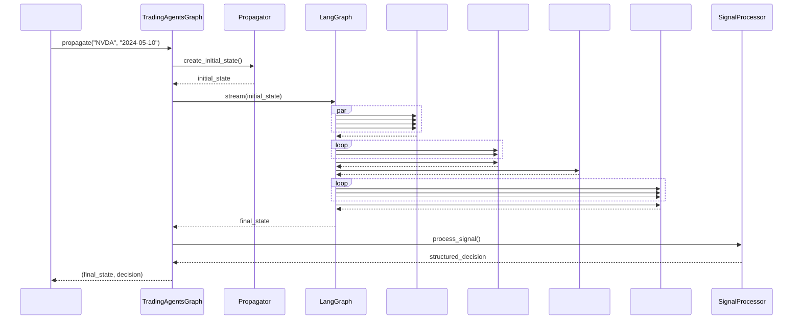

# TradingAgents 

## 

TradingAgents LangGraph DAG

## 

### 

- ****: `AgentState` 
- ****: 
- ****: 
- ****: →→→→
- ****: 

### 

```mermaid
graph TD
 START([]) --> INIT[]

 INIT --> PARALLEL_ANALYSIS{}

 subgraph " ()"
 MARKET[]
 SOCIAL[]
 NEWS[]
 FUNDAMENTALS[]

 MARKET --> MARKET_TOOLS[]
 SOCIAL --> SOCIAL_TOOLS[]
 NEWS --> NEWS_TOOLS[]
 FUNDAMENTALS --> FUND_TOOLS[]

 MARKET_TOOLS --> MARKET_CLEAR[]
 SOCIAL_TOOLS --> SOCIAL_CLEAR[]
 NEWS_TOOLS --> NEWS_CLEAR[]
 FUND_TOOLS --> FUND_CLEAR[]
 end

 PARALLEL_ANALYSIS --> MARKET
 PARALLEL_ANALYSIS --> SOCIAL
 PARALLEL_ANALYSIS --> NEWS
 PARALLEL_ANALYSIS --> FUNDAMENTALS

 MARKET_CLEAR --> RESEARCH_DEBATE
 SOCIAL_CLEAR --> RESEARCH_DEBATE
 NEWS_CLEAR --> RESEARCH_DEBATE
 FUND_CLEAR --> RESEARCH_DEBATE

 subgraph ""
 RESEARCH_DEBATE[]
 BULL[]
 BEAR[]
 RESEARCH_MGR[]
 end

 RESEARCH_DEBATE --> BULL
 BULL --> BEAR
 BEAR --> BULL
 BULL --> RESEARCH_MGR
 BEAR --> RESEARCH_MGR

 RESEARCH_MGR --> TRADER[]

 subgraph ""
 TRADER --> RISK_DEBATE[]
 RISK_DEBATE --> RISKY[]
 RISKY --> SAFE[]
 SAFE --> NEUTRAL[]
 NEUTRAL --> RISKY
 RISKY --> RISK_JUDGE[]
 SAFE --> RISK_JUDGE
 NEUTRAL --> RISK_JUDGE
 end

 RISK_JUDGE --> SIGNAL[]
 SIGNAL --> END([])
```

## 

### 1. TradingAgentsGraph 

****: `tradingagents/graph/trading_graph.py`

```python
class TradingAgentsGraph:
 """"""

 def __init__(
 self,
 selected_analysts=["market", "social", "news", "fundamentals"],
 debug=False,
 config: Dict[str, Any] = None,
 ):
 """"""
 self.debug = debug
 self.config = config or DEFAULT_CONFIG

 # LLM
 self._initialize_llms()

 # 
 self.setup = GraphSetup()
 self.conditional_logic = ConditionalLogic()
 self.propagator = Propagator()
 self.reflector = Reflector()
 self.signal_processor = SignalProcessor()

 def propagate(self, company_name: str, trade_date: str):
 """"""
 # 
 initial_state = self.propagator.create_initial_state(
 company_name, trade_date
 )

 # 
 graph_args = self.propagator.get_graph_args()

 for step in self.graph.stream(initial_state, **graph_args):
 if self.debug:
 print(step)

 # 
 final_signal = step.get("final_trade_decision", "")
 decision = self.signal_processor.process_signal(
 final_signal, company_name
 )

 return step, decision
```

### 2. ConditionalLogic 

****: `tradingagents/graph/conditional_logic.py`

```python
class ConditionalLogic:
 """"""

 def __init__(self, max_debate_rounds=1, max_risk_discuss_rounds=1):
 self.max_debate_rounds = max_debate_rounds
 self.max_risk_discuss_rounds = max_risk_discuss_rounds

 def should_continue_market(self, state: AgentState):
 """"""
 messages = state["messages"]
 last_message = messages[-1]

 if hasattr(last_message, 'tool_calls') and last_message.tool_calls:
 return "tools_market"
 return "Msg Clear Market"

 def should_continue_debate(self, state: AgentState) -> str:
 """"""
 if state["investment_debate_state"]["count"] >= 2 * self.max_debate_rounds:
 return "Research Manager"
 if state["investment_debate_state"]["current_response"].startswith("Bull"):
 return "Bear Researcher"
 return "Bull Researcher"
```

## 

### 



## 

### 

#### 1. (Sequential Edges)
```python
# 
workflow.add_edge("Msg Clear Market", "Bull Researcher")
workflow.add_edge("Msg Clear Social", "Bull Researcher")
workflow.add_edge("Msg Clear News", "Bull Researcher")
workflow.add_edge("Msg Clear Fundamentals", "Bull Researcher")

# → 
workflow.add_edge("Research Manager", "Trader")

# → 
workflow.add_edge("Trader", "Risky Analyst")
```

#### 2. (Conditional Edges)
```python
# 
workflow.add_conditional_edges(
 "market",
 self.conditional_logic.should_continue_market,
 {
 "tools_market": "tools_market",
 "Msg Clear Market": "Msg Clear Market",
 },
)

# 
workflow.add_conditional_edges(
 "Bull Researcher",
 self.conditional_logic.should_continue_debate,
 {
 "Bear Researcher": "Bear Researcher",
 "Research Manager": "Research Manager",
 },
)
```

#### 3. (Parallel Edges)
```python
# START
workflow.add_edge(START, "market")
workflow.add_edge(START, "social")
workflow.add_edge(START, "news")
workflow.add_edge(START, "fundamentals")
```

## 

### 

```python
# 
try:
 # 
 result = agent.invoke(state)
 return {"messages": [result]}
except Exception as e:
 logger.error(f": {e}")
 # 
 return {"messages": [("ai", "")]}
```

### 

```python
# TradingAgentsGraph
try:
 for step in self.graph.stream(initial_state, **graph_args):
 if self.debug:
 print(step)
except Exception as e:
 logger.error(f": {e}")
 # 
 return None, {
 'action': '',
 'target_price': None,
 'confidence': 0.5,
 'risk_score': 0.5,
 'reasoning': ''
 }
```

## 

### 

```python
import time
from tradingagents.utils.tool_logging import log_graph_module

@log_graph_module("graph_execution")
def propagate(self, company_name: str, trade_date: str):
 start_time = time.time()

 # 
 result = self.graph.stream(initial_state, **graph_args)

 execution_time = time.time() - start_time
 logger.info(f": {execution_time:.2f}")

 return result
```

## 

### 

```python
# 1. 
def create_custom_analyst(llm, toolkit):
 # 
 pass

# 2. GraphSetup
if "custom" in selected_analysts:
 analyst_nodes["custom"] = create_custom_analyst(
 self.quick_thinking_llm, self.toolkit
 )
 tool_nodes["custom"] = self.tool_nodes["custom"]
 delete_nodes["custom"] = create_msg_delete()

# 3. 
def should_continue_custom(self, state: AgentState):
 # 
 pass
```

## 

### 1. 
- ****: 
- ****: TypedDict Annotated 
- ****: 

### 2. 
- ****: 
- ****: 
- ****: 

### 3. 
- ****: 
- ****: 
- ****: 

 LangGraph TradingAgents 
