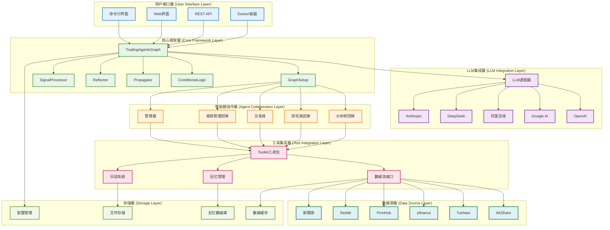
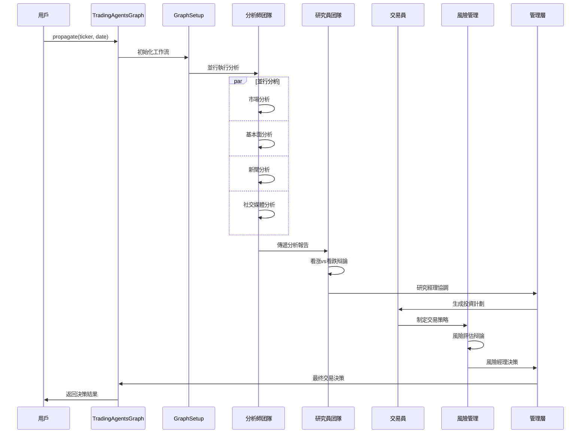

# TradingAgents 系統架構

## 概述

TradingAgents 是一個基於多智能體協作的金融交易決策框架，採用 LangGraph 構建智能體工作流，支持中國A股、港股和美股的全面分析。系統通過模塊化設計實現高度可擴展性和可維護性。

## 🏗️ 系統架構設計

### 架構原則

- **模塊化設計**: 每個組件獨立開發和部署
- **智能體協作**: 多智能體分工合作，模擬真實交易团隊
- **數據驱動**: 基於多源數據融合的決策機制
- **可擴展性**: 支持新智能體、數據源和分析工具的快速集成
- **容錯性**: 完善的錯誤處理和降級策略
- **性能優化**: 並行處理和緩存機制

### 系統架構圖



## 📋 各層次詳細說明

### 1. 用戶接口層 (User Interface Layer)

#### 命令行界面 (CLI)
**文件位置**: `main.py`

```python
from tradingagents.graph.trading_graph import TradingAgentsGraph
from tradingagents.default_config import DEFAULT_CONFIG

# 創建自定義配置
config = DEFAULT_CONFIG.copy()
config["llm_provider"] = "google"
config["deep_think_llm"] = "gemini-2.0-flash"
config["quick_think_llm"] = "gemini-2.0-flash"
config["max_debate_rounds"] = 1
config["online_tools"] = True

# 初始化交易圖
ta = TradingAgentsGraph(debug=True, config=config)

# 執行分析
_, decision = ta.propagate("NVDA", "2024-05-10")
print(decision)
```

#### Docker容器化部署
**配置文件**: `pyproject.toml`

```toml
[project]
name = "tradingagents"
version = "0.1.13-preview"
description = "Multi-agent trading framework"
requires-python = ">=3.10"

[project.scripts]
tradingagents = "main:main"
```

### 2. LLM集成層 (LLM Integration Layer)

#### LLM適配器架構
**文件位置**: `tradingagents/llm_adapters/`

```python
from langchain_openai import ChatOpenAI
from langchain_anthropic import ChatAnthropic
from langchain_google_genai import ChatGoogleGenerativeAI
from tradingagents.llm_adapters import ChatDashScope, ChatDashScopeOpenAI, ChatGoogleOpenAI

# LLM提供商配置
if config["llm_provider"].lower() == "openai":
    deep_thinking_llm = ChatOpenAI(
        model=config["deep_think_llm"], 
        base_url=config["backend_url"]
    )
    quick_thinking_llm = ChatOpenAI(
        model=config["quick_think_llm"], 
        base_url=config["backend_url"]
    )
elif config["llm_provider"] == "google":
    deep_thinking_llm = ChatGoogleGenerativeAI(
        model=config["deep_think_llm"]
    )
    quick_thinking_llm = ChatGoogleGenerativeAI(
        model=config["quick_think_llm"]
    )
```

#### 支持的LLM提供商

- **OpenAI**: GPT-4o, GPT-4o-mini, o1-preview, o1-mini
- **Google AI**: Gemini-2.0-flash, Gemini-1.5-pro, Gemini-1.5-flash
- **阿里百炼**: Qwen系列模型
- **DeepSeek**: DeepSeek-V3 (高性價比選擇)
- **Anthropic**: Claude系列模型

### 3. 核心框架層 (Core Framework Layer)

#### TradingAgentsGraph 主控制器
**文件位置**: `tradingagents/graph/trading_graph.py`

```python
class TradingAgentsGraph:
    """交易智能體圖的主要編排類"""
    
    def __init__(
        self,
        selected_analysts=["market", "social", "news", "fundamentals"],
        debug=False,
        config: Dict[str, Any] = None,
    ):
        """初始化交易智能體圖和組件
        
        Args:
            selected_analysts: 要包含的分析師類型列表
            debug: 是否運行在調試模式
            config: 配置字典，如果為None則使用默認配置
        """
        self.debug = debug
        self.config = config or DEFAULT_CONFIG
        
        # 更新接口配置
        set_config(self.config)
        
        # 創建必要的目錄
        os.makedirs(
            os.path.join(self.config["project_dir"], "dataflows/data_cache"),
            exist_ok=True,
        )
        
        # 初始化LLM
        self._initialize_llms()
        
        # 初始化組件
        self.setup = GraphSetup()
        self.conditional_logic = ConditionalLogic()
        self.propagator = Propagator()
        self.reflector = Reflector()
        self.signal_processor = SignalProcessor()
```

#### GraphSetup 圖構建器
**文件位置**: `tradingagents/graph/setup.py`

```python
class GraphSetup:
    """负责構建和配置LangGraph工作流"""
    
    def __init__(self):
        self.workflow = StateGraph(AgentState)
        self.toolkit = None
        
    def build_graph(self, llm, toolkit, selected_analysts):
        """構建完整的智能體工作流圖"""
        # 添加分析師節點
        self._add_analyst_nodes(llm, toolkit, selected_analysts)
        
        # 添加研究員節點
        self._add_researcher_nodes(llm)
        
        # 添加交易員節點
        self._add_trader_node(llm)
        
        # 添加風險管理節點
        self._add_risk_management_nodes(llm)
        
        # 添加管理層節點
        self._add_management_nodes(llm)
        
        # 定義工作流邊
        self._define_workflow_edges()
        
        return self.workflow.compile()
```

#### ConditionalLogic 條件路由
**文件位置**: `tradingagents/graph/conditional_logic.py`

```python
class ConditionalLogic:
    """處理工作流中的條件分支和路由逻辑"""
    
    def should_continue_debate(self, state: AgentState) -> str:
        """判斷是否繼续研究員辩論"""
        if state["investment_debate_state"]["count"] >= self.max_debate_rounds:
            return "research_manager"
        return "continue_debate"
    
    def should_continue_risk_discussion(self, state: AgentState) -> str:
        """判斷是否繼续風險討論"""
        if state["risk_debate_state"]["count"] >= self.max_risk_rounds:
            return "risk_manager"
        return "continue_risk_discussion"
```

### 4. 智能體協作層 (Agent Collaboration Layer)

#### 狀態管理系統
**文件位置**: `tradingagents/agents/utils/agent_states.py`

```python
from typing import Annotated
from langgraph.graph import MessagesState

class AgentState(MessagesState):
    """智能體狀態管理類 - 繼承自 LangGraph MessagesState"""
    
    # 基础信息
    company_of_interest: Annotated[str, "目標分析公司股票代碼"]
    trade_date: Annotated[str, "交易日期"]
    sender: Annotated[str, "發送消息的智能體"]
    
    # 分析師報告
    market_report: Annotated[str, "市場分析師報告"]
    sentiment_report: Annotated[str, "社交媒體分析師報告"]
    news_report: Annotated[str, "新聞分析師報告"]
    fundamentals_report: Annotated[str, "基本面分析師報告"]
    
    # 研究和決策
    investment_debate_state: Annotated[InvestDebateState, "投資辩論狀態"]
    investment_plan: Annotated[str, "投資計劃"]
    trader_investment_plan: Annotated[str, "交易員投資計劃"]
    
    # 風險管理
    risk_debate_state: Annotated[RiskDebateState, "風險辩論狀態"]
    final_trade_decision: Annotated[str, "最终交易決策"]
```

#### 智能體工厂模式
**文件位置**: `tradingagents/agents/`

```python
# 分析師創建函數
from tradingagents.agents.analysts import (
    create_fundamentals_analyst,
    create_market_analyst,
    create_news_analyst,
    create_social_media_analyst,
    create_china_market_analyst
)

# 研究員創建函數
from tradingagents.agents.researchers import (
    create_bull_researcher,
    create_bear_researcher
)

# 交易員創建函數
from tradingagents.agents.trader import create_trader

# 風險管理創建函數
from tradingagents.agents.risk_mgmt import (
    create_conservative_debator,
    create_neutral_debator,
    create_aggressive_debator
)

# 管理層創建函數
from tradingagents.agents.managers import (
    create_research_manager,
    create_risk_manager
)
```

### 5. 工具集成層 (Tool Integration Layer)

#### Toolkit 統一工具包
**文件位置**: `tradingagents/agents/utils/agent_utils.py`

```python
class Toolkit:
    """統一工具包，為所有智能體提供數據訪問接口"""
    
    def __init__(self, config):
        self.config = config
        self.dataflow = DataFlowInterface(config)
    
    def get_stock_fundamentals_unified(self, ticker: str):
        """統一基本面分析工具，自動识別股票類型"""
        from tradingagents.utils.stock_utils import StockUtils
        market_info = StockUtils.get_market_info(ticker)
        
        if market_info['market_type'] == 'A股':
            return self.dataflow.get_a_stock_fundamentals(ticker)
        elif market_info['market_type'] == '港股':
            return self.dataflow.get_hk_stock_fundamentals(ticker)
        else:
            return self.dataflow.get_us_stock_fundamentals(ticker)
    
    def get_market_data(self, ticker: str, period: str = "1y"):
        """獲取市場數據"""
        return self.dataflow.get_market_data(ticker, period)
    
    def get_news_data(self, ticker: str, days: int = 7):
        """獲取新聞數據"""
        return self.dataflow.get_news_data(ticker, days)
```

#### 數據流接口
**文件位置**: `tradingagents/dataflows/interface.py`

```python
# 全局配置管理
from .config import get_config, set_config, DATA_DIR

# 數據獲取函數
def get_finnhub_news(
    ticker: Annotated[str, "公司股票代碼，如 'AAPL', 'TSM' 等"],
    curr_date: Annotated[str, "當前日期，格式為 yyyy-mm-dd"],
    look_back_days: Annotated[int, "回看天數"],
):
    """獲取指定時間範围內的公司新聞
    
    Args:
        ticker (str): 目標公司的股票代碼
        curr_date (str): 當前日期，格式為 yyyy-mm-dd
        look_back_days (int): 回看天數
    
    Returns:
        str: 包含公司新聞的數據框
    """
    start_date = datetime.strptime(curr_date, "%Y-%m-%d")
    before = start_date - relativedelta(days=look_back_days)
    before = before.strftime("%Y-%m-%d")
    
    result = get_data_in_range(ticker, before, curr_date, "news_data", DATA_DIR)
    
    if len(result) == 0:
        error_msg = f"⚠️ 無法獲取{ticker}的新聞數據 ({before} 到 {curr_date})"
        logger.debug(f"📰 [DEBUG] {error_msg}")
        return error_msg
    
    return result
```

#### 記忆管理系統
**文件位置**: `tradingagents/agents/utils/memory.py`

```python
class FinancialSituationMemory:
    """金融情况記忆管理類"""
    
    def __init__(self, config):
        self.config = config
        self.memory_store = {}
    
    def get_memories(self, query: str, n_matches: int = 2):
        """檢索相關歷史記忆
        
        Args:
            query (str): 查詢字符串
            n_matches (int): 返回匹配數量
        
        Returns:
            List[Dict]: 相關記忆列表
        """
        # 實現記忆檢索逻辑
        pass
    
    def add_memory(self, content: str, metadata: dict):
        """添加新記忆
        
        Args:
            content (str): 記忆內容
            metadata (dict): 元數據
        """
        # 實現記忆存储逻辑
        pass
```

### 6. 數據源層 (Data Source Layer)

#### 多數據源支持
**文件位置**: `tradingagents/dataflows/`

```python
# AKShare - 中國金融數據
from .akshare_utils import (
    get_hk_stock_data_akshare,
    get_hk_stock_info_akshare
)

# Tushare - 專業金融數據
from .tushare_utils import get_tushare_data

# yfinance - 國际市場數據
from .yfin_utils import get_yahoo_finance_data

# FinnHub - 新聞和基本面數據
from .finnhub_utils import get_data_in_range

# Reddit - 社交媒體情绪
from .reddit_utils import fetch_top_from_category

# 中國社交媒體情绪
from .chinese_finance_utils import get_chinese_social_sentiment

# Google新聞
from .googlenews_utils import get_google_news
```

#### 數據源可用性檢查

```python
# 港股工具可用性檢查
try:
    from .hk_stock_utils import get_hk_stock_data, get_hk_stock_info
    HK_STOCK_AVAILABLE = True
except ImportError as e:
    logger.warning(f"⚠️ 港股工具不可用: {e}")
    HK_STOCK_AVAILABLE = False

# yfinance可用性檢查
try:
    import yfinance as yf
    YF_AVAILABLE = True
except ImportError as e:
    logger.warning(f"⚠️ yfinance庫不可用: {e}")
    yf = None
    YF_AVAILABLE = False
```

### 7. 存储層 (Storage Layer)

#### 配置管理
**文件位置**: `tradingagents/default_config.py`

```python
import os

DEFAULT_CONFIG = {
    "project_dir": os.path.abspath(os.path.join(os.path.dirname(__file__), ".")),
    "results_dir": os.getenv("TRADINGAGENTS_RESULTS_DIR", "./results"),
    "data_dir": os.path.join(os.path.expanduser("~"), "Documents", "TradingAgents", "data"),
    "data_cache_dir": os.path.join(
        os.path.abspath(os.path.join(os.path.dirname(__file__), ".")),
        "dataflows/data_cache",
    ),
    # LLM設置
    "llm_provider": "openai",
    "deep_think_llm": "o4-mini",
    "quick_think_llm": "gpt-4o-mini",
    "backend_url": "https://api.openai.com/v1",
    # 辩論和討論設置
    "max_debate_rounds": 1,
    "max_risk_discuss_rounds": 1,
    "max_recur_limit": 100,
    # 工具設置
    "online_tools": True,
}
```

#### 數據緩存系統
**文件位置**: `tradingagents/dataflows/config.py`

```python
from .config import get_config, set_config, DATA_DIR

# 數據目錄配置
DATA_DIR = get_config().get("data_dir", "./data")
CACHE_DIR = get_config().get("data_cache_dir", "./cache")

# 緩存策略
CACHE_EXPIRY = {
    "market_data": 300,  # 5分鐘
    "news_data": 3600,   # 1小時
    "fundamentals": 86400,  # 24小時
}
```

## 🔄 系統工作流程

### 完整分析流程



### 數據流轉過程

1. **數據獲取**: 從多個數據源並行獲取數據
2. **數據處理**: 清洗、標準化和緩存數據
3. **智能體分析**: 各智能體基於數據進行專業分析
4. **狀態同步**: 通過 `AgentState` 共享分析結果
5. **協作決策**: 多轮辩論和協商形成最终決策
6. **結果輸出**: 格式化輸出決策結果和推理過程

## 🛠️ 技術棧

### 核心框架
- **LangGraph**: 智能體工作流編排
- **LangChain**: LLM集成和工具調用
- **Python 3.10+**: 主要開發語言

### LLM集成
- **OpenAI**: GPT系列模型
- **Google AI**: Gemini系列模型
- **阿里百炼**: Qwen系列模型
- **DeepSeek**: DeepSeek-V3模型
- **Anthropic**: Claude系列模型

### 數據處理
- **pandas**: 數據分析和處理
- **numpy**: 數值計算
- **yfinance**: 國际市場數據
- **akshare**: 中國金融數據
- **tushare**: 專業金融數據

### 存储和緩存
- **文件系統**: 本地數據緩存
- **JSON**: 配置和狀態存储
- **CSV/Parquet**: 數據文件格式

### 部署和運維
- **Docker**: 容器化部署
- **Poetry/pip**: 依賴管理
- **pytest**: 單元測試
- **GitHub Actions**: CI/CD

## ⚙️ 配置管理

### 環境變量配置

```bash
# LLM API密鑰
OPENAI_API_KEY=your_openai_key
GOOGLE_API_KEY=your_google_key
DASHSCOPE_API_KEY=your_dashscope_key
DEEPSEEK_API_KEY=your_deepseek_key
ANTHROPIC_API_KEY=your_anthropic_key

# 數據源API密鑰
TUSHARE_TOKEN=your_tushare_token
FINNHUB_API_KEY=your_finnhub_key
REDDIT_CLIENT_ID=your_reddit_client_id
REDDIT_CLIENT_SECRET=your_reddit_secret

# 系統配置
TRADINGAGENTS_RESULTS_DIR=./results
TRADINGAGENTS_DATA_DIR=./data
TRADINGAGENTS_LOG_LEVEL=INFO
```

### 運行時配置

```python
# 自定義配置示例
custom_config = {
    "llm_provider": "google",
    "deep_think_llm": "gemini-2.0-flash",
    "quick_think_llm": "gemini-1.5-flash",
    "max_debate_rounds": 3,
    "max_risk_discuss_rounds": 2,
    "online_tools": True,
    "debug": True,
}

ta = TradingAgentsGraph(config=custom_config)
```

## 📊 監控和觀測

### 日誌系統
**文件位置**: `tradingagents/utils/logging_init.py`

```python
from tradingagents.utils.logging_init import get_logger

# 獲取日誌記錄器
logger = get_logger("default")
logger.info("📊 [系統] 開始分析股票: AAPL")
logger.debug("📊 [DEBUG] 配置信息: {config}")
logger.warning("⚠️ [警告] 數據源不可用")
logger.error("❌ [錯誤] API調用失败")
```

### 性能監控

```python
# 智能體執行時間監控
from tradingagents.utils.tool_logging import log_analyst_module

@log_analyst_module("market")
def market_analyst_node(state):
    """市場分析師節點，自動記錄執行時間和性能指標"""
    # 分析逻辑
    pass
```

### 錯誤處理和降級

```python
# 數據源降級策略
try:
    data = primary_data_source.get_data(ticker)
except Exception as e:
    logger.warning(f"主數據源失败，切換到备用數據源: {e}")
    data = fallback_data_source.get_data(ticker)

# LLM調用重試機制
from tenacity import retry, stop_after_attempt, wait_exponential

@retry(stop=stop_after_attempt(3), wait=wait_exponential(multiplier=1, min=4, max=10))
def call_llm_with_retry(llm, prompt):
    """帶重試機制的LLM調用"""
    return llm.invoke(prompt)
```

## 🚀 擴展性設計

### 添加新智能體

```python
# 1. 創建智能體文件
# tradingagents/agents/analysts/custom_analyst.py
def create_custom_analyst(llm, toolkit):
    @log_analyst_module("custom")
    def custom_analyst_node(state):
        # 自定義分析逻辑
        return state
    return custom_analyst_node

# 2. 更新狀態類
class AgentState(MessagesState):
    custom_report: Annotated[str, "自定義分析師報告"]

# 3. 集成到工作流
workflow.add_node("custom_analyst", create_custom_analyst(llm, toolkit))
```

### 添加新數據源

```python
# 1. 創建數據源適配器
# tradingagents/dataflows/custom_data_source.py
def get_custom_data(ticker: str, date: str):
    """自定義數據源接口"""
    # 數據獲取逻辑
    pass

# 2. 集成到工具包
class Toolkit:
    def get_custom_data_tool(self, ticker: str):
        return get_custom_data(ticker, self.current_date)
```

### 添加新LLM提供商

```python
# 1. 創建LLM適配器
# tradingagents/llm_adapters/custom_llm.py
class CustomLLMAdapter:
    def __init__(self, api_key, model_name):
        self.api_key = api_key
        self.model_name = model_name
    
    def invoke(self, prompt):
        # 自定義LLM調用逻辑
        pass

# 2. 集成到主配置
if config["llm_provider"] == "custom":
    llm = CustomLLMAdapter(
        api_key=os.getenv("CUSTOM_API_KEY"),
        model_name=config["custom_model"]
    )
```

## 🛡️ 安全性考慮

### API密鑰管理
- 使用環境變量存储敏感信息
- 支持 `.env` 文件配置
- 避免在代碼中硬編碼密鑰

### 數據隐私
- 本地數據緩存，不上傳敏感信息
- 支持數據加密存储
- 可配置數據保留策略

### 訪問控制
- API調用頻率限制
- 錯誤重試機制
- 資源使用監控

## 📈 性能優化

### 並行處理
- 分析師团隊並行執行
- 數據獲取異步處理
- 智能體狀態並發更新

### 緩存策略
- 多層緩存架構
- 智能緩存失效
- 數據預取機制

### 資源管理
- 內存使用優化
- 連接池管理
- 垃圾回收優化

TradingAgents 系統架構通過模塊化設計、智能體協作和多源數據融合，為複雜的金融決策提供了强大、可擴展和高性能的技術基础。系統支持多種LLM提供商、數據源和部署方式，能夠適應不同的使用場景和性能要求。