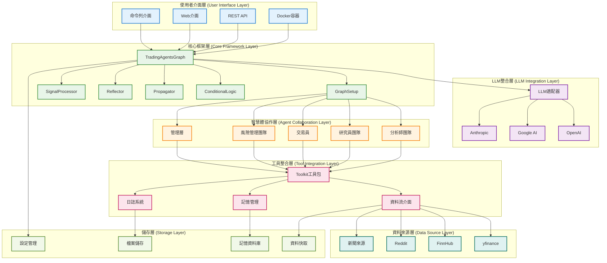
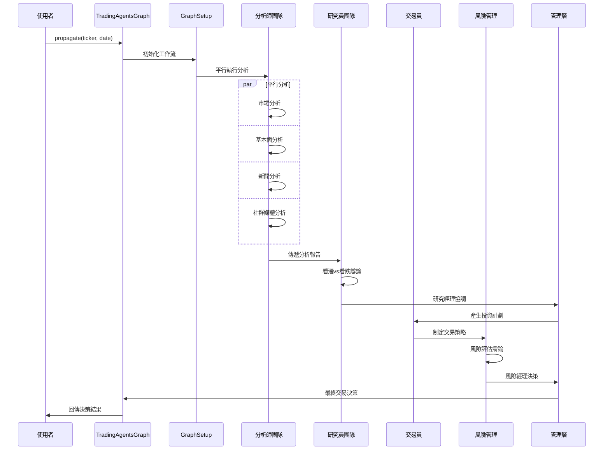

# TradingAgents 系統架構

## 概述

TradingAgents 是一個基於多智慧體協作的金融交易決策框架，採用 LangGraph 構建智慧體工作流，支援全球股票市場的全面分析。系統透過模組化設計實現高度可擴展性和可維護性。

## 🏗️ 系統架構設計

### 架構原則

- **模組化設計**: 每個組件獨立開發和部署
- **智慧體協作**: 多智慧體分工合作，模擬真實交易團隊
- **資料驅動**: 基於多源資料融合的決策機制
- **可擴展性**: 支援新智慧體、資料來源和分析工具的快速整合
- **容錯性**: 完善的錯誤處理和降級策略
- **效能優化**: 平行處理和快取機制

### 系統架構圖



## 📋 各層次詳細說明

### 1. 使用者介面層 (User Interface Layer)

#### 命令列介面 (CLI)
**檔案位置**: `main.py`

```python
from tradingagents.graph.trading_graph import TradingAgentsGraph
from tradingagents.default_config import DEFAULT_CONFIG

# 建立自訂設定
config = DEFAULT_CONFIG.copy()
config["llm_provider"] = "google"
config["deep_think_llm"] = "gemini-2.0-flash"
config["quick_think_llm"] = "gemini-2.0-flash"
config["max_debate_rounds"] = 1
config["online_tools"] = True

# 初始化交易圖
ta = TradingAgentsGraph(debug=True, config=config)

# 執行分析
_, decision = ta.propagate("NVDA", "2024-05-10")
print(decision)
```

#### Docker容器化部署
**設定檔案**: `pyproject.toml`

```toml
[project]
name = "tradingagents"
version = "0.1.13-preview"
description = "Multi-agent trading framework"
requires-python = ">=3.10"

[project.scripts]
tradingagents = "main:main"
```

### 2. LLM整合層 (LLM Integration Layer)

#### LLM適配器架構
**檔案位置**: `tradingagents/llm_adapters/`

```python
from langchain_openai import ChatOpenAI
from langchain_anthropic import ChatAnthropic
from langchain_google_genai import ChatGoogleGenerativeAI

# LLM提供商設定
if config["llm_provider"].lower() == "openai":
    deep_thinking_llm = ChatOpenAI(
        model=config["deep_think_llm"],
        base_url=config["backend_url"]
    )
    quick_thinking_llm = ChatOpenAI(
        model=config["quick_think_llm"],
        base_url=config["backend_url"]
    )
elif config["llm_provider"] == "google":
    deep_thinking_llm = ChatGoogleGenerativeAI(
        model=config["deep_think_llm"]
    )
    quick_thinking_llm = ChatGoogleGenerativeAI(
        model=config["quick_think_llm"]
    )
```

#### 支援的LLM提供商

- **OpenAI**: GPT-4o, GPT-4o-mini, o1-preview, o1-mini
- **Google AI**: Gemini-2.0-flash, Gemini-1.5-pro, Gemini-1.5-flash
- **Anthropic**: Claude系列模型

### 3. 核心框架層 (Core Framework Layer)

#### TradingAgentsGraph 主控制器
**檔案位置**: `tradingagents/graph/trading_graph.py`

```python
class TradingAgentsGraph:
    """交易智慧體圖的主要編排類"""

    def __init__(
        self,
        selected_analysts=["market", "social", "news", "fundamentals"],
        debug=False,
        config: Dict[str, Any] = None,
    ):
        """初始化交易智慧體圖和組件

        Args:
            selected_analysts: 要包含的分析師類型清單
            debug: 是否執行在除錯模式
            config: 設定字典，如果為None則使用預設設定
        """
        self.debug = debug
        self.config = config or DEFAULT_CONFIG

        # 更新介面設定
        set_config(self.config)

        # 建立必要的目錄
        os.makedirs(
            os.path.join(self.config["project_dir"], "dataflows/data_cache"),
            exist_ok=True,
        )

        # 初始化LLM
        self._initialize_llms()

        # 初始化組件
        self.setup = GraphSetup()
        self.conditional_logic = ConditionalLogic()
        self.propagator = Propagator()
        self.reflector = Reflector()
        self.signal_processor = SignalProcessor()
```

### 4. 智慧體協作層 (Agent Collaboration Layer)

#### 狀態管理系統
**檔案位置**: `tradingagents/agents/utils/agent_states.py`

```python
from typing import Annotated
from langgraph.graph import MessagesState

class AgentState(MessagesState):
    """智慧體狀態管理類 - 繼承自 LangGraph MessagesState"""

    # 基礎資訊
    company_of_interest: Annotated[str, "目標分析公司股票代號"]
    trade_date: Annotated[str, "交易日期"]
    sender: Annotated[str, "傳送訊息的智慧體"]

    # 分析師報告
    market_report: Annotated[str, "市場分析師報告"]
    sentiment_report: Annotated[str, "社群媒體分析師報告"]
    news_report: Annotated[str, "新聞分析師報告"]
    fundamentals_report: Annotated[str, "基本面分析師報告"]

    # 研究和決策
    investment_debate_state: Annotated[InvestDebateState, "投資辯論狀態"]
    investment_plan: Annotated[str, "投資計劃"]
    trader_investment_plan: Annotated[str, "交易員投資計劃"]

    # 風險管理
    risk_debate_state: Annotated[RiskDebateState, "風險辯論狀態"]
    final_trade_decision: Annotated[str, "最終交易決策"]
```

### 5. 工具整合層 (Tool Integration Layer)

#### Toolkit 統一工具包
**檔案位置**: `tradingagents/agents/utils/agent_utils.py`

```python
class Toolkit:
    """統一工具包，為所有智慧體提供資料存取介面"""

    def __init__(self, config):
        self.config = config
        self.dataflow = DataFlowInterface(config)

    def get_stock_fundamentals_unified(self, ticker: str):
        """統一基本面分析工具，自動識別股票類型"""
        from tradingagents.utils.stock_utils import get_stock_market_info
        market_info = get_stock_market_info(ticker)

        return self.dataflow.get_us_stock_fundamentals(ticker)

    def get_market_data(self, ticker: str, period: str = "1y"):
        """取得市場資料"""
        return self.dataflow.get_market_data(ticker, period)

    def get_news_data(self, ticker: str, days: int = 7):
        """取得新聞資料"""
        return self.dataflow.get_news_data(ticker, days)
```

### 6. 資料來源層 (Data Source Layer)

#### 多資料來源支援
**檔案位置**: `tradingagents/dataflows/`

```python
# yfinance - 國際市場資料
from .yfin_utils import get_yahoo_finance_data

# FinnHub - 新聞和基本面資料
from .finnhub_utils import get_data_in_range

# Reddit - 社群媒體情緒
from .reddit_utils import fetch_top_from_category

# Google新聞
from .googlenews_utils import get_google_news
```

## 🔄 系統工作流程

### 完整分析流程



## 🛠️ 技術棧

### 核心框架
- **LangGraph**: 智慧體工作流編排
- **LangChain**: LLM整合和工具呼叫
- **Python 3.10+**: 主要開發語言

### LLM整合
- **OpenAI**: GPT系列模型
- **Google AI**: Gemini系列模型
- **Anthropic**: Claude系列模型

### 資料處理
- **pandas**: 資料分析和處理
- **numpy**: 數值計算
- **yfinance**: 國際市場資料

### 儲存和快取
- **檔案系統**: 本地資料快取
- **JSON**: 設定和狀態儲存
- **CSV/Parquet**: 資料檔案格式

### 部署和維運
- **Docker**: 容器化部署
- **Poetry/pip**: 依賴管理
- **pytest**: 單元測試
- **GitHub Actions**: CI/CD

## ⚙️ 設定管理

### 環境變數設定

```bash
# LLM API密鑰
OPENAI_API_KEY=your_openai_key
GOOGLE_API_KEY=your_google_key
ANTHROPIC_API_KEY=your_anthropic_key

# 資料來源API密鑰
FINNHUB_API_KEY=your_finnhub_key
REDDIT_CLIENT_ID=your_reddit_client_id
REDDIT_CLIENT_SECRET=your_reddit_secret

# 系統設定
TRADINGAGENTS_RESULTS_DIR=./results
TRADINGAGENTS_DATA_DIR=./data
TRADINGAGENTS_LOG_LEVEL=INFO
```

### 執行時設定

```python
# 自訂設定範例
custom_config = {
    "llm_provider": "google",
    "deep_think_llm": "gemini-2.0-flash",
    "quick_think_llm": "gemini-1.5-flash",
    "max_debate_rounds": 3,
    "max_risk_discuss_rounds": 2,
    "online_tools": True,
    "debug": True,
}

ta = TradingAgentsGraph(config=custom_config)
```

## 📊 監控和觀測

### 日誌系統
**檔案位置**: `tradingagents/utils/logging_init.py`

```python
from tradingagents.utils.logging_init import get_logger

# 取得日誌記錄器
logger = get_logger("default")
logger.info("📊 [系統] 開始分析股票: AAPL")
logger.debug("📊 [DEBUG] 設定資訊: {config}")
logger.warning("⚠️ [警告] 資料來源不可用")
logger.error("❌ [錯誤] API呼叫失敗")
```

## 🚀 擴展性設計

### 新增新智慧體

```python
# 1. 建立智慧體檔案
# tradingagents/agents/analysts/custom_analyst.py
def create_custom_analyst(llm, toolkit):
    @log_analyst_module("custom")
    def custom_analyst_node(state):
        # 自訂分析邏輯
        return state
    return custom_analyst_node

# 2. 更新狀態類
class AgentState(MessagesState):
    custom_report: Annotated[str, "自訂分析師報告"]

# 3. 整合到工作流
workflow.add_node("custom_analyst", create_custom_analyst(llm, toolkit))
```

TradingAgents 系統架構透過模組化設計、智慧體協作和多源資料融合，為複雜的金融決策提供強大、可擴展和高效能的技術基礎。系統支援多種LLM提供商、資料來源和部署方式，能夠適應不同的使用場景和效能需求。
