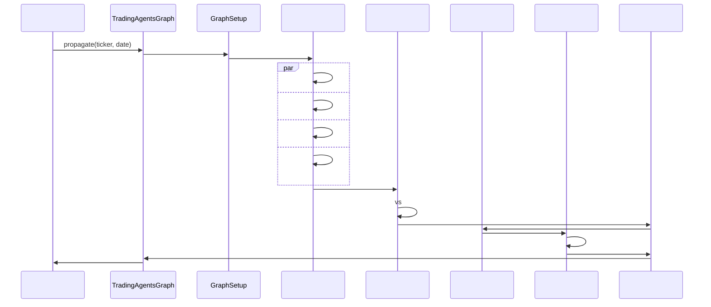

# TradingAgents 

## 

TradingAgents LangGraph 

## 

### 

- ****: 
- ****: 
- ****: 
- ****: 
- ****: 
- ****: 

### 

```mermaid
graph TB
 subgraph " (User Interface Layer)"
 CLI[]
 WEB[Web]
 API[REST API]
 DOCKER[Docker]
 end

 subgraph "LLM (LLM Integration Layer)"
 OPENAI[OpenAI]
 ANTHROPIC[Anthropic]
 ADAPTERS[LLM]
 end

 subgraph " (Core Framework Layer)"
 GRAPH[TradingAgentsGraph]
 SETUP[GraphSetup]
 CONDITIONAL[ConditionalLogic]
 PROPAGATOR[Propagator]
 REFLECTOR[Reflector]
 SIGNAL[SignalProcessor]
 end

 subgraph " (Agent Collaboration Layer)"
 ANALYSTS[]
 RESEARCHERS[]
 TRADER[]
 RISKMGMT[]
 MANAGERS[]
 end

 subgraph " (Tool Integration Layer)"
 TOOLKIT[Toolkit]
 DATAFLOW[]
 MEMORY[]
 LOGGING[]
 end

 subgraph " (Data Source Layer)"
 YFINANCE[yfinance]
 FINNHUB[FinnHub]
 FINNHUB_SENT[FinnHub ]
 NEWS[]
 end

 subgraph " (Storage Layer)"
 CACHE[]
 FILES[]
 MEMORY_DB[]
 CONFIG[]
 end

 %% 
 CLI --> GRAPH
 WEB --> GRAPH
 API --> GRAPH
 DOCKER --> GRAPH

 GRAPH --> ADAPTERS
 ADAPTERS --> OPENAI
 ADAPTERS --> ANTHROPIC

 GRAPH --> SETUP
 GRAPH --> CONDITIONAL
 GRAPH --> PROPAGATOR
 GRAPH --> REFLECTOR
 GRAPH --> SIGNAL

 SETUP --> ANALYSTS
 SETUP --> RESEARCHERS
 SETUP --> TRADER
 SETUP --> RISKMGMT
 SETUP --> MANAGERS

 ANALYSTS --> TOOLKIT
 RESEARCHERS --> TOOLKIT
 TRADER --> TOOLKIT
 RISKMGMT --> TOOLKIT
 MANAGERS --> TOOLKIT

 TOOLKIT --> DATAFLOW
 TOOLKIT --> MEMORY
 TOOLKIT --> LOGGING

 DATAFLOW --> YFINANCE
 DATAFLOW --> FINNHUB
 DATAFLOW --> FINNHUB_SENT
 DATAFLOW --> NEWS

 DATAFLOW --> CACHE
 MEMORY --> MEMORY_DB
 LOGGING --> FILES
 GRAPH --> CONFIG

 %% 
 classDef uiLayer fill:#e3f2fd,stroke:#1976d2,stroke-width:2px
 classDef llmLayer fill:#f3e5f5,stroke:#7b1fa2,stroke-width:2px
 classDef coreLayer fill:#e8f5e8,stroke:#388e3c,stroke-width:2px
 classDef agentLayer fill:#fff3e0,stroke:#f57c00,stroke-width:2px
 classDef toolLayer fill:#fce4ec,stroke:#c2185b,stroke-width:2px
 classDef dataLayer fill:#e0f2f1,stroke:#00695c,stroke-width:2px
 classDef storageLayer fill:#f1f8e9,stroke:#558b2f,stroke-width:2px

 class CLI,WEB,API,DOCKER uiLayer
 class OPENAI,ANTHROPIC,ADAPTERS llmLayer
 class GRAPH,SETUP,CONDITIONAL,PROPAGATOR,REFLECTOR,SIGNAL coreLayer
 class ANALYSTS,RESEARCHERS,TRADER,RISKMGMT,MANAGERS agentLayer
 class TOOLKIT,DATAFLOW,MEMORY,LOGGING toolLayer
 class YFINANCE,FINNHUB,FINNHUB_SENT,NEWS dataLayer
 class CACHE,FILES,MEMORY_DB,CONFIG storageLayer
```

## 

### 1. (User Interface Layer)

#### (CLI)
****: `main.py`

```python
from tradingagents.graph.trading_graph import TradingAgentsGraph
from tradingagents.default_config import DEFAULT_CONFIG

# 
config = DEFAULT_CONFIG.copy()
config["llm_provider"] = "openai"
config["deep_think_llm"] = "gpt-4o"
config["quick_think_llm"] = "gpt-4o-mini"
config["max_debate_rounds"] = 1
config["online_tools"] = True

# 
ta = TradingAgentsGraph(debug=True, config=config)

# 
_, decision = ta.propagate("NVDA", "2024-05-10")
print(decision)
```

#### Docker
****: `pyproject.toml`

```toml
[project]
name = "tradingagents"
version = "0.1.13-preview"
description = "Multi-agent trading framework"
requires-python = ">=3.10"

[project.scripts]
tradingagents = "main:main"
```

### 2. LLM (LLM Integration Layer)

#### LLM
****: `tradingagents/graph/trading_graph.py`

```python
from langchain_openai import ChatOpenAI
from langchain_anthropic import ChatAnthropic

# LLM
if config["llm_provider"].lower() == "openai":
 deep_thinking_llm = ChatOpenAI(
 model=config["deep_think_llm"],
 base_url=config["backend_url"]
 )
 quick_thinking_llm = ChatOpenAI(
 model=config["quick_think_llm"],
 base_url=config["backend_url"]
 )
elif config["llm_provider"] == "anthropic":
 deep_thinking_llm = ChatAnthropic(
 model=config["deep_think_llm"]
 )
 quick_thinking_llm = ChatAnthropic(
 model=config["quick_think_llm"]
 )
```

#### LLM

- **OpenAI**: GPT-4o, GPT-4o-mini
- **Anthropic**: Claude Opus 4, Claude Sonnet 4

### 3. (Core Framework Layer)

#### TradingAgentsGraph 
****: `tradingagents/graph/trading_graph.py`

```python
class TradingAgentsGraph:
 """"""

 def __init__(
 self,
 selected_analysts=["market", "social", "news", "fundamentals"],
 debug=False,
 config: Dict[str, Any] = None,
 ):
 """

 Args:
 selected_analysts: 
 debug: 
 config: None
 """
 self.debug = debug
 self.config = config or DEFAULT_CONFIG

 # 
 set_config(self.config)

 # 
 os.makedirs(
 os.path.join(self.config["project_dir"], "dataflows/data_cache"),
 exist_ok=True,
 )

 # LLM
 self._initialize_llms()

 # 
 self.setup = GraphSetup()
 self.conditional_logic = ConditionalLogic()
 self.propagator = Propagator()
 self.reflector = Reflector()
 self.signal_processor = SignalProcessor()
```

### 4. (Agent Collaboration Layer)

#### 
****: `tradingagents/agents/utils/agent_states.py`

```python
from typing import Annotated
from langgraph.graph import MessagesState

class AgentState(MessagesState):
 """ - LangGraph MessagesState"""

 # 
 company_of_interest: Annotated[str, ""]
 trade_date: Annotated[str, ""]
 sender: Annotated[str, ""]

 # 
 market_report: Annotated[str, ""]
 sentiment_report: Annotated[str, ""]
 news_report: Annotated[str, ""]
 fundamentals_report: Annotated[str, ""]

 # 
 investment_debate_state: Annotated[InvestDebateState, ""]
 investment_plan: Annotated[str, ""]
 trader_investment_plan: Annotated[str, ""]

 # 
 risk_debate_state: Annotated[RiskDebateState, ""]
 final_trade_decision: Annotated[str, ""]
```

### 5. (Tool Integration Layer)

#### Toolkit 
****: `tradingagents/agents/utils/agent_utils.py`

```python
class Toolkit:
 """"""

 def __init__(self, config):
 self.config = config
 self.dataflow = DataFlowInterface(config)

 def get_stock_fundamentals_unified(self, ticker: str):
 """"""
 from tradingagents.utils.stock_utils import get_stock_market_info
 market_info = get_stock_market_info(ticker)

 return self.dataflow.get_us_stock_fundamentals(ticker)

 def get_market_data(self, ticker: str, period: str = "1y"):
 """"""
 return self.dataflow.get_market_data(ticker, period)

 def get_news_data(self, ticker: str, days: int = 7):
 """"""
 return self.dataflow.get_news_data(ticker, days)
```

### 6. (Data Source Layer)

#### 
****: `tradingagents/dataflows/`

```python
# yfinance - 
from .yfin_utils import get_yahoo_finance_data

# FinnHub - 
from .finnhub_utils import get_data_in_range

# FinnHub - 
from .finnhub_utils import get_social_sentiment

# Google
from .googlenews_utils import get_google_news
```

## 

### 



## 

### 
- **LangGraph**: 
- **LangChain**: LLM
- **Python 3.10+**: 

### LLM
- **OpenAI**: GPT
- **Anthropic**: Claude

### 
- **pandas**: 
- **numpy**: 
- **yfinance**: 

### 
- ****: 
- **JSON**: 
- **CSV/Parquet**: 

### 
- **Docker**: 
- **Poetry/pip**: 
- **pytest**: 
- **GitHub Actions**: CI/CD

## 

### 

```bash
# LLM API
OPENAI_API_KEY=your_openai_key
ANTHROPIC_API_KEY=your_anthropic_key

# API
FINNHUB_API_KEY=your_finnhub_key

# 
TRADINGAGENTS_RESULTS_DIR=./results
TRADINGAGENTS_DATA_DIR=./data
TRADINGAGENTS_LOG_LEVEL=INFO
```

### 

```python
# 
custom_config = {
 "llm_provider": "openai",
 "deep_think_llm": "gpt-4o",
 "quick_think_llm": "gpt-4o-mini",
 "max_debate_rounds": 3,
 "max_risk_discuss_rounds": 2,
 "online_tools": True,
 "debug": True,
}

ta = TradingAgentsGraph(config=custom_config)
```

## 

### 
****: `tradingagents/utils/logging_init.py`

```python
from tradingagents.utils.logging_init import get_logger

# 
logger = get_logger("default")
logger.info(" [] : AAPL")
logger.debug(" [DEBUG] : {config}")
logger.warning(" [] ")
logger.error(" [] API")
```

## 

### 

```python
# 1. 
# tradingagents/agents/analysts/custom_analyst.py
def create_custom_analyst(llm, toolkit):
 @log_analyst_module("custom")
 def custom_analyst_node(state):
 # 
 return state
 return custom_analyst_node

# 2. 
class AgentState(MessagesState):
 custom_report: Annotated[str, ""]

# 3. 
workflow.add_node("custom_analyst", create_custom_analyst(llm, toolkit))
```

TradingAgents LLM
