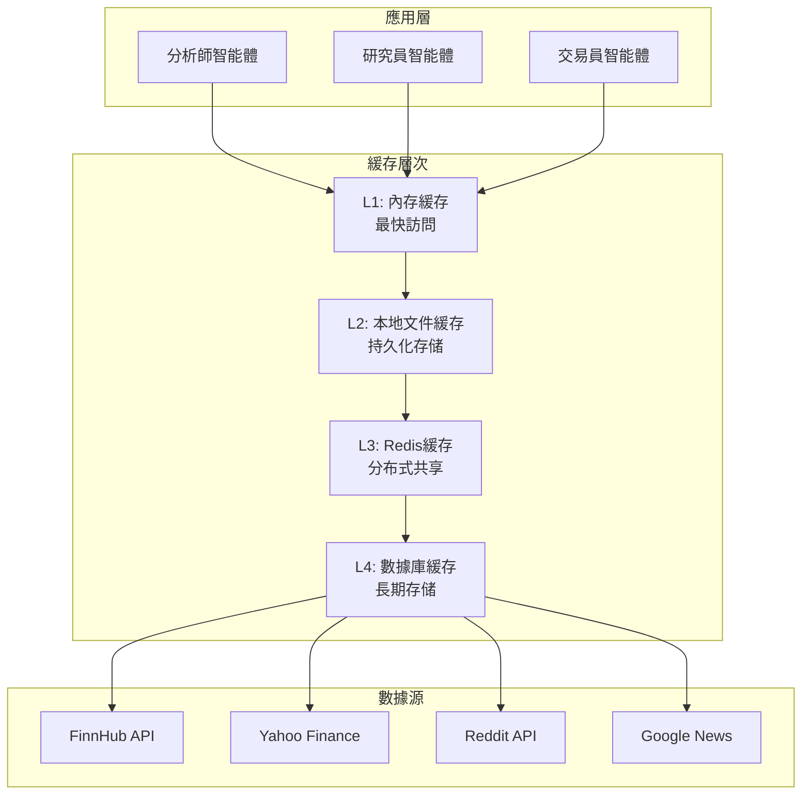

# 數據緩存策略

## 概述

TradingAgents 框架採用多層次的緩存策略來優化數據訪問性能，減少API調用成本，並提高系統響應速度。本文檔詳細介紹了緩存架構、策略、實現和最佳實踐。

## 緩存架構

### 多層緩存設計



## 1. 緩存管理器

### 核心緩存類
```python
class CacheManager:
    """緩存管理器 - 統一管理多層緩存"""
    
    def __init__(self, config: Dict):
        self.config = config
        self.memory_cache = MemoryCache(config.get("memory_cache", {}))
        self.file_cache = FileCache(config.get("file_cache", {}))
        self.redis_cache = RedisCache(config.get("redis_cache", {})) if config.get("redis_enabled") else None
        self.db_cache = DatabaseCache(config.get("db_cache", {})) if config.get("db_enabled") else None
        
        # 緩存策略配置
        self.cache_strategies = self._load_cache_strategies()
        self.ttl_config = self._load_ttl_config()
        
    def get(self, key: str, data_type: str = "default") -> Optional[Any]:
        """獲取緩存數據 - 按層次查找"""
        
        # L1: 內存緩存
        data = self.memory_cache.get(key)
        if data is not None:
            self._record_cache_hit("memory", key, data_type)
            return data
        
        # L2: 文件緩存
        data = self.file_cache.get(key)
        if data is not None:
            # 回填到內存緩存
            self.memory_cache.set(key, data, self._get_ttl(data_type))
            self._record_cache_hit("file", key, data_type)
            return data
        
        # L3: Redis緩存
        if self.redis_cache:
            data = self.redis_cache.get(key)
            if data is not None:
                # 回填到上層緩存
                self.file_cache.set(key, data, self._get_ttl(data_type))
                self.memory_cache.set(key, data, self._get_ttl(data_type))
                self._record_cache_hit("redis", key, data_type)
                return data
        
        # L4: 數據庫緩存
        if self.db_cache:
            data = self.db_cache.get(key)
            if data is not None:
                # 回填到所有上層緩存
                if self.redis_cache:
                    self.redis_cache.set(key, data, self._get_ttl(data_type))
                self.file_cache.set(key, data, self._get_ttl(data_type))
                self.memory_cache.set(key, data, self._get_ttl(data_type))
                self._record_cache_hit("database", key, data_type)
                return data
        
        # 緩存未命中
        self._record_cache_miss(key, data_type)
        return None
    
    def set(self, key: str, data: Any, data_type: str = "default", ttl: Optional[int] = None) -> None:
        """設置緩存數據 - 寫入所有層次"""
        
        if ttl is None:
            ttl = self._get_ttl(data_type)
        
        # 根據數據類型和大小決定緩存策略
        cache_strategy = self._determine_cache_strategy(data, data_type)
        
        # L1: 內存緩存 (總是緩存小數據)
        if cache_strategy["memory"]:
            self.memory_cache.set(key, data, ttl)
        
        # L2: 文件緩存 (緩存中等大小數據)
        if cache_strategy["file"]:
            self.file_cache.set(key, data, ttl)
        
        # L3: Redis緩存 (緩存共享數據)
        if cache_strategy["redis"] and self.redis_cache:
            self.redis_cache.set(key, data, ttl)
        
        # L4: 數據庫緩存 (緩存重要數據)
        if cache_strategy["database"] and self.db_cache:
            self.db_cache.set(key, data, ttl)
    
    def _determine_cache_strategy(self, data: Any, data_type: str) -> Dict[str, bool]:
        """確定緩存策略"""
        
        data_size = self._estimate_data_size(data)
        data_importance = self._assess_data_importance(data_type)
        
        strategy = {
            "memory": data_size < 1024 * 1024,  # 小於1MB
            "file": data_size < 10 * 1024 * 1024,  # 小於10MB
            "redis": data_importance >= 0.7,  # 重要數據
            "database": data_importance >= 0.8 or data_type in ["fundamental_data", "company_profile"]
        }
        
        return strategy
    
    def _get_ttl(self, data_type: str) -> int:
        """獲取數據類型的TTL"""
        return self.ttl_config.get(data_type, self.ttl_config["default"])
```

## 2. 內存緩存 (L1)

### 高速內存緩存
```python
class MemoryCache:
    """內存緩存 - 最快的緩存層"""
    
    def __init__(self, config: Dict):
        self.config = config
        self.cache = {}
        self.access_times = {}
        self.max_size = config.get("max_size", 1000)
        self.cleanup_threshold = config.get("cleanup_threshold", 0.8)
        
    def get(self, key: str) -> Optional[Any]:
        """獲取緩存項"""
        if key in self.cache:
            item = self.cache[key]
            
            # 檢查是否過期
            if self._is_expired(item):
                del self.cache[key]
                if key in self.access_times:
                    del self.access_times[key]
                return None
            
            # 更新訪問時間
            self.access_times[key] = time.time()
            return item["data"]
        
        return None
    
    def set(self, key: str, data: Any, ttl: int) -> None:
        """設置緩存項"""
        
        # 檢查是否需要清理
        if len(self.cache) >= self.max_size * self.cleanup_threshold:
            self._cleanup_cache()
        
        # 存储數據
        self.cache[key] = {
            "data": data,
            "timestamp": time.time(),
            "ttl": ttl
        }
        self.access_times[key] = time.time()
    
    def _cleanup_cache(self) -> None:
        """清理過期和最少使用的緩存項"""
        
        current_time = time.time()
        
        # 首先清理過期項
        expired_keys = []
        for key, item in self.cache.items():
            if self._is_expired(item):
                expired_keys.append(key)
        
        for key in expired_keys:
            del self.cache[key]
            if key in self.access_times:
                del self.access_times[key]
        
        # 如果还是太多，使用LRU策略清理
        if len(self.cache) >= self.max_size * self.cleanup_threshold:
            # 按訪問時間排序，刪除最少使用的
            sorted_keys = sorted(self.access_times.keys(), key=lambda k: self.access_times[k])
            keys_to_remove = sorted_keys[:len(sorted_keys) // 4]  # 刪除25%
            
            for key in keys_to_remove:
                if key in self.cache:
                    del self.cache[key]
                if key in self.access_times:
                    del self.access_times[key]
    
    def _is_expired(self, item: Dict) -> bool:
        """檢查緩存項是否過期"""
        return time.time() - item["timestamp"] > item["ttl"]
```

## 3. 文件緩存 (L2)

### 持久化文件緩存
```python
class FileCache:
    """文件緩存 - 持久化存储"""
    
    def __init__(self, config: Dict):
        self.config = config
        self.cache_dir = Path(config.get("cache_dir", "./cache"))
        self.cache_dir.mkdir(parents=True, exist_ok=True)
        self.compression_enabled = config.get("compression", True)
        self.max_file_size = config.get("max_file_size", 50 * 1024 * 1024)  # 50MB
        
    def get(self, key: str) -> Optional[Any]:
        """從文件獲取緩存數據"""
        
        cache_file = self._get_cache_file_path(key)
        
        if not cache_file.exists():
            return None
        
        try:
            # 檢查文件修改時間
            if self._is_file_expired(cache_file, key):
                cache_file.unlink()  # 刪除過期文件
                return None
            
            # 讀取數據
            with open(cache_file, 'rb') as f:
                if self.compression_enabled:
                    compressed_data = f.read()
                    data = self._decompress_data(compressed_data)
                else:
                    data = pickle.load(f)
            
            return data
            
        except Exception as e:
            print(f"Error reading cache file {cache_file}: {e}")
            # 刪除損坏的緩存文件
            if cache_file.exists():
                cache_file.unlink()
            return None
    
    def set(self, key: str, data: Any, ttl: int) -> None:
        """將數據寫入文件緩存"""
        
        cache_file = self._get_cache_file_path(key)
        
        try:
            # 檢查數據大小
            data_size = self._estimate_data_size(data)
            if data_size > self.max_file_size:
                print(f"Data too large for file cache: {data_size} bytes")
                return
            
            # 創建緩存元數據
            cache_data = {
                "data": data,
                "timestamp": time.time(),
                "ttl": ttl,
                "key": key
            }
            
            # 寫入文件
            with open(cache_file, 'wb') as f:
                if self.compression_enabled:
                    compressed_data = self._compress_data(cache_data)
                    f.write(compressed_data)
                else:
                    pickle.dump(cache_data, f)
            
        except Exception as e:
            print(f"Error writing cache file {cache_file}: {e}")
    
    def _get_cache_file_path(self, key: str) -> Path:
        """獲取緩存文件路徑"""
        # 使用哈希避免文件名過長或包含特殊字符
        key_hash = hashlib.md5(key.encode()).hexdigest()
        return self.cache_dir / f"{key_hash}.cache"
    
    def _is_file_expired(self, cache_file: Path, key: str) -> bool:
        """檢查緩存文件是否過期"""
        try:
            with open(cache_file, 'rb') as f:
                if self.compression_enabled:
                    compressed_data = f.read()
                    cache_data = self._decompress_data(compressed_data)
                else:
                    cache_data = pickle.load(f)
            
            return time.time() - cache_data["timestamp"] > cache_data["ttl"]
            
        except Exception:
            return True  # 如果無法讀取，認為已過期
    
    def _compress_data(self, data: Any) -> bytes:
        """壓縮數據"""
        import gzip
        pickled_data = pickle.dumps(data)
        return gzip.compress(pickled_data)
    
    def _decompress_data(self, compressed_data: bytes) -> Any:
        """解壓數據"""
        import gzip
        pickled_data = gzip.decompress(compressed_data)
        return pickle.loads(pickled_data)
    
    def cleanup_expired_files(self) -> None:
        """清理過期的緩存文件"""
        for cache_file in self.cache_dir.glob("*.cache"):
            try:
                if self._is_file_expired(cache_file, ""):
                    cache_file.unlink()
            except Exception as e:
                print(f"Error checking cache file {cache_file}: {e}")
```

## 4. Redis緩存 (L3)

### 分布式共享緩存
```python
class RedisCache:
    """Redis緩存 - 分布式共享緩存"""
    
    def __init__(self, config: Dict):
        self.config = config
        self.redis_client = self._initialize_redis_client()
        self.key_prefix = config.get("key_prefix", "tradingagents:")
        self.serialization_format = config.get("serialization", "pickle")  # pickle, json, msgpack
        
    def _initialize_redis_client(self):
        """初始化Redis客戶端"""
        try:
            import redis
            
            redis_config = {
                "host": self.config.get("host", "localhost"),
                "port": self.config.get("port", 6379),
                "db": self.config.get("db", 0),
                "password": self.config.get("password"),
                "socket_timeout": self.config.get("timeout", 5),
                "socket_connect_timeout": self.config.get("connect_timeout", 5),
                "retry_on_timeout": True,
                "health_check_interval": 30
            }
            
            # 移除None值
            redis_config = {k: v for k, v in redis_config.items() if v is not None}
            
            client = redis.Redis(**redis_config)
            
            # 測試連接
            client.ping()
            print("Redis connection established")
            
            return client
            
        except Exception as e:
            print(f"Failed to connect to Redis: {e}")
            return None
    
    def get(self, key: str) -> Optional[Any]:
        """從Redis獲取數據"""
        if not self.redis_client:
            return None
        
        try:
            full_key = self.key_prefix + key
            data = self.redis_client.get(full_key)
            
            if data is None:
                return None
            
            # 反序列化數據
            return self._deserialize_data(data)
            
        except Exception as e:
            print(f"Error getting data from Redis: {e}")
            return None
    
    def set(self, key: str, data: Any, ttl: int) -> None:
        """向Redis設置數據"""
        if not self.redis_client:
            return
        
        try:
            full_key = self.key_prefix + key
            
            # 序列化數據
            serialized_data = self._serialize_data(data)
            
            # 設置數據和TTL
            self.redis_client.setex(full_key, ttl, serialized_data)
            
        except Exception as e:
            print(f"Error setting data to Redis: {e}")
    
    def _serialize_data(self, data: Any) -> bytes:
        """序列化數據"""
        if self.serialization_format == "pickle":
            return pickle.dumps(data)
        elif self.serialization_format == "json":
            import json
            return json.dumps(data, default=str).encode('utf-8')
        elif self.serialization_format == "msgpack":
            import msgpack
            return msgpack.packb(data, default=str)
        else:
            raise ValueError(f"Unsupported serialization format: {self.serialization_format}")
    
    def _deserialize_data(self, data: bytes) -> Any:
        """反序列化數據"""
        if self.serialization_format == "pickle":
            return pickle.loads(data)
        elif self.serialization_format == "json":
            import json
            return json.loads(data.decode('utf-8'))
        elif self.serialization_format == "msgpack":
            import msgpack
            return msgpack.unpackb(data, raw=False)
        else:
            raise ValueError(f"Unsupported serialization format: {self.serialization_format}")
    
    def delete(self, key: str) -> None:
        """刪除Redis中的數據"""
        if not self.redis_client:
            return
        
        try:
            full_key = self.key_prefix + key
            self.redis_client.delete(full_key)
        except Exception as e:
            print(f"Error deleting data from Redis: {e}")
    
    def clear_expired(self) -> None:
        """清理過期的鍵（Redis自動處理TTL）"""
        # Redis會自動清理過期鍵，這里可以添加額外的清理邏輯
        pass
```

## 5. 緩存策略配置

### TTL配置
```python
# 不同數據類型的TTL配置
TTL_CONFIG = {
    "price_data": 60,           # 1分鐘 - 價格數據變化快
    "fundamental_data": 3600,   # 1小時 - 基本面數據相對穩定
    "company_profile": 86400,   # 24小時 - 公司信息變化很少
    "news_data": 1800,          # 30分鐘 - 新聞數據中等頻率
    "social_data": 900,         # 15分鐘 - 社交媒體數據變化較快
    "technical_indicators": 300, # 5分鐘 - 技術指標需要較新數據
    "market_data": 600,         # 10分鐘 - 市場數據中等頻率
    "historical_data": 7200,    # 2小時 - 歷史數據相對穩定
    "default": 1800             # 30分鐘 - 默認TTL
}

# 緩存重要性評分
DATA_IMPORTANCE = {
    "price_data": 0.9,          # 高重要性
    "fundamental_data": 0.8,    # 高重要性
    "company_profile": 0.7,     # 中高重要性
    "news_data": 0.6,           # 中等重要性
    "social_data": 0.5,         # 中等重要性
    "technical_indicators": 0.7, # 中高重要性
    "market_data": 0.6,         # 中等重要性
    "historical_data": 0.8,     # 高重要性
}
```

## 6. 緩存監控和優化

### 緩存性能監控
```python
class CacheMonitor:
    """緩存性能監控"""
    
    def __init__(self):
        self.metrics = {
            "hits": defaultdict(int),
            "misses": defaultdict(int),
            "hit_rates": defaultdict(float),
            "response_times": defaultdict(list),
            "cache_sizes": defaultdict(int)
        }
        
    def record_hit(self, cache_level: str, key: str, data_type: str, response_time: float = None):
        """記錄緩存命中"""
        self.metrics["hits"][cache_level] += 1
        if response_time:
            self.metrics["response_times"][cache_level].append(response_time)
        
        self._update_hit_rate(cache_level)
    
    def record_miss(self, key: str, data_type: str):
        """記錄緩存未命中"""
        self.metrics["misses"]["total"] += 1
        self._update_hit_rate("total")
    
    def _update_hit_rate(self, cache_level: str):
        """更新命中率"""
        hits = self.metrics["hits"][cache_level]
        misses = self.metrics["misses"].get(cache_level, 0)
        total = hits + misses
        
        if total > 0:
            self.metrics["hit_rates"][cache_level] = hits / total
    
    def get_performance_report(self) -> Dict:
        """獲取性能報告"""
        return {
            "hit_rates": dict(self.metrics["hit_rates"]),
            "total_hits": sum(self.metrics["hits"].values()),
            "total_misses": sum(self.metrics["misses"].values()),
            "avg_response_times": {
                level: sum(times) / len(times) if times else 0
                for level, times in self.metrics["response_times"].items()
            },
            "cache_efficiency": self._calculate_cache_efficiency()
        }
    
    def _calculate_cache_efficiency(self) -> float:
        """計算緩存效率"""
        total_hits = sum(self.metrics["hits"].values())
        total_requests = total_hits + sum(self.metrics["misses"].values())
        
        return total_hits / total_requests if total_requests > 0 else 0.0
```

## 7. 緩存最佳實踐

### 使用建議
```python
class CacheBestPractices:
    """緩存最佳實踐指南"""
    
    @staticmethod
    def generate_cache_key(symbol: str, data_type: str, date: str = None, **kwargs) -> str:
        """生成標準化的緩存鍵"""
        
        key_parts = [symbol.upper(), data_type]
        
        if date:
            key_parts.append(date)
        
        # 添加其他參數
        for k, v in sorted(kwargs.items()):
            key_parts.append(f"{k}:{v}")
        
        return ":".join(key_parts)
    
    @staticmethod
    def should_cache_data(data: Any, data_type: str) -> bool:
        """判斷是否應该緩存數據"""
        
        # 不緩存空數據
        if not data:
            return False
        
        # 不緩存錯誤數據
        if isinstance(data, dict) and "error" in data:
            return False
        
        # 不緩存過大的數據
        data_size = CacheBestPractices._estimate_size(data)
        if data_size > 100 * 1024 * 1024:  # 100MB
            return False
        
        return True
    
    @staticmethod
    def _estimate_size(obj: Any) -> int:
        """估算對象大小"""
        try:
            return len(pickle.dumps(obj))
        except:
            return 0
```

通過這套完整的緩存策略，TradingAgents 能夠顯著提高數據訪問性能，減少API調用成本，並提供更好的用戶體驗。
