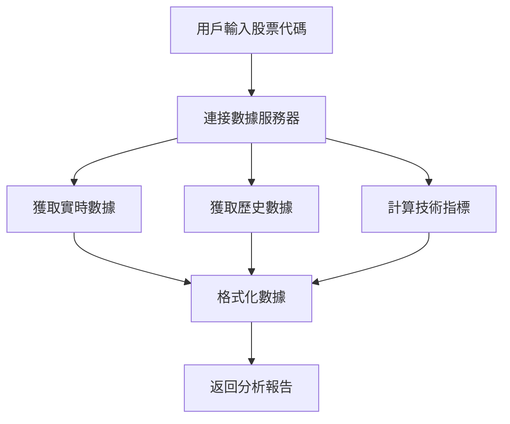

# Tushare數據接口集成指南

## 🎯 概述

Tushare數據接口為TradingAgents-CN提供了高质量的中國股票數據，包括A股、深股、創業板、科創板等所有板塊的實時行情和歷史數據。

## 🌟 優势對比

### 📊 數據覆蓋對比

| 數據類型 | Tushare數據接口 | Yahoo Finance | 優势 |
|----------|-----------|---------------|------|
| **A股實時數據** | ✅ 完整覆蓋 | ❌ 不支持 | 🟢 獨有優势 |
| **港股數據** | ✅ 實時數據 | ⚠️ 部分支持 | 🟢 更全面 |
| **數據實時性** | ✅ 秒級更新 | ⚠️ 15分鐘延迟 | 🟢 實時性强 |
| **技術指標** | ✅ 丰富指標 | ✅ 基础指標 | 🟡 相當 |
| **歷史數據** | ✅ 完整歷史 | ✅ 完整歷史 | 🟡 相當 |
| **中文支持** | ✅ 原生支持 | ❌ 不支持 | 🟢 本土化 |

### 🇨🇳 本土化優势

- **數據源權威**: 直接對接交易所數據
- **更新及時**: 實時行情，無延迟
- **中文支持**: 股票名稱、板塊分類等
- **本土特色**: 涨跌停、ST股票等特殊標記
- **免費使用**: 無需API密鑰，免費獲取數據

## 🔧 安裝和配置

### 1. 安裝依賴

```bash
# 方法1: 使用安裝腳本
python install_tdx.py

# 方法2: 手動安裝
pip install pytdx
```

### 2. 驗證安裝

```bash
# 運行測試腳本
python test_tdx_integration.py
```

### 3. 無需額外配置

Tushare數據接口使用免費的公共服務器，無需申請API密鑰或進行額外配置。

## 📊 支持的數據類型

### 1. 實時行情數據

```python
# 獲取實時數據
realtime_data = {
    'code': '000001',
    'name': '平安銀行',
    'price': 12.34,
    'change_percent': 2.15,
    'volume': 1234567,
    'amount': 15234567.89,
    'bid_prices': [12.33, 12.32, 12.31, 12.30, 12.29],
    'ask_prices': [12.34, 12.35, 12.36, 12.37, 12.38],
    'update_time': '2024-01-01 15:00:00'
}
```

### 2. 歷史K線數據

```python
# 支持的周期
periods = {
    'D': '日線',
    'W': '周線', 
    'M': '月線'
}

# 數據格式 (兼容Yahoo Finance)
columns = ['Open', 'High', 'Low', 'Close', 'Volume', 'Amount']
```

### 3. 技術指標

```python
# 支持的技術指標
indicators = {
    'MA5': '5日移動平均',
    'MA10': '10日移動平均',
    'MA20': '20日移動平均',
    'RSI': '相對强弱指數',
    'MACD': 'MACD指標',
    'BB_Upper': '布林帶上轨',
    'BB_Lower': '布林帶下轨'
}
```

### 4. 市場概覽

```python
# 主要指數
indices = {
    '上證指數': '000001',
    '深證成指': '399001', 
    '創業板指': '399006',
    '科創50': '000688'
}
```

## 🎯 使用方法

### 1. Web界面使用

1. **啟動Web界面**:
   ```bash
   python -m streamlit run web/app.py
   ```

2. **選擇A股市場**:
   - 在"選擇市場"下拉框中選擇"A股"

3. **輸入股票代碼**:
   ```
   000001  # 平安銀行
   600519  # 贵州茅台
   000858  # 五粮液
   300750  # 宁德時代
   ```

4. **開始分析**:
   - 系統将自動使用Tushare數據接口獲取實時數據

### 2. 編程接口使用

```python
from tradingagents.dataflows.tdx_utils import get_china_stock_data, get_china_market_overview

# 獲取股票數據
stock_data = get_china_stock_data('000001', '2024-01-01', '2024-01-31')
print(stock_data)

# 獲取市場概覽
market_overview = get_china_market_overview()
print(market_overview)
```

### 3. 在分析師中使用

```python
# 新增的工具函數
toolkit.get_china_stock_data('000001', '2024-01-01', '2024-01-31')
toolkit.get_china_market_overview('2024-01-31')
```

## 📈 支持的股票代碼格式

### A股代碼規則

| 代碼前缀 | 市場 | 示例 | 說明 |
|----------|------|------|------|
| **000xxx** | 深圳主板 | 000001 | 平安銀行 |
| **002xxx** | 深圳中小板 | 002415 | 海康威視 |
| **003xxx** | 深圳主板 | 003816 | 中國廣核 |
| **300xxx** | 創業板 | 300750 | 宁德時代 |
| **600xxx** | 上海主板 | 600519 | 贵州茅台 |
| **601xxx** | 上海主板 | 601318 | 中國平安 |
| **603xxx** | 上海主板 | 603259 | 藥明康德 |
| **688xxx** | 科創板 | 688981 | 中芯國际 |

### 常用股票代碼

```python
popular_stocks = {
    # 銀行股
    '000001': '平安銀行',
    '600036': '招商銀行',
    '601398': '工商銀行',
    
    # 白酒股
    '600519': '贵州茅台',
    '000858': '五粮液',
    '000568': '泸州老窖',
    
    # 科技股
    '000002': '万科A',
    '000651': '格力电器',
    '300750': '宁德時代',
    
    # 新能源
    '002594': '比亚迪',
    '300274': '阳光电源'
}
```

## 🔍 技術實現細節

### 1. 連接機制

```python
# 使用免費的數據服務器
servers = [
    ('119.147.212.81', 7709),  # 主服務器
    ('119.147.212.81', 7721)   # 擴展服務器
]
```

### 2. 數據獲取流程



### 3. 錯誤處理

```python
# 自動重連機制
if not connected:
    success = connect()
    if not success:
        return fallback_data

# 數據驗證
if not data or len(data) == 0:
    return empty_result_with_message
```

## 🚨 註意事項

### 1. 網絡要求

- **需要網絡連接**: Tushare數據接口需要連接到數據服務器
- **服務器穩定性**: 依賴通達信免費服務器的可用性
- **連接超時**: 網絡不穩定時可能出現連接超時

### 2. 數據限制

- **歷史數據**: 單次最多獲取800條K線數據
- **實時數據**: 交易時間內數據更新頻率最高
- **技術指標**: 需要足夠的歷史數據進行計算

### 3. 使用建议

- **备用方案**: 建议同時配置Yahoo Finance作為备用數據源
- **數據驗證**: 重要決策前建议交叉驗證數據
- **交易時間**: 非交易時間獲取的是最後交易日數據

## 🔧 故障排除

### 常见問題

#### 1. 連接失败

```bash
❌ Tushare數據接口連接失败: [Errno 11001] getaddrinfo failed
```

**解決方案**:
- 檢查網絡連接
- 嘗試重新運行程序
- 檢查防火墙設置

#### 2. 數據獲取失败

```bash
⚠️ 未獲取到股票數據
```

**解決方案**:
- 確認股票代碼格式正確
- 檢查股票是否存在
- 嘗試其他股票代碼

#### 3. pytdx安裝失败

```bash
❌ pytdx庫安裝失败
```

**解決方案**:
```bash
# 升級pip
python -m pip install --upgrade pip

# 重新安裝
pip install pytdx --no-cache-dir

# 或使用國內鏡像
pip install pytdx -i https://pypi.tuna.tsinghua.edu.cn/simple/
```

## 🎯 最佳實踐

### 1. 性能優化

```python
# 複用連接
provider = get_tdx_provider()  # 全局實例

# 批量獲取數據
stocks = ['000001', '600519', '000858']
for stock in stocks:
    data = provider.get_real_time_data(stock)
```

### 2. 錯誤處理

```python
try:
    data = get_china_stock_data(stock_code, start_date, end_date)
    if "獲取失败" in data:
        # 使用备用數據源
        fallback_data = get_yahoo_finance_data(stock_code)
except Exception as e:
    # 記錄錯誤並提供用戶友好的消息
    logger.error(f"數據獲取失败: {e}")
    return "數據暂時不可用，請稍後重試"
```

### 3. 數據緩存

```python
# 實現簡單的數據緩存
cache = {}
cache_key = f"{stock_code}_{date}"

if cache_key in cache:
    return cache[cache_key]
else:
    data = fetch_data(stock_code, date)
    cache[cache_key] = data
    return data
```

## 📊 性能基準

### 數據獲取速度

| 操作 | 平均耗時 | 說明 |
|------|----------|------|
| **連接服務器** | 1-3秒 | 首次連接 |
| **實時數據** | 0.5-1秒 | 單只股票 |
| **歷史數據** | 2-5秒 | 30天數據 |
| **技術指標** | 1-2秒 | 基础指標 |
| **市場概覽** | 3-5秒 | 主要指數 |

### 數據準確性

- **實時數據**: 与交易所數據一致
- **歷史數據**: 複權處理準確
- **技術指標**: 計算方法標準
- **中文名稱**: 官方標準名稱

## 🎉 总結

Tushare數據接口的集成為TradingAgents-CN帶來了以下價值：

1. **🇨🇳 本土化優势**: 完整的A股數據覆蓋
2. **⚡ 實時性**: 秒級數據更新
3. **💰 成本優势**: 免費使用，無API限制
4. **🔧 易用性**: 無需複雜配置
5. **📊 專業性**: 丰富的技術指標

現在您可以在TradingAgents-CN中無缝分析中國股票，享受專業級的本土化股票分析體驗！
