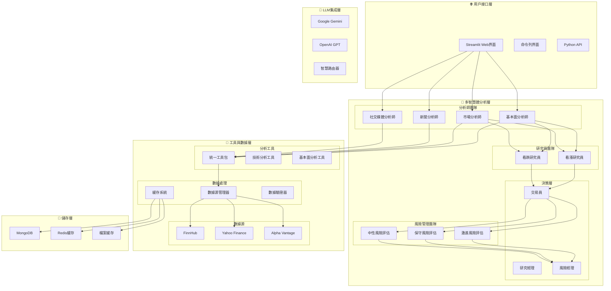
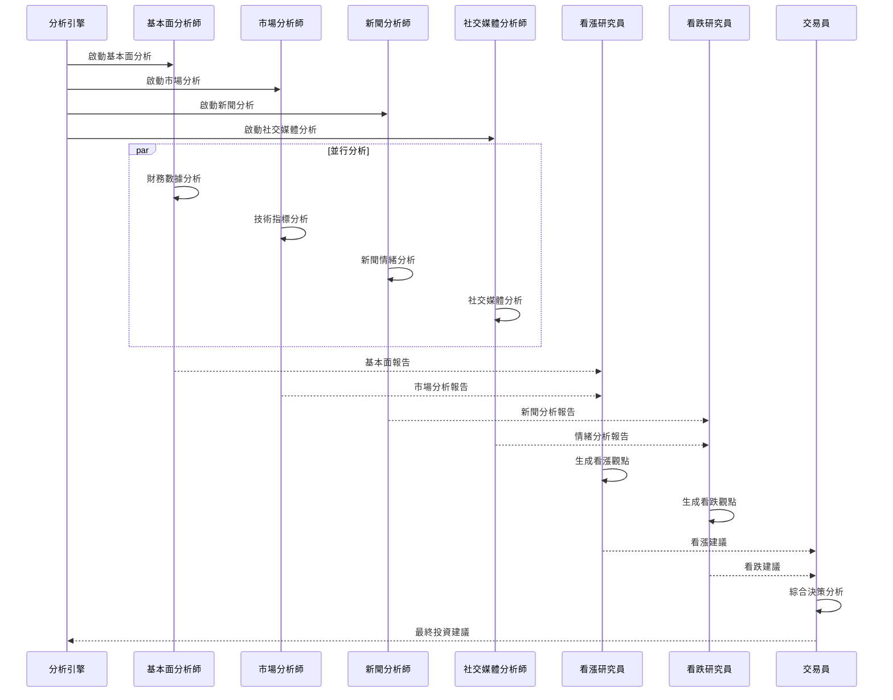
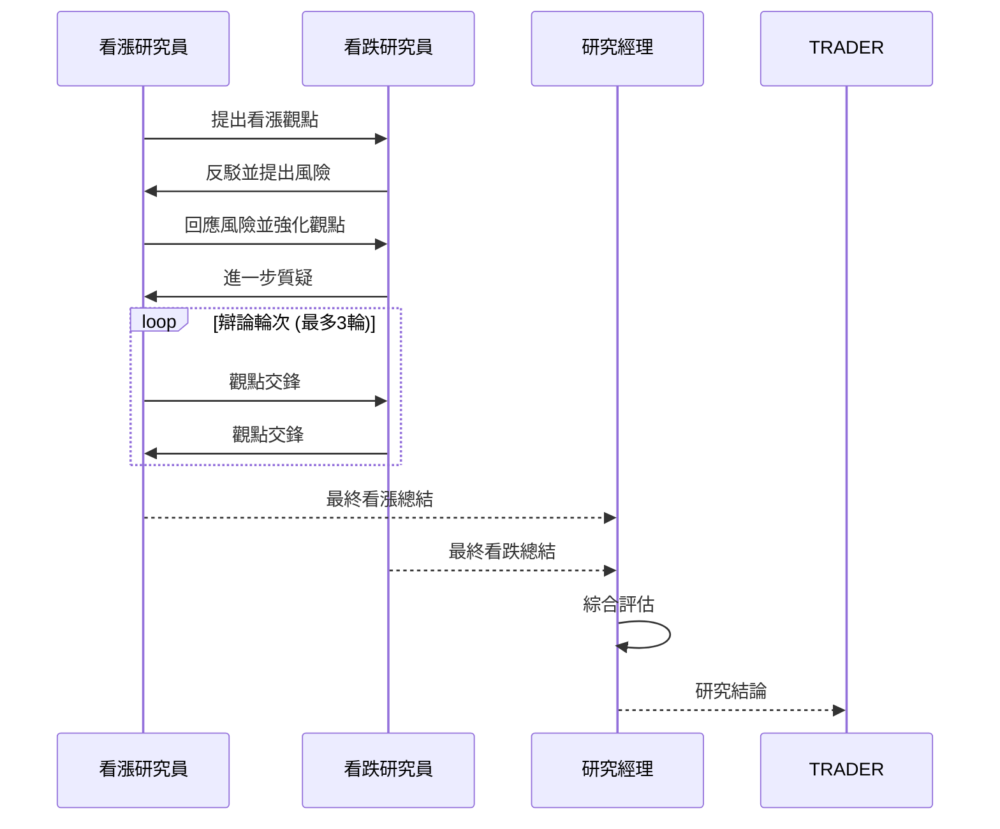

# TradingAgents-CN 股票分析系統詳細設計文檔

## 📋 文檔概述

本文檔詳細描述了TradingAgents-CN股票分析系統的完整架構、數據流程、模塊協作機制以及各組件的輸入輸出規範。

**版本**: v0.1.7
**更新日期**: 2025-07-16
**作者**: TradingAgents-CN團隊

---

## 🎯 系統總覽

### 核心理念
TradingAgents-CN採用**多智慧體協作**的設計理念，模擬真實金融機構的分析團隊，通過專業化分工和協作機制，實現全面、客觀的股票投資分析。

### 設計原則
1. **專業化分工**: 每個智慧體專注特定領域的分析
2. **協作決策**: 通過辯論和協商機制形成最終決策
3. **數據驅動**: 基於真實市場數據進行分析
4. **風險控制**: 多層次風險評估和管理
5. **可擴展性**: 支援新增分析師和數據源

---

## 🏗️ 系統架構

### 整體架構圖



---

## 📊 數據流程設計

### 1. 數據獲取流程


### 2. 分析師協作流程



---

## 🤖 智慧體詳細設計

### 1. 基本面分析師 (Fundamentals Analyst)

#### 輸入數據
```json
{
    "ticker": "AAPL",
    "start_date": "2025-06-01",
    "end_date": "2025-07-15",
    "curr_date": "2025-07-15"
}
```

#### 處理流程
1. **數據獲取**: 調用統一基本面工具獲取財務數據
2. **指標計算**: 計算PE、PB、ROE、ROA等關鍵指標
3. **行業分析**: 基於股票代碼判斷行業特徵
4. **估值分析**: 評估股票估值水平
5. **報告生成**: 生成結構化基本面分析報告

#### 輸出格式
```markdown
# 美股基本面分析報告 - AAPL

## 📊 股票基本資訊
- **股票代碼**: AAPL
- **股票名稱**: Apple Inc.
- **所屬行業**: 科技硬體
- **當前股價**: $185.23
- **漲跌幅**: +1.25%

## 💰 財務數據分析
### 估值指標
- **PE比率**: 28.5倍
- **PB比率**: 42.8倍
- **PS比率**: 7.5倍

### 盈利能力
- **ROE**: 145.8%
- **ROA**: 28.2%
- **毛利率**: 45.5%

## 📈 投資建議
基於當前財務指標分析，建議...
```

### 2. 市場分析師 (Market Analyst)

#### 輸入數據
```json
{
    "ticker": "AAPL",
    "period": "1y",
    "indicators": ["SMA", "EMA", "RSI", "MACD"]
}
```

#### 處理流程
1. **價格數據獲取**: 獲取歷史價格和成交量數據
2. **技術指標計算**: 計算移動平均線、RSI、MACD等
3. **趨勢分析**: 識別價格趨勢和支撐阻力位
4. **成交量分析**: 分析成交量變化模式
5. **圖表分析**: 生成技術分析圖表

#### 輸出格式
```markdown
# 市場技術分析報告 - AAPL

## 📈 價格趨勢分析
- **當前趨勢**: 震盪上行
- **支撐位**: $178.50
- **阻力位**: $192.80

## 📊 技術指標
- **RSI**: 58.2 (中性偏多)
- **MACD**: 正值，上行趨勢
- **成交量**: 相對活躍

## 🎯 技術面建議
基於技術指標分析，短期內...
```

### 3. 新聞分析師 (News Analyst)

#### 輸入數據
```json
{
    "ticker": "AAPL",
    "company_name": "Apple Inc.",
    "date_range": "7d",
    "sources": ["google_news", "finnhub_news"]
}
```

#### 處理流程
1. **新聞獲取**: 從多個新聞源獲取相關新聞
2. **情緒分析**: 分析新聞的正面/負面情緒
3. **事件識別**: 識別重要的公司和行業事件
4. **影響評估**: 評估新聞對股價的潛在影響
5. **報告整合**: 生成新聞分析摘要

#### 輸出格式
```markdown
# 新聞分析報告 - AAPL

## 📰 重要新聞事件
### 近期新聞摘要
- **正面新聞**: 8條
- **負面新聞**: 2條
- **中性新聞**: 5條

### 關鍵事件
1. 公司發布Q2財報，業績超預期
2. 新產品發布會順利舉行
3. 分析師調高目標價

## 📊 情緒分析
- **整體情緒**: 偏正面 (73%)
- **市場關注度**: 高
- **預期影響**: 短期正面

## 🎯 新聞面建議
基於新聞分析，建議關注...
```

### 4. 社交媒體分析師 (Social Media Analyst)

#### 輸入數據
```json
{
    "ticker": "AAPL",
    "platforms": ["finnhub_sentiment"],
    "sentiment_period": "7d"
}
```

#### 處理流程
1. **社交數據獲取**: 從 FinnHub 取得社交情緒數據
2. **情緒計算**: 計算投資者情緒指數
3. **熱度分析**: 分析討論熱度和關注度
4. **觀點提取**: 提取主要的投資觀點
5. **趨勢識別**: 識別情緒變化趨勢

#### 輸出格式
```markdown
# 社交媒體情緒分析報告 - AAPL

## 📱 平台數據概覽
- **FinnHub 情緒數據**: 社交情緒指數
- **整體討論熱度**: 高

## 📊 情緒指標
- **整體情緒**: 樂觀 (68%)
- **情緒波動**: 低
- **關注熱度**: 高

## 💭 主要觀點
### 看漲觀點
- 產品創新持續
- 營收增長穩健

### 看跌觀點
- 估值偏高擔憂
- 宏觀環境不確定

## 🎯 情緒面建議
基於社交媒體分析，投資者情緒...
```

---

## 🔄 協作機制設計

### 1. 研究員辯論機制

#### 看漲研究員 (Bull Researcher)
- **輸入**: 基本面報告 + 市場分析報告
- **職責**: 從樂觀角度分析投資機會
- **輸出**: 看漲投資建議和理由

#### 看跌研究員 (Bear Researcher)
- **輸入**: 新聞分析報告 + 社交媒體報告
- **職責**: 從悲觀角度分析投資風險
- **輸出**: 看跌投資建議和風險警示

#### 辯論流程


### 2. 風險評估機制

#### 三層風險評估
1. **激進風險評估**: 評估高風險高收益策略
2. **保守風險評估**: 評估低風險穩健策略
3. **中性風險評估**: 平衡風險收益評估

#### 風險評估流程


---

## 🛠️ 技術實現細節

### 1. 數據源管理

#### 數據源優先級
```python
class MarketDataSource(Enum):
    YAHOO = "yahoo"          # 優先級1: Yahoo Finance
    FINNHUB = "finnhub"      # 優先級2: FinnHub API
    ALPHA = "alphavantage"   # 優先級3: Alpha Vantage
```

#### 數據獲取策略
1. **主數據源**: 優先使用Yahoo Finance獲取數據
2. **故障轉移**: 主數據源失敗時自動切換到備用源
3. **數據驗證**: 驗證數據完整性和準確性
4. **緩存機制**: 緩存數據以提高性能

### 2. 緩存系統設計

#### 多層緩存架構
```python
class CacheManager:
    def __init__(self):
        self.memory_cache = {}      # 記憶體緩存 (最快)
        self.redis_cache = Redis()  # Redis緩存 (中等)
        self.file_cache = {}        # 檔案緩存 (持久)
        self.db_cache = MongoDB()   # 資料庫緩存 (最持久)
```

#### 緩存策略
- **熱數據**: 儲存在記憶體緩存中，TTL=1小時
- **溫數據**: 儲存在Redis中，TTL=24小時
- **冷數據**: 儲存在檔案系統中，TTL=7天
- **歷史數據**: 儲存在MongoDB中，永久保存

### 3. LLM集成架構

#### 多模型支援
```python
class LLMRouter:
    def __init__(self):
        self.models = {
            "google": GoogleAdapter(),
            "openai": OpenAIAdapter()
        }

    def route_request(self, task_type, content):
        if task_type == "analysis":
            return self.models["google"]
        elif task_type == "summary":
            return self.models["openai"]
        else:
            return self.models["google"]
```

#### 模型選擇策略
- **深度分析**: 使用Google Gemini (推理能力強)
- **快速總結**: 使用OpenAI GPT (速度快)
- **多語言處理**: 使用Google Gemini (多語言支援佳)

---

## 📈 性能優化設計

### 1. 並行處理機制

#### 分析師並行執行
```python
async def run_analysts_parallel(state):
    tasks = [
        run_fundamentals_analyst(state),
        run_market_analyst(state),
        run_news_analyst(state),
        run_social_analyst(state)
    ]

    results = await asyncio.gather(*tasks)
    return combine_results(results)
```

### 2. 資源管理

#### API調用限制
- **請求頻率**: 每秒最多10次API調用
- **並發控制**: 最多5個並發請求
- **重試機制**: 失敗時指數退避重試
- **熔斷器**: 連續失敗時暫停調用

#### 記憶體管理
- **對象池**: 複用LLM實例減少初始化開銷
- **垃圾回收**: 及時清理大型數據對象
- **記憶體監控**: 監控記憶體使用情況防止洩漏

---

## 🔒 安全與可靠性

### 1. 數據安全

#### API密鑰管理
```python
class SecureConfig:
    def __init__(self):
        self.api_keys = {
            "finnhub": os.getenv("FINNHUB_API_KEY"),
            "google": os.getenv("GOOGLE_API_KEY"),
            "openai": os.getenv("OPENAI_API_KEY")
        }

    def validate_keys(self):
        # 驗證API密鑰格式和有效性
        pass
```

#### 數據加密
- **傳輸加密**: 所有API調用使用HTTPS
- **儲存加密**: 敏感數據加密儲存
- **訪問控制**: 基於角色的訪問控制

### 2. 錯誤處理

#### 分層錯誤處理
```python
class ErrorHandler:
    def handle_data_error(self, error):
        # 數據獲取錯誤處理
        logger.error(f"數據獲取失敗: {error}")
        return self.fallback_data_source()

    def handle_llm_error(self, error):
        # LLM調用錯誤處理
        logger.error(f"LLM調用失敗: {error}")
        return self.fallback_llm_model()

    def handle_analysis_error(self, error):
        # 分析過程錯誤處理
        logger.error(f"分析失敗: {error}")
        return self.generate_error_report()
```

---

## 📊 監控與日誌

### 1. 日誌系統

#### 分層日誌記錄
```python
# 系統級日誌
logger.info("系統啟動")

# 模塊級日誌
logger.info("[基本面分析師] 開始分析")

# 調試級日誌
logger.debug("[DEBUG] API調用參數: {params}")

# 錯誤級日誌
logger.error("[ERROR] 數據獲取失敗: {error}")
```

#### 日誌分類
- **系統日誌**: 系統啟動、關閉、配置變更
- **業務日誌**: 分析流程、決策過程、結果輸出
- **性能日誌**: 響應時間、資源使用、API調用統計
- **錯誤日誌**: 異常資訊、錯誤堆疊、恢復過程

### 2. 性能監控

#### 關鍵指標監控
- **響應時間**: 各分析師的執行時間
- **成功率**: API調用和分析的成功率
- **資源使用**: CPU、記憶體、網路使用情況
- **用戶體驗**: 頁面載入時間、互動響應時間

---

## 🚀 部署與擴展

### 1. 容器化部署

#### Docker Compose配置
```yaml
version: '3.8'
services:
  web:
    build: .
    ports:
      - "8501:8501"
    environment:
      - GOOGLE_API_KEY=${GOOGLE_API_KEY}
      - OPENAI_API_KEY=${OPENAI_API_KEY}
    depends_on:
      - mongodb
      - redis

  mongodb:
    image: mongo:latest
    ports:
      - "27017:27017"
    volumes:
      - mongodb_data:/data/db

  redis:
    image: redis:alpine
    ports:
      - "6379:6379"
```

### 2. 擴展性設計

#### 水平擴展
- **負載均衡**: 多個Web實例負載均衡
- **資料庫分片**: MongoDB分片儲存大量歷史數據
- **緩存集群**: Redis集群提高緩存性能

#### 垂直擴展
- **新增分析師**: 插件式添加新的分析師類型
- **新增數據源**: 統一接口集成新的數據提供商
- **新增LLM**: 適配器模式支援新的語言模型

---

## 📋 總結

TradingAgents-CN股票分析系統通過多智慧體協作、數據驅動分析、風險控制機制等設計，實現了專業、全面、可靠的股票投資分析。系統具備良好的擴展性、可維護性和性能表現，能夠滿足個人投資者和機構用戶的多樣化需求。

### 核心優勢
1. **專業分工**: 模擬真實投資團隊的專業化分工
2. **協作決策**: 通過辯論機制形成客觀決策
3. **數據驅動**: 基於真實市場數據進行分析
4. **風險控制**: 多層次風險評估和管理
5. **技術先進**: 集成最新的AI和大語言模型技術

### 應用場景
- **個人投資**: 為個人投資者提供專業分析建議
- **機構研究**: 為投資機構提供研究支援
- **教育培訓**: 為金融教育提供實踐平台
- **量化策略**: 為量化投資提供信號支援
