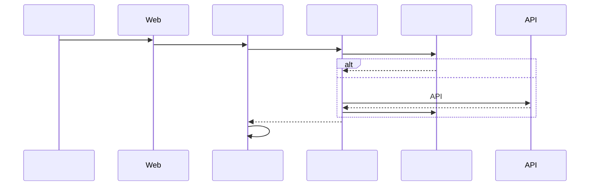
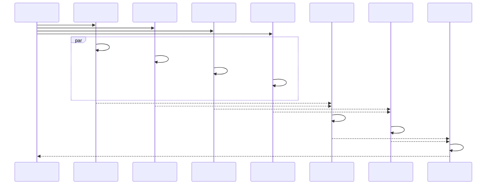
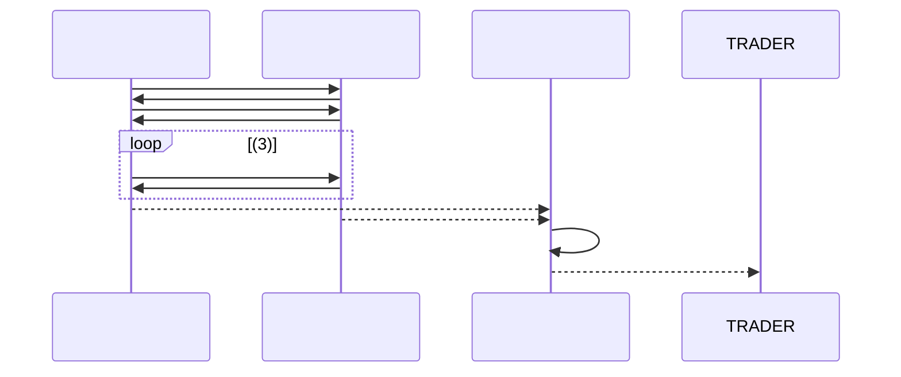

# TradingAgents-CN 

## 

TradingAgents-CN

****: v0.1.7
****: 2025-07-16
****: TradingAgents-CN

---

## 

### 
TradingAgents-CN****

### 
1. ****: 
2. ****: 
3. ****: 
4. ****: 
5. ****: 

---

## 

### 

```mermaid
graph TB
 subgraph " "
 WEB[FastAPI Web]
 CLI[]
 API[Python API]
 end

 subgraph "LLM"
 OPENAI[OpenAI GPT]
 ANTHROPIC[Anthropic Claude]
 ROUTER[]
 end

 subgraph " "
 subgraph ""
 FA[]
 MA[]
 NA[]
 SA[]
 end

 subgraph ""
 BR[]
 BEAR[]
 end

 subgraph ""
 AGG[]
 CON[]
 NEU[]
 end

 subgraph ""
 TRADER[]
 RM[]
 RISKM[]
 end
 end

 subgraph " "
 subgraph ""
 FINNHUB[FinnHub]
 YFINANCE[Yahoo Finance]
 ALPHA[Alpha Vantage]
 end

 subgraph ""
 DSM[]
 CACHE[]
 VALIDATOR[]
 end

 subgraph ""
 TOOLKIT[]
 TECH[]
 FUND[]
 end
 end

 subgraph " "
 MONGO[MongoDB]
 REDIS[Redis]
 FILE[]
 end

 WEB --> FA
 WEB --> MA
 WEB --> NA
 WEB --> SA

 FA --> TOOLKIT
 MA --> TOOLKIT
 NA --> TOOLKIT
 SA --> TOOLKIT

 TOOLKIT --> DSM
 DSM --> FINNHUB
 DSM --> YFINANCE
 DSM --> ALPHA

 FA --> BR
 FA --> BEAR
 MA --> BR
 MA --> BEAR

 BR --> TRADER
 BEAR --> TRADER

 TRADER --> AGG
 TRADER --> CON
 TRADER --> NEU

 AGG --> RISKM
 CON --> RISKM
 NEU --> RISKM

 CACHE --> MONGO
 CACHE --> REDIS
 CACHE --> FILE
```

---

## 

### 1. 



### 2. 



---

## 

### 1. (Fundamentals Analyst)

#### 
```json
{
 "ticker": "AAPL",
 "start_date": "2025-06-01",
 "end_date": "2025-07-15",
 "curr_date": "2025-07-15"
}
```

#### 
1. ****: 
2. ****: PEPBROEROA
3. ****: 
4. ****: 
5. ****: 

#### 
```markdown
# - AAPL

## 
- ****: AAPL
- ****: Apple Inc.
- ****: 
- ****: $185.23
- ****: +1.25%

## 
### 
- **PE**: 28.5
- **PB**: 42.8
- **PS**: 7.5

### 
- **ROE**: 145.8%
- **ROA**: 28.2%
- ****: 45.5%

## 
...
```

### 2. (Market Analyst)

#### 
```json
{
 "ticker": "AAPL",
 "period": "1y",
 "indicators": ["SMA", "EMA", "RSI", "MACD"]
}
```

#### 
1. ****: 
2. ****: RSIMACD
3. ****: 
4. ****: 
5. ****: 

#### 
```markdown
# - AAPL

## 
- ****: 
- ****: $178.50
- ****: $192.80

## 
- **RSI**: 58.2 ()
- **MACD**: 
- ****: 

## 
...
```

### 3. (News Analyst)

#### 
```json
{
 "ticker": "AAPL",
 "company_name": "Apple Inc.",
 "date_range": "7d",
 "sources": ["google_news", "finnhub_news"]
}
```

#### 
1. ****: 
2. ****: /
3. ****: 
4. ****: 
5. ****: 

#### 
```markdown
# - AAPL

## 
### 
- ****: 8
- ****: 2
- ****: 5

### 
1. Q2
2. 
3. 

## 
- ****: (73%)
- ****: 
- ****: 

## 
...
```

### 4. (Social Media Analyst)

#### 
```json
{
 "ticker": "AAPL",
 "platforms": ["finnhub_sentiment"],
 "sentiment_period": "7d"
}
```

#### 
1. ****: FinnHub 
2. ****: 
3. ****: 
4. ****: 
5. ****: 

#### 
```markdown
# - AAPL

## 
- **FinnHub **: 
- ****: 

## 
- ****: (68%)
- ****: 
- ****: 

## 
### 
- 
- 

### 
- 
- 

## 
...
```

---

## 

### 1. 

#### (Bull Researcher)
- ****: + 
- ****: 
- ****: 

#### (Bear Researcher)
- ****: + 
- ****: 
- ****: 

#### 


### 2. 

#### 
1. ****: 
2. ****: 
3. ****: 

#### 
```mermaid
graph LR
 TRADER[] --> AGG[]
 TRADER --> CON[]
 TRADER --> NEU[]

 AGG --> RISK_SCORE[]
 CON --> RISK_SCORE
 NEU --> RISK_SCORE

 RISK_SCORE --> FINAL[]
```

---

## 

### 1. 

#### 
```python
class MarketDataSource(Enum):
 YAHOO = "yahoo" # 1: Yahoo Finance
 FINNHUB = "finnhub" # 2: FinnHub API
 ALPHA = "alphavantage" # 3: Alpha Vantage
```

#### 
1. ****: Yahoo Finance
2. ****: 
3. ****: 
4. ****: 

### 2. 

#### 
```python
class CacheManager:
 def __init__(self):
 self.memory_cache = {} # ()
 self.redis_cache = Redis() # Redis ()
 self.file_cache = {} # ()
 self.db_cache = MongoDB() # ()
```

#### 
- ****: TTL=1
- ****: RedisTTL=24
- ****: TTL=7
- ****: MongoDB

### 3. LLM

#### 
```python
class LLMRouter:
 def __init__(self):
 self.models = {
 "openai": OpenAIAdapter(),
 "anthropic": AnthropicAdapter()
 }

 def route_request(self, task_type, content):
 if task_type == "analysis":
 return self.models["openai"]
 elif task_type == "summary":
 return self.models["openai"]
 else:
 return self.models["anthropic"]
```

#### 
- ****: OpenAI GPT-4o ()
- ****: OpenAI GPT-4o-mini ()
- ****: Anthropic Claude ()

---

## 

### 1. 

#### 
```python
async def run_analysts_parallel(state):
 tasks = [
 run_fundamentals_analyst(state),
 run_market_analyst(state),
 run_news_analyst(state),
 run_social_analyst(state)
 ]

 results = await asyncio.gather(*tasks)
 return combine_results(results)
```

### 2. 

#### API
- ****: 10API
- ****: 5
- ****: 
- ****: 

#### 
- ****: LLM
- ****: 
- ****: 

---

## 

### 1. 

#### API
```python
class SecureConfig:
 def __init__(self):
 self.api_keys = {
 "finnhub": os.getenv("FINNHUB_API_KEY"),
 "openai": os.getenv("OPENAI_API_KEY"),
 "anthropic": os.getenv("ANTHROPIC_API_KEY")
 }

 def validate_keys(self):
 # API
 pass
```

#### 
- ****: APIHTTPS
- ****: 
- ****: 

### 2. 

#### 
```python
class ErrorHandler:
 def handle_data_error(self, error):
 # 
 logger.error(f": {error}")
 return self.fallback_data_source()

 def handle_llm_error(self, error):
 # LLM
 logger.error(f"LLM: {error}")
 return self.fallback_llm_model()

 def handle_analysis_error(self, error):
 # 
 logger.error(f": {error}")
 return self.generate_error_report()
```

---

## 

### 1. 

#### 
```python
# 
logger.info("")

# 
logger.info("[] ")

# 
logger.debug("[DEBUG] API: {params}")

# 
logger.error("[ERROR] : {error}")
```

#### 
- ****: 
- ****: 
- ****: API
- ****: 

### 2. 

#### 
- ****: 
- ****: API
- ****: CPU
- ****: 

---

## 

### 1. 

#### Docker Compose
```yaml
version: '3.8'
services:
 web:
 build: .
 ports:
 - "8501:8501"
 environment:
 - OPENAI_API_KEY=${OPENAI_API_KEY}
 - ANTHROPIC_API_KEY=${ANTHROPIC_API_KEY}
 depends_on:
 - mongodb
 - redis

 mongodb:
 image: mongo:latest
 ports:
 - "27017:27017"
 volumes:
 - mongodb_data:/data/db

 redis:
 image: redis:alpine
 ports:
 - "6379:6379"
```

### 2. 

#### 
- ****: Web
- ****: MongoDB
- ****: Redis

#### 
- ****: 
- ****: 
- **LLM**: 

---

## 

TradingAgents-CN

### 
1. ****: 
2. ****: 
3. ****: 
4. ****: 
5. ****: AI

### 
- ****: 
- ****: 
- ****: 
- ****: 
