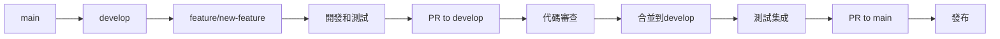
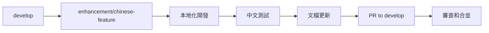
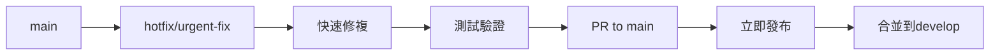

# 分支管理策略

## 🌿 分支架構設計

### 主要分支

```
main (生產分支)
├── develop (開發主分支)
├── feature/* (功能開發分支)
├── enhancement/* (中文增強分支)
├── hotfix/* (緊急修複分支)
├── release/* (發布準備分支)
└── upstream-sync/* (上游同步分支)
```

### 分支說明

#### 🏠 **main** - 生產主分支
- **用途**: 穩定的生產版本
- **保護**: 受保護，只能通過PR合並
- **來源**: develop、hotfix、upstream-sync
- **特點**: 始終保持可發布狀態

#### 🚀 **develop** - 開發主分支
- **用途**: 集成所有功能開發
- **保護**: 受保護，通過PR合並
- **來源**: feature、enhancement分支
- **特點**: 最新的開發進度

#### ✨ **feature/** - 功能開發分支
- **命名**: `feature/功能名稱`
- **用途**: 開發新功能
- **生命周期**: 短期（1-2周）
- **示例**: `feature/portfolio-optimization`

#### 🇨🇳 **enhancement/** - 中文增強分支
- **命名**: `enhancement/增強名稱`
- **用途**: 中文本地化和增強功能
- **生命周期**: 中期（2-4周）
- **示例**: `enhancement/chinese-llm-integration`

#### 🚨 **hotfix/** - 緊急修複分支
- **命名**: `hotfix/修複描述`
- **用途**: 緊急Bug修複
- **生命周期**: 短期（1-3天）
- **示例**: `hotfix/api-timeout-fix`

#### 📦 **release/** - 發布準備分支
- **命名**: `release/版本號`
- **用途**: 發布前的最後準備
- **生命周期**: 短期（3-7天）
- **示例**: `release/v1.1.0-cn`

#### 🔄 **upstream-sync/** - 上游同步分支
- **命名**: `upstream-sync/日期`
- **用途**: 同步上游更新
- **生命周期**: 臨時（1天）
- **示例**: `upstream-sync/20240115`

## 🔄 工作流程

### 功能開發流程



### 中文增強流程



### 緊急修複流程



## 📋 分支操作指南

### 創建功能分支

```bash
# 從develop創建功能分支
git checkout develop
git pull origin develop
git checkout -b feature/portfolio-analysis

# 開發完成後推送
git push -u origin feature/portfolio-analysis
```

### 創建中文增強分支

```bash
# 從develop創建增強分支
git checkout develop
git pull origin develop
git checkout -b enhancement/finnhub-enhancement

# 推送分支
git push -u origin enhancement/finnhub-enhancement
```

### 創建緊急修複分支

```bash
# 從main創建修複分支
git checkout main
git pull origin main
git checkout -b hotfix/api-error-fix

# 推送分支
git push -u origin hotfix/api-error-fix
```

## 🔒 分支保護規則

### main分支保護
- ✅ 要求PR審查
- ✅ 要求狀態檢查通過
- ✅ 要求分支為最新
- ✅ 限制推送權限
- ✅ 限制強制推送

### develop分支保護
- ✅ 要求PR審查
- ✅ 要求CI通過
- ✅ 允許管理員繞過

### 功能分支
- ❌ 無特殊保護
- ✅ 自動刪除已合並分支

## 🏷️ 命名規範

### 分支命名

```bash
# 功能開發
feature/功能名稱-簡短描述
feature/chinese-data-source
feature/risk-management-enhancement

# 中文增強
enhancement/增強類型-具體內容
enhancement/llm-baidu-integration
enhancement/chinese-financial-terms

# Bug修複
hotfix/問題描述
hotfix/memory-leak-fix
hotfix/config-loading-error

# 發布準備
release/版本號
release/v1.1.0-cn
release/v1.2.0-cn-beta
```

### 提交信息規範

```bash
# 功能開發
feat(agents): 添加量化分析師智能體
feat(data): 集成FinnHub數據源

# 中文增強
enhance(llm): 集成Google AI API
enhance(docs): 完善中文文檔體系

# Bug修複
fix(api): 修複API超時問題
fix(config): 解決配置文件加載錯誤

# 文檔更新
docs(readme): 更新安裝指南
docs(api): 添加API使用示例
```

## 🧪 測試策略

### 分支測試要求

#### feature分支
- ✅ 單元測試覆蓋率 > 80%
- ✅ 功能測試通過
- ✅ 代碼風格檢查

#### enhancement分支
- ✅ 中文功能測試
- ✅ 兼容性測試
- ✅ 文檔完整性檢查

#### develop分支
- ✅ 完整測試套件
- ✅ 集成測試
- ✅ 性能測試

#### main分支
- ✅ 生產環境測試
- ✅ 端到端測試
- ✅ 安全掃描

## 📊 分支監控

### 分支健康度指標

```bash
# 檢查分支狀態
git branch -a --merged    # 已合並分支
git branch -a --no-merged # 未合並分支

# 檢查分支差異
git log develop..main --oneline
git log feature/branch..develop --oneline

# 檢查分支大小
git rev-list --count develop..feature/branch
```

### 定期清理

```bash
# 刪除已合並的本地分支
git branch --merged develop | grep -v "develop\|main" | xargs -n 1 git branch -d

# 刪除遠端跟蹤分支
git remote prune origin

# 清理過期分支
git for-each-ref --format='%(refname:short) %(committerdate)' refs/heads | awk '$2 <= "'$(date -d '30 days ago' '+%Y-%m-%d')'"' | cut -d' ' -f1
```

## 🚀 發布流程

### 版本發布步驟

1. **創建發布分支**
   ```bash
   git checkout develop
   git pull origin develop
   git checkout -b release/v1.1.0-cn
   ```

2. **版本準備**
   ```bash
   # 更新版本號
   # 更新CHANGELOG.md
   # 最後測試
   ```

3. **合並到main**
   ```bash
   git checkout main
   git merge release/v1.1.0-cn
   git tag v1.1.0-cn
   git push origin main --tags
   ```

4. **回合並到develop**
   ```bash
   git checkout develop
   git merge main
   git push origin develop
   ```

## 🔧 自動化工具

### Git Hooks

```bash
# pre-commit hook
#!/bin/sh
# 運行代碼風格檢查
black --check .
flake8 .

# pre-push hook
#!/bin/sh
# 運行測試
python -m pytest tests/
```

### GitHub Actions

```yaml
# 分支保護檢查
on:
  pull_request:
    branches: [main, develop]
    
jobs:
  test:
    runs-on: ubuntu-latest
    steps:
      - uses: actions/checkout@v4
      - name: Run tests
        run: python -m pytest
```

## 🚀 推薦的開發工作流

### 1. 日常功能開發流程

#### 標準功能開發
```bash
# 步驟1: 創建功能分支
python scripts/branch_manager.py create feature portfolio-optimization -d "投資組合優化功能"

# 步驟2: 開發功能
# 編寫代碼...
git add .
git commit -m "feat: 添加投資組合優化算法"

# 步驟3: 定期同步develop分支
git fetch origin
git merge origin/develop  # 或使用 git rebase origin/develop

# 步驟4: 推送到遠端
git push origin feature/portfolio-optimization

# 步驟5: 創建Pull Request
# 在GitHub上創建PR: feature/portfolio-optimization -> develop
# 填寫PR模板，包含功能描述、測試說明等

# 步驟6: 代碼審查
# 等待團隊成員審查，根據反饋修改代碼

# 步驟7: 合並和清理
# PR合並後，刪除本地和遠端分支
python scripts/branch_manager.py delete feature/portfolio-optimization
```

#### 功能開發檢查清單
- [ ] 功能需求明確，有詳細的設計文檔
- [ ] 創建了合適的分支名稱和描述
- [ ] 編寫了完整的單元測試
- [ ] 代碼符合項目編碼規範
- [ ] 更新了相關文檔
- [ ] 通過了所有自動化測試
- [ ] 進行了代碼審查
- [ ] 測試了與現有功能的兼容性

### 2. 中文增強開發流程

#### 本地化功能開發
```bash
# 步驟1: 建立增強分支
python scripts/branch_manager.py create enhancement finnhub-integration -d "集成FinnHub美股數據源"

# 步驟2: 開發功能
# 集成數據源
git add tradingagents/dataflows/yfin_utils.py
git commit -m "enhance(data): 添加Yahoo Finance數據源適配器"

# 添加配置
git add config/market_config.yaml
git commit -m "enhance(config): 添加市場配置"

# 步驟3: 更新文檔
git add docs/data/finnhub-integration.md
git commit -m "docs: 添加FinnHub集成文檔"

# 步驟4: 功能測試
python -m pytest tests/test_finnhub_connection.py
git add tests/test_finnhub_connection.py
git commit -m "test: 添加FinnHub集成測試"

# 步驟5: 推送和合並
git push origin enhancement/finnhub-integration
# 建立PR到develop分支
```

#### 中文增強檢查清單
- [ ] 功能適配中國金融市場特點
- [ ] 添加了完整的中文文檔
- [ ] 支持中文金融術語
- [ ] 兼容現有的國際化功能
- [ ] 測試了中文數據處理
- [ ] 更新了配置文件和示例

### 3. 緊急修複流程

#### 生產環境Bug修複
```bash
# 步驟1: 從main創建修複分支
python scripts/branch_manager.py create hotfix api-timeout-fix -d "修複API請求超時問題"

# 步驟2: 快速定位和修複
# 分析問題根因
# 實施最小化修複
git add tradingagents/api/client.py
git commit -m "fix: 增加API請求超時重試機制"

# 步驟3: 緊急測試
python -m pytest tests/test_api_client.py -v
# 手動測試關鍵路徑

# 步驟4: 立即部署到main
git push origin hotfix/api-timeout-fix
# 創建PR到main，標記為緊急修複

# 步驟5: 同步到develop
git checkout develop
git merge main
git push origin develop
```

#### 緊急修複檢查清單
- [ ] 問題影響評估和優先級確認
- [ ] 實施最小化修複方案
- [ ] 通過了關鍵路徑測試
- [ ] 有回滾計劃
- [ ] 同步到所有相關分支
- [ ] 通知相關團隊成員

### 4. 版本發布流程

#### 正式版本發布
```bash
# 步驟1: 創建發布分支
python scripts/branch_manager.py create release v1.1.0-cn -d "v1.1.0中文增強版發布"

# 步驟2: 版本準備
# 更新版本號
echo "1.1.0-cn" > VERSION
git add VERSION
git commit -m "bump: 版本號更新到v1.1.0-cn"

# 更新變更日誌
git add CHANGELOG.md
git commit -m "docs: 更新v1.1.0-cn變更日誌"

# 最終測試
python -m pytest tests/ --cov=tradingagents
python examples/full_test.py

# 步驟3: 合並到main
git checkout main
git merge release/v1.1.0-cn
git tag v1.1.0-cn
git push origin main --tags

# 步驟4: 回合並到develop
git checkout develop
git merge main
git push origin develop

# 步驟5: 清理發布分支
python scripts/branch_manager.py delete release/v1.1.0-cn
```

#### 版本發布檢查清單
- [ ] 所有計劃功能已完成並合並
- [ ] 通過了完整的測試套件
- [ ] 更新了版本號和變更日誌
- [ ] 創建了版本標簽
- [ ] 準備了發布說明
- [ ] 通知了用戶和社群

### 5. 上游同步集成流程

#### 與原項目保持同步
```bash
# 步驟1: 檢查上游更新
python scripts/sync_upstream.py

# 步驟2: 如果有更新，會自動創建同步分支
# upstream-sync/20240115

# 步驟3: 解決可能的衝突
# 保護我們的中文文檔和增強功能
# 採用上游的核心代碼更新

# 步驟4: 測試同步結果
python -m pytest tests/
python examples/basic_example.py

# 步驟5: 合並到主分支
git checkout main
git merge upstream-sync/20240115
git push origin main

# 步驟6: 同步到develop
git checkout develop
git merge main
git push origin develop
```

## 📈 最佳實踐

### 開發建議

1. **小而頻繁的提交** - 每個提交解決一個具體問題
2. **描述性分支名** - 清楚表達分支用途
3. **及時同步** - 定期從develop拉取最新更改
4. **完整測試** - 合並前確保所有測試通過
5. **文檔同步** - 功能開發同時更新文檔

### 協作規範

1. **PR模板** - 使用標準的PR描述模板
2. **代碼審查** - 至少一人審查後合並
3. **衝突解決** - 及時解決合並衝突
4. **分支清理** - 及時刪除已合並分支
5. **版本標記** - 重要節點創建版本標簽

### 品質保證

1. **自動化測試** - 每個PR都要通過CI測試
2. **代碼覆蓋率** - 保持80%以上的測試覆蓋率
3. **性能測試** - 重要功能要進行性能測試
4. **安全掃描** - 定期進行安全漏洞掃描
5. **文檔更新** - 功能變更同步更新文檔

通過這套完整的分支管理策略和開發工作流，我們可以確保項目開發的有序進行，同時保持代碼品質和發布穩定性。
