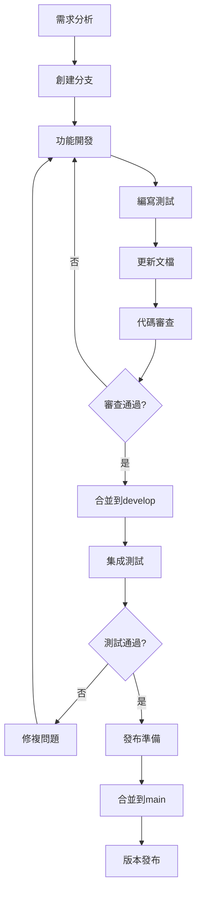

# 開發工作流指南

## 🎯 概述

本文檔詳細說明 TradingAgents 中文增强版的標準開發工作流程，確保团隊協作的一致性和代碼品質。

## 🔄 核心工作流程

### 工作流程圖



## 🚀 詳細工作流程

### 1. 功能開發工作流

#### 1.1 需求分析階段
```bash
# 確認開發需求
# 1. 阅讀需求文檔或Issue描述
# 2. 確認技術方案和實現路徑
# 3. 評估開發時間和資源需求
# 4. 與團隊討論技術細節
```

#### 1.2 分支創建階段
```bash
# 確保本地develop分支是最新的
git checkout develop
git pull origin develop

# 創建功能分支
python scripts/branch_manager.py create feature risk-management-v2 -d "風險管理模塊重構"

# 驗證分支創建
git branch --show-current
# 應该顯示: feature/risk-management-v2
```

#### 1.3 功能開發階段
```bash
# 開發核心功能
# 1. 實現主要功能邏輯
git add tradingagents/risk/manager_v2.py
git commit -m "feat(risk): 實現新版風險管理器核心邏輯"

# 2. 添加配置支持
git add config/risk_management_v2.yaml
git commit -m "feat(config): 添加風險管理v2配置文件"

# 3. 集成到主框架
git add tradingagents/graph/trading_graph.py
git commit -m "feat(graph): 集成風險管理v2到交易圖"

# 定期同步develop分支
git fetch origin
git rebase origin/develop  # 或使用 merge
```

#### 1.4 測試開發階段
```bash
# 編寫單元測試
git add tests/risk/test_manager_v2.py
git commit -m "test(risk): 添加風險管理v2單元測試"

# 編寫集成測試
git add tests/integration/test_risk_integration.py
git commit -m "test(integration): 添加風險管理集成測試"

# 運行測試確保通過
python -m pytest tests/risk/ -v
python -m pytest tests/integration/test_risk_integration.py -v
```

#### 1.5 文檔更新階段
```bash
# 更新API文檔
git add docs/api/risk-management.md
git commit -m "docs(api): 更新風險管理API文檔"

# 添加使用示例
git add examples/risk_management_example.py
git commit -m "docs(examples): 添加風險管理使用示例"

# 更新配置文檔
git add docs/configuration/risk-config.md
git commit -m "docs(config): 更新風險管理配置文檔"
```

#### 1.6 代碼審查階段
```bash
# 推送分支到遠端
git push origin feature/risk-management-v2

# 創建Pull Request
# 1. 訪問GitHub倉庫
# 2. 創建PR: feature/risk-management-v2 -> develop
# 3. 填寫PR模板
# 4. 添加審查者
# 5. 等待審查反饋

# 根據審查意见修改代碼
git add .
git commit -m "fix(risk): 根據審查意见修複代碼風格問題"
git push origin feature/risk-management-v2
```

### 2. 中文增强開發工作流

#### 2.1 功能開發
```bash
# 建立增強分支
python scripts/branch_manager.py create enhancement finnhub-integration -d "集成FinnHub數據源"

# 開發數據源適配器
git add tradingagents/dataflows/yfin_utils.py
git commit -m "enhance(data): 添加Yahoo Finance數據源適配器"

# 添加金融術語支援
git add tradingagents/utils/stock_utils.py
git commit -m "enhance(utils): 添加金融術語映射"

# 配置市場參數
git add config/market_config/
git commit -m "enhance(config): 添加市場配置"
```

#### 2.2 文檔開發
```bash
# 添加使用指南
git add docs/data/finnhub-integration.md
git commit -m "docs: 添加FinnHub集成指南"

# 更新中文示例
git add examples/chinese_market_analysis.py
git commit -m "examples: 添加中國市場分析示例"

# 更新中文FAQ
git add docs/faq/chinese-features-faq.md
git commit -m "docs: 添加中文功能常見問題"
```

### 3. 緊急修複工作流

#### 3.1 問題識別和評估
```bash
# 1. 確認問題嚴重程度
# 2. 評估影響範围
# 3. 制定修複方案
# 4. 確定修複時間線
```

#### 3.2 緊急修複開發
```bash
# 從main分支創建修複分支
git checkout main
git pull origin main
python scripts/branch_manager.py create hotfix memory-leak-fix -d "修複內存泄漏問題"

# 實施最小化修複
git add tradingagents/core/memory_manager.py
git commit -m "fix: 修複智能體內存泄漏問題"

# 緊急測試
python -m pytest tests/core/test_memory_manager.py -v
python tests/manual/memory_leak_test.py
```

#### 3.3 快速部署
```bash
# 推送修複
git push origin hotfix/memory-leak-fix

# 創建緊急PR到main
# 標記為緊急修複，跳過常規審查流程

# 合並後立即同步到develop
git checkout develop
git merge main
git push origin develop
```

### 4. 版本發布工作流

#### 4.1 發布準備
```bash
# 創建發布分支
python scripts/branch_manager.py create release v1.2.0-cn -d "v1.2.0中文增强版發布"

# 版本號更新
echo "1.2.0-cn" > VERSION
git add VERSION
git commit -m "bump: 版本更新到v1.2.0-cn"

# 更新變更日誌
# 編辑CHANGELOG.md，添加新版本的變更內容
git add CHANGELOG.md
git commit -m "docs: 更新v1.2.0-cn變更日誌"
```

#### 4.2 發布測試
```bash
# 完整測試套件
python -m pytest tests/ --cov=tradingagents --cov-report=html

# 性能測試
python tests/performance/benchmark_test.py

# 集成測試
python examples/full_integration_test.py

# 文檔測試
# 驗證所有文檔鏈接和示例代碼
```

#### 4.3 正式發布
```bash
# 合並到main
git checkout main
git merge release/v1.2.0-cn

# 創建版本標簽
git tag -a v1.2.0-cn -m "TradingAgents中文增强版 v1.2.0"
git push origin main --tags

# 同步到develop
git checkout develop
git merge main
git push origin develop

# 清理發布分支
python scripts/branch_manager.py delete release/v1.2.0-cn
```

## 📋 工作流檢查清單

### 功能開發檢查清單
- [ ] **需求明確**: 功能需求和驗收標準清晰
- [ ] **設計文檔**: 有詳細的技術設計文檔
- [ ] **分支命名**: 使用規範的分支命名
- [ ] **代碼品質**: 通過代碼風格檢查
- [ ] **單元測試**: 測試覆蓋率達到80%以上
- [ ] **集成測試**: 通過集成測試
- [ ] **文檔更新**: 更新相關API和使用文檔
- [ ] **示例代碼**: 提供使用示例
- [ ] **代碼審查**: 至少一人審查通過
- [ ] **向後兼容**: 確保向後兼容性

### 中文增强檢查清單
- [ ] **市場適配**: 適配中國金融市場特點
- [ ] **術語支持**: 支持中文金融術語
- [ ] **數據源**: 集成中文數據源
- [ ] **配置文件**: 添加中文市場配置
- [ ] **中文文檔**: 完整的中文使用文檔
- [ ] **示例代碼**: 中文市場分析示例
- [ ] **測試用例**: 中文功能測試用例
- [ ] **兼容性**: 與國際化功能兼容

### 發布檢查清單
- [ ] **功能完整**: 所有計劃功能已實現
- [ ] **測試通過**: 完整測試套件通過
- [ ] **性能驗證**: 性能測試達標
- [ ] **文檔完整**: 所有文檔已更新
- [ ] **版本標記**: 正確的版本號和標簽
- [ ] **變更日誌**: 詳細的變更記錄
- [ ] **發布說明**: 準備發布公告
- [ ] **回滚計劃**: 有應急回滚方案

## 🔧 工具和自動化

### 開發工具
```bash
# 分支管理
python scripts/branch_manager.py

# 上游同步
python scripts/sync_upstream.py

# 代碼品質檢查
black tradingagents/
flake8 tradingagents/
mypy tradingagents/

# 測試運行
python -m pytest tests/ -v --cov=tradingagents
```

### CI/CD集成
- **GitHub Actions**: 自動化測試和部署
- **代碼品質**: 自動代碼風格和品質檢查
- **測試覆蓋**: 自動生成測試覆蓋率報告
- **文檔構建**: 自動構建和部署文檔

## 📞 獲取幫助

### 文檔資源
- [分支管理策略](branch-strategy.md)
- [分支快速指南](../../BRANCH_GUIDE.md)
- [上游同步指南](../maintenance/upstream-sync.md)

### 聯系方式
- **GitHub Issues**: [提交問題](https://github.com/hsliuping/TradingAgents-CN/issues)
- **邮箱**: hsliup@163.com

通過遵循這套標準化的開發工作流程，我們可以確保項目的高品質開發和穩定發布。
